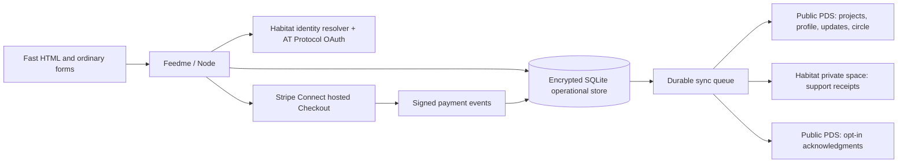

# Feedme 🌱

**A little support. A world of possibility.**

An open-source home for the projects, practices, and people you want to make more room for. Think creator support with AT Protocol identity, Habitat private data, and a small circle of recommendations that helps generosity travel.

TypeScript · pnpm · Astro · Tailwind CSS · Node · MIT licensed

## Try it

Use Node **24 LTS** and pnpm **10.11.1**.

```sh
pnpm install
cp .env.example .env
pnpm dev
```

Open [127.0.0.1:4321](http://127.0.0.1:4321). The default **demo** includes an example creator, editable projects, field notes, a private studio, and simulated tips. Choose **Sign in → Explore the demo studio** or **Explore as a supporter**. No accounts, credentials, or money required. Demo state persists in `.data/demo.sqlite`; live state uses a separate database.

```sh
pnpm check
pnpm test
pnpm build
pnpm start
```

## What works in this release

- Server-rendered, responsive HTML pages with ordinary HTML forms. Core interactions work with JavaScript disabled; the optional video player loads on demand.
- A mobile-first, minimal interface with matching hosted Checkout colors and controls. See the [appearance guide](docs/appearance.md) for theme customization.
- One creator per instance, with projects and ongoing support categories, optional aspirations, images, external links, and project status.
- AT Protocol OAuth through Habitat’s TypeScript identity resolver; any provider Habitat supports can supply the identity.
- Creator studio with project/profile editing, field notes, support breakdowns, and friend recommendations.
- Native creator/friend follows, portable project subscriptions, a Following feed, and explicit public messages after tipping.
- Markdown project stories with safe images and video embeds. Project logs use native Bluesky posts, including imported photo/video posts.
- Profile and project supporter timelines with public amounts and separately permitted anonymous entries. Private tips stay hidden.
- One-time USD support with anonymous, creator-private, or public identity choices.
- Stripe Connect hosted onboarding, direct-charge hosted Checkout, signed webhooks, and refund/dispute reconciliation.
- Habitat private receipt storage and public PDS records, backed by an encrypted operational database and a durable retry queue.
- Docker, Compose, Railway configuration, and GitHub Actions checks.

**Integration status:** the real provider adapters are implemented and tested with fixtures. Live Habitat OAuth/space writes and Stripe test-account onboarding/payment have **not** been exercised with an operator account. Complete the [live acceptance checklist](docs/hosting.md#live-acceptance-checklist) before taking real payments. Habitat is actively changing; the SDK and the source revision reviewed here are documented in [the data model](docs/data-model.md).

## How it fits together



Tips go to the creator regardless of progress. An aspiration is not an escrow threshold. Direct charges live on the creator’s connected Stripe account. Feedme adds no application fee; Stripe and hosting fees still apply.

Private and anonymous tips **do not affect public counters**. Anonymous means Feedme stores no supporter DID, not that the payment is anonymous to Stripe or the recipient. Tip notes are always private. Anonymous timeline entries require a separate opt-in and expose only the project and date. Public acknowledgment requires sign-in and explicit consent, and public records can be copied by the network.

## Host it

| Option | Shape | Best fit |
| --- | --- | --- |
| Node on a VPS | One process, persistent data directory, HTTPS reverse proxy | Smallest stack; full control |
| Docker Compose | One application container and a named volume | Reproducible personal hosting |
| Railway | Dockerfile + volume at `/data` + public domain | Managed deployment from a GitHub fork |
| Fully static hosting | Public mirror only; needs a separate transaction backend | Future architecture, not supported by this release |

```sh
cp .env.example .env
docker compose up --build -d
```

See [hosting and first-run setup](docs/hosting.md). A single replica is deliberate: OAuth session locking and SQLite live in one process. Habitat can be managed separately or self-hosted; running Feedme does not require you to run a public PDS yourself.

## Build on it

| Location | Purpose |
| --- | --- |
| `src/pages/`, `src/components/` | Astro HTML, forms, and page composition |
| `src/lib/model.ts` | Validation, money, privacy projections |
| `src/lib/auth.ts`, `habitat.ts` | Identity and protocol adapters |
| `src/lib/payments.ts` | Stripe integration and event reconciliation |
| `src/lib/db.ts`, `repository.ts` | Local persistence and durable outbox |
| `lexicons/` | Draft public and private wire contracts |
| `docs/plans/foundation/` | Checked implementation plan and later work |

Read the [architecture](docs/architecture.md), [data model](docs/data-model.md), [social protocol](docs/social-protocol.md), [project content](docs/project-content.md), and [contributor guide](CONTRIBUTING.md). The `social.feedme.*` namespace is a **draft**; claim a domain you control and finalize lexicon discovery before a public protocol release.

The [verification report](docs/verification.md) records the passing local checks and the remaining real-account acceptance work.

## What comes next

Recurring memberships and subscription management; organization workspaces and Habitat roles; cross-instance discovery; remote re-indexing and recovery; media uploads/native Bluesky video embeds; a separate Bitcoin provider. Stripe’s current crypto checkout supports [stablecoins](https://docs.stripe.com/payments/stablecoin-payments), not a Bitcoin option in this application.

This repository is a working first release, not an assertion that these later features already exist.
