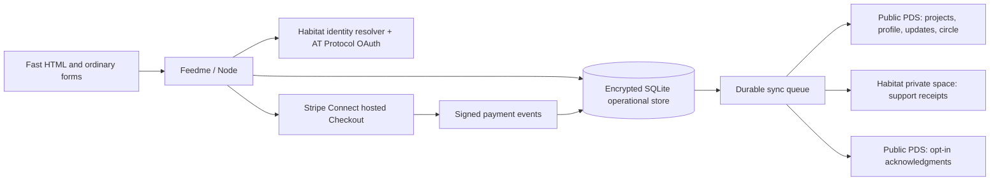

# Feedme 🌱

**A little support. A world of possibility.**

An open-source home for the projects, practices, and people you want to make more room for. Think creator support with AT Protocol identity, Habitat private data, and a small circle of recommendations that helps generosity travel.

TypeScript · pnpm · Astro · Tailwind CSS · Node · MIT licensed

Repository: [crs48/feedme](https://github.com/crs48/feedme). Private during development, with a public release planned.

## Try it

Use Node **24 LTS** and pnpm **10.11.1**.

```sh
pnpm install
cp .env.example .env
pnpm dev
```

Open [127.0.0.1:4321](http://127.0.0.1:4321). The default **demo** includes an example creator, editable projects, field notes, a private studio, and simulated tips. Choose **Sign in → Explore the demo studio** or **Explore as a supporter**. No accounts, credentials, or money required. Demo state persists in `.data/demo.sqlite`; live state uses a separate database.

```sh
pnpm check
pnpm test
pnpm build
pnpm start
```

Suggested tips default to **$11, $22, $44, and $88**, with **$22** prefilled. To customize them, set four comma-separated USD amounts in `.env` or your hosting environment, then restart the app:

```dotenv
TIP_AMOUNTS=11,22,44,88
```

The second amount is the starting amount on both the homepage and project pages. Use four distinct values between $1 and $1,000, with up to two decimal places. Supporters can always enter a custom amount. The suggestions apply to one-time, monthly, and yearly tips; existing recurring payments keep their saved amounts.

## Your Bluesky account is your admin login

Copy the template, then change this one identity setting in `.env` or your host’s environment:

```dotenv
BLUESKY_HANDLE=crs.land
# Optional: grant full admin access to more people.
ADMIN_ACCOUNTS=friend.bsky.social,another.example
```

The default creator/admin is **@crs.land**. For your own instance, replace it with your handle before the first live launch. In live mode, click **Sign in**, authenticate with that Bluesky/AT Protocol account, and open **Dashboard** at `/studio`. No separate admin password. A handle is verified through Habitat and pinned to its permanent DID in the persistent database; display names never grant permissions. Additional admins have the same access to private payment records and project publishing as the creator. Restart after changing configuration.

The demo uses a fictional account and an **Explore the demo studio** button, so no real Bluesky login is needed to preview the dashboard. For real login, complete [live hosting setup](docs/hosting.md#live-configuration); a handle does not replace HTTPS, encryption, or Stripe credentials. Existing installations can keep `OWNER_DID`, which overrides `BLUESKY_HANDLE`.

See the [administration guide](docs/admin.md) for project workflows, report definitions, admin removal, and identity recovery.

## What works in this release

- Server-rendered, responsive HTML pages with ordinary HTML forms. Core interactions work with JavaScript disabled; the allocation preview is a small progressive enhancement, and the optional video player loads on demand.
- A mobile-first interface combining Bluesky-inspired profiles and feeds with Stripe-style forms and matching hosted Checkout colors. See the [appearance guide](docs/appearance.md) for theme customization.
- Choose one-time, monthly, or yearly support, with Stripe-hosted renewal management and a separate receipt for every successful payment. See [recurring support](docs/recurring-support.md).
- Split a single tip across projects from the homepage with linked percentage sliders and a live dollar breakdown. One Stripe Checkout handles the whole amount; project pages remain available for details.
- Confirmed public tips get a share link and a PNG preview of their top six project allocations, with percentages and rainbow progress beyond each aspiration. See [public support cards](docs/support-cards.md).
- One creator per instance, with projects and ongoing support categories, optional aspirations, images, external links, and project status.
- AT Protocol OAuth through Habitat’s TypeScript identity resolver; any provider Habitat supports can supply the identity.
- Configurable Bluesky administrators (default `crs.land`) and a private dashboard: draft/publish/archive projects, Markdown previews, weekly/monthly earnings, project performance, recurring support, searchable payments, CSV exports, supporter profiles, connection health, and admin activity.
- Discover creators you follow, mutuals, followers, and friends of friends through Bluesky; browse the public network or search a handle. Public recommendations travel with your own PDS. See [discovery](docs/discovery.md).
- Native creator/friend follows, portable project subscriptions, a Following feed, and explicit public messages after tipping.
- Markdown project stories with safe images and video embeds. Project logs use native Bluesky posts, including imported photo/video posts.
- Author avatars on posts, with bundled demo portraits and responsive project photography. Missing portraits use initials; anonymous supporters use a generic icon.
- Profile and project supporter timelines with public amounts and separately permitted anonymous entries. Private tips stay hidden.
- One-time USD support with anonymous, creator-private, or public identity choices.
- Stripe Connect hosted onboarding, direct-charge hosted Checkout, signed webhooks, and refund/dispute reconciliation.
- Habitat private receipt storage and public PDS records, backed by an encrypted operational database and a durable retry queue.
- Docker/Compose, a Render Blueprint, Fly.io and Railway configuration, and GitHub Actions checks.

**Integration status:** the real provider adapters are implemented and tested with fixtures. Live Habitat OAuth/space writes and Stripe test-account onboarding/payment have **not** been exercised with an operator account. Complete the [live acceptance checklist](docs/hosting.md#live-acceptance-checklist) before taking real payments. Habitat is actively changing; the SDK and the source revision reviewed here are documented in [the data model](docs/data-model.md).

## How it fits together



Tips go to the creator regardless of progress. An aspiration is not an escrow threshold. Direct charges live on the creator’s connected Stripe account. Feedme adds no application fee; Stripe and hosting fees still apply.

Private and anonymous tips **do not affect public counters**. Anonymous means Feedme stores no supporter DID, not that the payment is anonymous to Stripe or the recipient. Tip notes are always private. Anonymous timeline entries require a separate opt-in and expose only the project and date. Public acknowledgment requires sign-in and explicit consent, and public records can be copied by the network.

## Host it

**Start with Render for the shortest setup, or Railway if you already use it.** Feedme runs as one Node server with a persistent disk. You do not need to host your own PDS or Habitat server.

[](https://render.com/deploy?repo=https%3A%2F%2Fgithub.com%2Fcrs48%2Ffeedme)
[](https://railway.com/new)
[](docs/hosting.md#flyio)
[](docs/hosting.md#coolify)
[](docs/hosting.md#dokploy)
[](docs/hosting.md#docker-compose)

The **Render button provisions a service and persistent disk** from [render.yaml](render.yaml); review the paid resources before deploying. The other buttons open guided setup. All routes start with a demo unless you configure live mode. A hosted demo has a shared, editable studio: use sample data only.

This repository is currently **private**. You need repository access and must authorize your host's GitHub integration. [Use this GitHub template](https://github.com/crs48/feedme/generate) to make your own copy; update `crs48/feedme` in the Render and Koyeb button URLs to deploy your copy. The Render Blueprint itself uses whichever repository contains it.

| Option | Included setup | What you provide |
| --- | --- | --- |
| [Render](docs/hosting.md#render) | Deploy button; Docker server, 1 GB disk, health check, one instance | Render account, GitHub access; paid service and disk |
| [Railway](docs/hosting.md#railway) | Docker build, health check, one replica via [railway.json](railway.json) | Select repo, attach `/data` volume, generate domain; usage billing |
| [Fly.io](docs/hosting.md#flyio) | [fly.toml](fly.toml), volume mount, HTTPS, health check | Fly CLI/account, unique app name, one Machine and volume |
| [Coolify](docs/hosting.md#coolify) | Existing Dockerfile | Coolify server, GitHub connection, `/data` volume, domain |
| [Dokploy](docs/hosting.md#dokploy) | Existing Dockerfile | Dokploy server, GitHub connection, `/data` volume, domain |
| [Docker Compose](docs/hosting.md#docker-compose) | [compose.yaml](compose.yaml), named volume and health check | VPS, Docker, HTTPS reverse proxy |
| [Node on a VPS](docs/hosting.md#vps-with-node) | `pnpm build` + `pnpm start` | Node 24, process supervisor, persistent directory, HTTPS |

**Render:** click the button, connect GitHub, review the Blueprint, and deploy. The app uses Render's generated HTTPS URL automatically. Open it to try the demo. Automatic source redeploys are off; enable them for your own fork if desired. [Render instructions](docs/hosting.md#render).

**Railway:** click Setup → GitHub repository → select Feedme. Attach a volume at `/data`, generate a domain targeting port `4321`, and deploy with one replica. The app picks up the generated domain automatically. A saved Railway one-click template has not been created yet; [the guide includes the exact template recipe](docs/hosting.md#railway-template-recipe).

**Your own server:** clone your copy, then:

```sh
cp .env.example .env
# Set PUBLIC_URL to your HTTPS origin in .env before hosting publicly.
docker compose up --build -d
```

Compose builds the app itself; Node and pnpm do not need to be installed on the host. Point an HTTPS reverse proxy at `127.0.0.1:4321`. Keep the named volume when upgrading.

### Turn on real support

After deploying, set these in your host's secret/environment settings:

1. `FEEDME_MODE=live`, `BLUESKY_HANDLE=your.handle`, and a `DATA_ENCRYPTION_KEY` generated with `node -e "console.log(require('crypto').randomBytes(32).toString('hex'))"`. Back up the key separately from the disk.
2. `PUBLIC_URL=https://your-custom-domain` if using a custom domain or VPS. Render, Railway, Fly.io, and Koyeb generated domains are detected automatically when this variable is absent. Don't copy the local `.env` URL to a hosted instance.
3. Stripe test credentials: `STRIPE_SECRET_KEY` and `STRIPE_WEBHOOK_SECRET`. Sign in as the owner, create Habitat private storage, and finish Stripe Connect onboarding in the studio.

Keep **one running instance** and persist the entire `DATA_DIR` (`/data` in the deployment configurations). Your handle is the only identity setting required; Feedme verifies and pins its permanent DID. Live hosting and payments still require HTTPS, encryption, and provider credentials. Follow [identity/payment setup and the live acceptance checklist](docs/hosting.md#live-configuration) before taking real payments.

### Koyeb demo button

[](https://app.koyeb.com/deploy?type=git&repository=github.com%2Fcrs48%2Ffeedme&branch=main&name=feedme&builder=dockerfile&dockerfile=Dockerfile&instance_type=free&ports=4321%3Bhttp%3B%2F&env%5BFEEDME_MODE%5D=demo&env%5BPORT%5D=4321)

This launches a **disposable demo**. Its filesystem is ephemeral, and Koyeb currently describes its volumes as testing-only public preview, so this is not a live-payment hosting recommendation. [Details and storage limitations](docs/hosting.md#koyeb-demo).

### Can this run on GitHub Pages?

**The complete app cannot run on GitHub Pages today.** Pages serves static files; Feedme needs server endpoints for OAuth sessions, checkout creation, payment webhooks, and private storage synchronization, plus durable SQLite data. A nightly build cannot replace those endpoints. See [GitHub's Pages documentation](https://docs.github.com/en/pages/getting-started-with-github-pages/what-is-github-pages).

A future static public profile/project mirror could run separately from a hosted Feedme backend. That exporter and cross-origin integration are not implemented. Never publish the `.data` directory or private Habitat/payment records in a Pages artifact. [Architecture and hosting boundaries](docs/hosting.md#static-hosting-and-github-pages).

## Build on it

| Location | Purpose |
| --- | --- |
| `src/pages/`, `src/components/` | Astro HTML, forms, and page composition |
| `src/lib/model.ts` | Validation, money, privacy projections |
| `src/lib/auth.ts`, `habitat.ts` | Identity and protocol adapters |
| `src/lib/payments.ts` | Stripe integration and event reconciliation |
| `src/lib/db.ts`, `repository.ts` | Local persistence and durable outbox |
| `lexicons/` | Draft public and private wire contracts |
| `docs/plans/foundation/` | Checked implementation plan and later work |

Read the [architecture](docs/architecture.md), [data model](docs/data-model.md), [social protocol](docs/social-protocol.md), [project content](docs/project-content.md), and [contributor guide](CONTRIBUTING.md). The `fund.feedme.*` namespace belongs to **feedme.fund**. See [discovery and schema publication](docs/discovery.md) for the creator directory, social recommendations, prototype migration, and the required DNS/PDS publication steps.

The [verification report](docs/verification.md) records the passing local checks and the remaining real-account acceptance work.

## What comes next

Organization workspaces and Habitat roles; cross-instance discovery; remote re-indexing and recovery; media uploads/native Bluesky video embeds; a separate Bitcoin provider. Stripe’s current crypto checkout supports [stablecoins](https://docs.stripe.com/payments/stablecoin-payments), not a Bitcoin option in this application.

This repository is a working first release, not an assertion that these later features already exist.

## License

[MIT](LICENSE) · Copyright © 2026 Christopher Smothers. Bundled demo media attribution is listed in [the media credits](public/demo/CREDITS.md).
