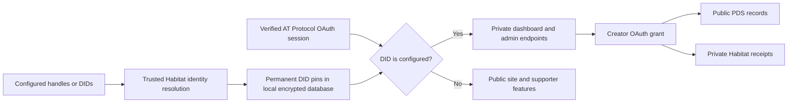
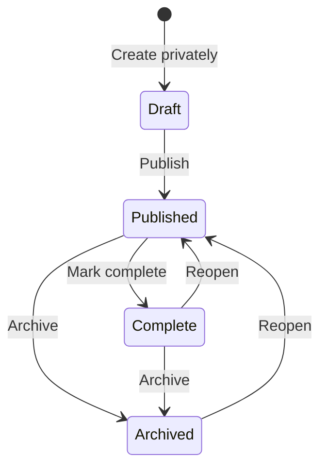

# Administration

Feedme has one creator per instance and supports multiple full-access administrators. The dashboard is rendered by Astro with ordinary links and forms; charts are SVG with accessible data tables. No dashboard JavaScript framework or external analytics service is required.

## Configure your account

```dotenv
BLUESKY_HANDLE=crs.land
# Optional; handles with or without @, or permanent DIDs.
ADMIN_ACCOUNTS=friend.bsky.social,did:plc:bbbbbbbbbbbbbbbbbbbbbbbb
```

`crs.land` is the template default. Replace it with your own handle before first live launch. The creator is always an administrator. Up to 20 additional entries can be configured. All admins can read private payments and notes, edit the public profile and recommendations, manage projects, publish creator updates, and configure connections. This is shared administration of one creator, not separate organization roles.

Set `FEEDME_MODE=live`, HTTPS, encryption, and payment credentials following [the hosting guide](hosting.md#live-configuration). Sign in through the regular Bluesky/AT Protocol OAuth flow. A configured admin signing in from the homepage lands at `/studio`; supporters cannot open any dashboard page or payment export. Demo mode deliberately uses a fictional creator and a shared demo login, not the configured real account. Never store private work in a publicly hosted demo.

`OWNER_DID` remains an optional legacy override and takes precedence over `BLUESKY_HANDLE`. Leave it unset for handle-only identity configuration. Settings can import the creator’s public Bluesky display name, handle, avatar, and bio; changing those display fields never changes access.



The Habitat SDK delegates identity verification to the configured Habitat service. Feedme additionally checks the returned DID document and handle agree, then stores the DID. A later handle reassignment cannot change the pin. AT Protocol describes [handle-to-DID verification](https://atproto.com/specs/handle) and [DID documents](https://atproto.com/specs/did).

After the first successful resolution, restarts read the persisted pin without resolving the handle again. Unresolved additional admins receive no access; the app retries resolution after one minute while existing admins keep access. Failure to resolve the creator on the first launch fails closed with HTTP 503. Use a trusted `HABITAT_URL`.

### Change or remove an administrator

Edit `ADMIN_ACCOUNTS` and restart. Removed accounts immediately lose admin access on subsequent requests, even if their login session is still valid. Their public supporter session can remain signed in. Add a replacement handle or DID explicitly. A stored pin is intentionally not updated just because a handle changes hands.

If your own handle changes, configure the new handle or your original DID. The resolved creator DID must match the stored instance owner; changing to a different creator requires a new data directory. Keep the persistent directory and its encryption key together. Do not delete the database to refresh an admin handle on an existing instance. For a recycled handle you intentionally want to authorize, remove that handle and configure the new account’s verified permanent DID instead.

Additional admins cannot supply their own OAuth grant in place of the creator’s. The creator must sign in at least once to authorize public writes and Habitat storage; sign in again if its grant is revoked. Additional admins are authorized through Feedme’s server; they are not automatically added to the Habitat space membership.

### Troubleshoot sign-in

OAuth uses the canonical HTTPS `PUBLIC_URL`: both `/oauth-client-metadata.json` and `/jwks.json` must be publicly reachable there. Feedme publishes its existing ES256 public key with `use: "sig"` and `key_ops: ["verify"]`, so Habitat can select it for confidential-client authentication. Do not rotate the stored OAuth key or delete the database to troubleshoot a metadata issue.

Server logs record `OAuth sign-in failed` with the stage, allowlisted provider error codes, HTTP status, and fixed diagnostic topics. They omit provider messages, request bodies, account identifiers, and tokens. An `invalid_client` during `authorize` indicates an application authentication problem; it does not mean the supporter entered an incorrect handle. Browser binding, PKCE, signed client assertions, and callback verification remain required.

## Dashboard pages

**Settings → Set up Stripe** opens a guided payment setup checklist. It explains the two host credentials, provides the exact webhook URL and event list, opens Stripe-hosted onboarding, and retrieves the connected account's payment/payout flags. Secret values and bank details never appear in this page. See [Stripe setup](stripe-setup.md).

| Page | Capabilities |
| --- | --- |
| Overview | Date/project filters, net and gross support, confirmed payment counts, named supporters, recurring run rate, weekly/monthly charts and tables, project performance, refunds, disputes, pending/failed payments, setup and sync health |
| Projects | Search and status filters; new private draft; saved Markdown/media preview; publish, edit, complete, archive, reopen, or duplicate into a new draft; lifetime project totals |
| Payments | Paginated history, date/project/status/frequency/privacy filters, payment ID or DID search, split allocations, private notes, CSV export |
| Supporters | Named public/private supporters grouped by DID, avatars and names from Bluesky where available, project breakdowns, first/latest contributions within the period, payment links; separate anonymous/guest aggregate |
| Updates | Publish a native Bluesky post as the creator, or attach an existing creator post with its images/video to a published project log |
| Settings | Import/edit public profile, recommendations, Habitat/Stripe setup, sync retries, configured admin identities, local action history |

### Project lifecycle



Drafts live only in the local database. They are absent from public project lists, public detail routes, checkout, project updates, and the public outbox. Use the authenticated editor for previews. Publishing makes the page available immediately and queues the public AT Protocol project record; background sync or Settings → Sync records sends it. Publishing a project is separate from publishing a Bluesky announcement in Updates.

Published projects cannot become private drafts: public records may already have been copied. Archive them to hide their page and stop new tips. Completed projects retain their public page but accept no new tips. **Archiving or completing does not cancel existing subscriptions.** Those retain their original project allocations until canceled through Stripe or the supporter’s Manage support flow. Duplicating copies content into a new private draft; it does not copy tips, subscriptions, or updates.

## Reporting definitions

- Amounts are USD. Net support means confirmed contributions less recorded refunds and amounts currently disputed. Pending/failed checkouts contribute zero. It is before Stripe fees and is not a bank balance or payout report.
- Date ranges are inclusive UTC dates. Weeks start Monday; months use calendar boundaries. Custom ranges require valid dates from 2000 through today. Partial weeks/months include only the selected dates.
- New payments use verified payment timestamps. Existing records without `paidAt` use `createdAt`. Refunds and dispute changes restate the original payment’s period, rather than appearing as separate cash movements on the refund date. Reports can therefore change as new webhook events arrive.
- A payment supporting several projects counts once in the overview and payment history. Project tables show each allocated contribution and its share of cumulative refunds. Selecting one project scopes both totals and CSV amounts to its allocation.
- Confirmed payment count includes paid, refunded, and disputed payments. Average net tip is net support divided by that count. Named supporter counts include only positive net contributions in the period. Anonymous tips are never treated as distinct identified people.
- Current monthly recurring support includes active monthly commitments plus one twelfth of active yearly commitments. It includes active subscriptions scheduled to end after the current period. Canceled, past-due, unpaid, and incomplete subscriptions are excluded. This current estimate does not follow the historical date filter and is not guaranteed income.
- CSV export respects the selected filters and contains one row per allocation. It omits private notes and provider/customer identifiers, omits DIDs for anonymous tips, escapes quoted values, and neutralizes spreadsheet formula prefixes. Named private DIDs remain in the admin-only export.
- Supporter display metadata is fetched from the public Bluesky AppView and cached for an hour. Only identified supporters on the displayed page are queried. Anonymous records are never looked up; AppView metadata is not used for authorization.

Admin pages, mutations, and exports require the configured session DID. Responses are private and not cacheable; POST actions require the same origin. No private report is published to AT Protocol. Local admin activity records acting DID, action, target, and timestamp; it is an operational history, not a tamper-proof compliance log. Payments, OAuth credentials, admin identity pins, drafts, and activity history remain part of the persistent encrypted local backup.

Refund issuance, disputes, bank payouts, subscription cancellation, granular roles, and analytics reconstruction from a lost database are not dashboard mutation features. Use Stripe for financial operations and keep backups of the instance data directory.

## LibCard source management

With `LIBCARD_REPO` configured, all links and socials accept picks by default (up to 99 plus the creator); `LIBCARD_DEFAULT_SUPPORT=explicit` retains explicit-only selection. **Projects → From LibCard** shows the last fetch, last successful check, content hash/ETag, and live/archived targets. Refresh manually, hide a target locally, or override its aspiration in whole dollars (blank inherits; zero removes). Source labels, destinations and blurbs remain read-only. Native edit/publish/duplicate actions reject these managed projects. The creator target cannot be hidden. See [LibCard](libcard.md) for import failures and compatibility with the separate LibCard repository.
