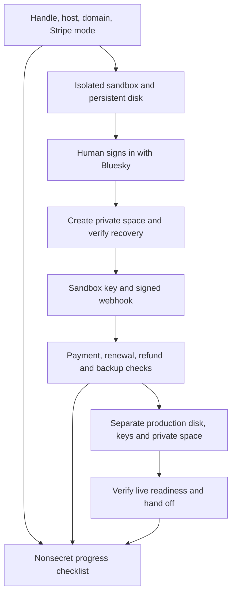

# Set up Feedme with an AI agent

This is the runbook behind the [copyable setup prompt](agent-setup-prompt.md) on [Set up your own](https://feedme.fund/get-started/). It works with Codex, Claude, and other assistants. A coding agent with terminal and hosting tools can do more automatically; a chat-only assistant can guide the same workflow with browser handoffs.

**Feedme is alpha software. It works, but use it at your own risk.** One prompt starts a guided installation, not unattended account creation. The operator still chooses paid services, signs in, enters secrets, completes Stripe verification, and decides when to accept real money. Do not claim a deployment or payment integration works until its verification gate passes.

## Working agreement and resume state

Read `AGENTS.md`, `.env.example`, and this guide from the **revision being installed**. Follow the linked guides for exact settings. Check current official provider documentation when dashboard labels or tool arguments differ; do not guess them. Provider plugins, MCPs, and CLIs are optional conveniences, not prerequisites. Do not install an unrelated plugin or rewrite the payment integration just to finish setup.

Ask once, in a short bundle, for the missing choices:

- Creator's Bluesky/AT Protocol handle; desired site name; any additional administrators (they receive full private-data access).
- Hosting provider, region, and spending limit. Offer Railway when there is no preference; Render or an existing VPS also work. Explain current compute, storage, and backup costs before provisioning. Reuse an explicitly chosen existing service only after checking its data and configuration.
- Desired HTTPS domain and who manages its DNS, or permission to start with the provider's generated hostname.
- Existing Stripe account and whether this is a personal site or a Connect platform. Recommend **own-account** for one creator.
- Optional public LibCard repository/ref; otherwise keep native projects.

Keep a local, ignored `.feedme-setup.md` using the checklist below. Record only the version/commit, provider project/service/environment identifiers, public URLs, completed checks and dates, and the next human action. Never record keys, passwords, OAuth tokens, private storage contents, supporter data, or bank details. If there is no filesystem, keep this nonsecret progress summary in the conversation. On resume, read it, inspect actual deployment state, and continue from the first incomplete gate. A prior checkmark is not evidence of a new deployment's health.

```markdown
# Feedme setup progress (no secrets)
Version / commit:
Creator handle:
Provider / project / service / environment:
Sandbox URL:
Production URL:
Next action:

- [ ] 1. Choices and existing installation checked
- [ ] 2. Source/version selected; local checks pass
- [ ] 3. Sandbox host, persistent disk, HTTPS and secrets configured
- [ ] 4. Creator login and private Habitat recovery verified
- [ ] 5. Sandbox Stripe account, webhook and emails configured
- [ ] 6. Sandbox payment and backup acceptance checks pass
- [ ] 7. Separate production instance configured and verified
- [ ] 8. Operator handoff and update procedure recorded
```

Only mark a phase complete when its evidence exists. A blocked bank verification does not prevent preparing docs or testing the sandbox. Keep useful independent work moving, but never pretend a pending human action succeeded.



## 1. Inspect before changing anything

Look for an existing checkout, deployment, `.env` **variable names only**, persistent volume, and running Feedme version. Do not dump environment files, provider variables, or complete logs into chat. Never rotate encryption keys, erase a volume, replace an identity, or reconnect a different Stripe account to fix a setup error. Existing sites may need the [recovery guide](backups-and-recovery.md) rather than a fresh installation.

An installation has one creator, one active writer, and one persistent SQLite data directory. GitHub Pages can host the product demo, **not** the live OAuth/payment backend. The creator's existing PDS and the configured Habitat service are sufficient; they do not need to host a new PDS or Habitat server.

## 2. Choose the application version

For source-based hosting, help the operator create their own copy using the [GitHub template](https://github.com/crs48/feedme/generate), then clone that copy. Record its commit. A template does not automatically receive upstream updates. Do not configure someone else's instance to auto-deploy every change to `crs48/feedme/main`.

For a VPS, check [releases](https://github.com/crs48/feedme/releases) for an actually published, compatible deployment bundle and image. If none is published, use the source Docker/Compose path; do not invent a release tag. See [deployment bundles and upgrades](../deploy/README.md).

Use Node 24 LTS and the pnpm version in `package.json` (currently 10.11.1). In a source checkout:

```sh
pnpm install --frozen-lockfile
pnpm check
pnpm test
pnpm build
```

A local preview may use `pnpm dev` after copying `.env.example` **only if `.env` does not already exist**. It starts a simulated demo. Demo login is not real OAuth, and demo payments do not exercise Stripe. Replace the example `BLUESKY_HANDLE=crs.land` with the operator's handle before real setup. Do not copy personal deployment IDs, DNS values, amounts, or domains from the `crs-tips` documents.

## 3. Provision the sandbox host

Use [sandbox isolation](sandbox.md) and [hosting recipes](hosting.md). Select the correct provider account and project before mutations. Use available authenticated tools; if they cannot perform an action, hand off its exact dashboard path rather than asking the user to send credentials to the assistant.

### Railway default path

1. Open [Railway → New project](https://railway.com/new), select the operator's GitHub repository, and grant that repository access if requested. Existing Railway CLI/MCP access can perform the equivalent steps. The included `Dockerfile` and `railway.json` supply the build, start and health-check configuration.
2. Attach a persistent volume mounted at **`/data` before storing account data**. Keep the container entrypoint and **one replica**. No Postgres or Redis service is required.
3. In the service's Variables, add the sandbox configuration below. Store secret values directly in the provider's secret settings. Apply the changes and deploy.
4. In service Settings → Networking, generate a public domain targeting **port 4321**, or add the chosen custom domain. For a custom domain, show the operator the **actual DNS records Railway returns**, the DNS provider's URL, and the record type/name/value. Preserve unrelated records; don't reuse `crs.tips` verification values. Wait for DNS and TLS to resolve.
5. Set `PUBLIC_URL` to the final HTTPS origin, with no path. If using the generated Railway hostname, omitting it lets Feedme read `RAILWAY_PUBLIC_DOMAIN`. Never upload the example localhost URL to the host. Configure the final origin before OAuth and Stripe webhooks; an origin change later requires new endpoint configuration and signing in again.
6. Inspect the specific deployment until it reports success, then visit `/api/health`. For GitHub autodeploy, use a branch the operator controls and enable **Wait for CI** where available. An upload or queued deployment is not a successful release.

Railway's configuration file does not provision a disk or domain. See [volumes](https://docs.railway.com/volumes), [volume CLI](https://docs.railway.com/cli/volume), and [GitHub autodeploys](https://docs.railway.com/deployments/github-autodeploys).

### Other hosts

| Choice | Agent's route | Required evidence |
| --- | --- | --- |
| Render | Operator's copy → New Blueprint using `render.yaml`; review paid disk/compute before deploy | One Docker service, `/data` disk, HTTPS, health success; retain operator variables |
| VPS / Docker | Source `compose.yaml` or a published pinned bundle; Caddy/reverse proxy for HTTPS | Persistent named volume, loopback app port behind proxy, automatic restart, one writer |
| Fly.io | Follow `fly.toml` and the [Fly recipe](hosting.md#flyio) | One Machine, writable volume in its region, HTTPS and healthy app |
| Coolify / Dokploy | Deploy the Dockerfile using the [hosting guide](hosting.md) | Persistent `/data` mount, one instance and HTTPS |
| Another provider | Translate the same requirements using that provider's official docs | Persistent disk, long-running Node/container process including sync worker, HTTPS and one instance |

Do not substitute an ephemeral filesystem or static/serverless host. For a source deployment, keep the repository's normal `pnpm start`/Docker command so its background synchronization and backups run.

### Sandbox configuration

These are placeholders, **not a ready-to-paste production configuration**. Set only the operator's values. Extra administrators and LibCard are optional.

```dotenv
FEEDME_MODE=sandbox
BLUESKY_HANDLE=your.handle
SITE_NAME=Your site name
PUBLIC_URL=https://test.your-domain.example
HOST=0.0.0.0
PORT=4321
DATA_DIR=/data
HABITAT_URL=https://pear.habitat.network
STRIPE_MODE=own-account
STRIPE_ACCOUNT_ID=acct_YOUR_SANDBOX_ACCOUNT
STRIPE_ENVIRONMENT=test
DIRECTORY_URL=off
# Optional:
# ADMIN_ACCOUNTS=another.handle
# LIBCARD_REPO=your-name/your-libcard
# LIBCARD_REF=main
# TIP_AMOUNTS=11,22,44,88
```

Generate **two different 32-byte random hex keys** securely: `DATA_ENCRYPTION_KEY` and `BACKUP_ENCRYPTION_KEY`. Store them in provider secrets and an operator-controlled password manager without printing them into chat, tool output, Git, or shell history. Add `STRIPE_SECRET_KEY` and `STRIPE_WEBHOOK_SECRET` in phase 5. If tools cannot transfer secrets without exposing them, have the operator enter them directly. Do not ask for a publishable key; this app uses server-side hosted Checkout.

Use the default trusted Habitat URL unless the operator has chosen another compatible Habitat host. Leave `OWNER_DID` unset for a new handle-based installation. If it is already set, explain that it overrides the handle before changing identity configuration.

**Gate:** `/api/health` returns `ok: true`, expected version, and `mode: sandbox`; deployment status is successful; a restart retains the same volume. Health only proves startup, not OAuth, private storage, or payment readiness.

## 4. Connect Bluesky and Habitat

1. Verify `https://<origin>/oauth-client-metadata.json` and `/jwks.json` serve public JSON without a login wall. Those are public keys/metadata; private keys stay on the persistent disk.
2. Open `https://<origin>/login`. Tell the operator: “Sign in as **your configured creator handle** at your AT Protocol provider, complete any password/2FA step there, and return to this site.” Do not ask for their password or an app password. An additional administrator's login does not replace the creator's stored authorization grant.
3. Confirm the resulting account can open `/studio`. In `/studio/settings`, import the Bluesky profile and check the name, bio, avatar and handle. If needed, diagnose origin, identity resolution and sanitized server errors; do not change the creator to bypass access control.
4. In Settings choose **Create private storage**. Feedme creates the appropriate private Habitat space and permissions through its adapter. Do not manually paste an arbitrary space URI or publish receipts to a PDS. The operator need not configure a separate Habitat account by hand.
5. Open `/studio/data`, run the available sync/status actions, and verify private recovery checkpoints complete without errors. A stored space URI alone is insufficient. Follow [data protection](backups-and-recovery.md) for diagnostics or restore.

The sandbox and production may use the same Bluesky identity, but they must have separate OAuth state, databases and private spaces. Sandbox suppresses public PDS writes. In production, only publish a profile/project or enable directory discovery when the operator wants it public. Checkout redirects never authorize public posting.

**Gate:** verified creator session, admin access, populated Bluesky profile, private space and successful recovery checkpoint. If storage is unavailable, keep checkout blocked and report the specific next action.

## 5. Configure Stripe in the sandbox

Use [Stripe setup](stripe-setup.md) as the authority for this version's permissions, account selection and webhook events. Personal sites explicitly set `STRIPE_MODE=own-account`; the application's compatibility default is `connect`. Do not create a connected account for someone who selected own-account.

### Account and credentials

- Open [Stripe Dashboard](https://dashboard.stripe.com/); ask the operator to sign in and select/create a **sandbox**, checking the account/environment before continuing. Live business details, identity verification and bank accounts must be completed by the operator in Stripe.
- For own-account, set `STRIPE_ACCOUNT_ID` to the sandbox account that owns the API key. In [API keys](https://dashboard.stripe.com/apikeys), create a dedicated restricted sandbox key and store it directly as `STRIPE_SECRET_KEY` on the sandbox service. Review the selected environment after opening any Stripe deep link.
- Required own-account access: **Write** for Checkout Sessions and Customer Portal; **Read** for Accounts, Payment Intents, Charges, Invoices, Invoice Payments, Subscriptions and Disputes. Use the [permission table](stripe-setup.md) if Stripe labels vary. A `pk_…` key cannot work here. Keep `STRIPE_ENVIRONMENT=test` to catch a mismatched live key.
- For an operator who actually wants Connect, follow that guide's platform/connected-account permissions and use `/studio/stripe` → **Set up payouts with Stripe**. The operator completes Stripe-hosted onboarding. Connect is not a shared Feedme platform account.

### Signed webhooks

Open `https://<origin>/studio/stripe` for the exact endpoint URL, **installed SDK API version**, account readiness and event list. Then open [Stripe Workbench → Webhooks](https://dashboard.stripe.com/workbench/webhooks) in the same sandbox:

1. Create a snapshot event destination: **Your account** for own-account, **Connected accounts** for Connect.
2. Use `https://<origin>/api/stripe/webhook`, the API version displayed in Studio, and **all events listed there**. The source of truth is `stripeWebhookEvents` in `src/lib/stripe-setup.ts`; this includes checkout success/failure/expiry, refund/dispute events, invoice paid/failed and subscription created/updated/deleted.
3. Transfer that destination's signing secret directly into the sandbox service as `STRIPE_WEBHOOK_SECRET`, apply/redeploy, then refresh Studio readiness. Do not use a local Stripe CLI forwarding secret for the deployed endpoint.
4. Confirm the server can read the intended Stripe account and that `charges_enabled` and `payouts_enabled` pass. A return from onboarding or a successful webhook health probe is not payment proof.

No need to create Products or Prices manually for Feedme's dynamic tip amounts. Do not replace hosted Checkout or add a custom credit-card form.

### Let Stripe handle emails

Feedme does not need an SMTP service. In the **account that receives the charges**, help the operator enable successful-payment receipts in [Customer emails](https://dashboard.stripe.com/settings/emails). Configure failed-payment emails and payment-method update links in [recovery emails](https://dashboard.stripe.com/revenue_recovery/emails), plus the desired retry/end-of-recovery policy in Billing. Review branding and support details. These settings are account/environment-specific; they are not guaranteed by adding an API key or webhook. See [Stripe receipts](https://docs.stripe.com/receipts) and [customer emails](https://docs.stripe.com/billing/revenue-recovery/customer-emails).

Use Stripe's supported email preview/test mechanisms; sandbox delivery has restrictions and cannot prove production delivery. Record which settings were verified. Stripe Dashboard invoicing can be used separately for coaching; those invoices are not automatically Feedme gifts. Feedme does not currently enable automatic Stripe Tax. Flag a request for tax collection as additional integration work rather than turning it on without validating accounting.

**Gate:** correct Stripe mode/account/environment, restricted server key working, destination configured, signing secret installed, Studio ready. Payment verification is next.

## 6. Verify the complete sandbox and backups

Follow the [acceptance checklist](hosting.md#live-acceptance-checklist) with [sandbox instructions](sandbox.md). Use Stripe's [test payment methods](https://docs.stripe.com/testing) only in the sandbox. Never enter a test card into live Checkout.

- [ ] One-time gift: pick projects/links, review, complete sandbox Checkout, and observe the **signed event delivery and paid ledger entry**. Visiting `/thanks` or a pending receipt must not mark it paid.
- [ ] Monthly/yearly gift: checkout, verify subscription status, test a subsequent paid invoice using supported Stripe testing tools, and confirm it appears once. Verify failure, retry, cancellation and portal payment-method management.
- [ ] Refund and dispute cases: use Stripe sandbox tools, verify net accounting and visibility; replay an event and confirm it does not duplicate money or tips.
- [ ] Privacy: anonymous/private supporter details do not leak into public pages/API/share cards. Public posting needs explicit consent. No sandbox public PDS writes.
- [ ] Restart persistence: login/configuration and saved payments survive redeployment with the same mounted disk and keys.
- [ ] Private recovery: latest checkpoint includes the saved state and has no pending failure.
- [ ] Encrypted backups: configure a separate backup key and an S3-compatible destination using `.env.example`; isolate sandbox/live buckets or prefixes. Verify the latest backup and temporary restore in `/studio/data`, following [backup instructions](backups-and-recovery.md). A backup only on the same disk is not protection against losing that disk.

Do not treat made-up webhook payloads as proof that the real Stripe event path works. If a case cannot be exercised, record it as unverified with the reason. Do not restore over a running installation or a live data volume for a test.

### Optional LibCard

Set `LIBCARD_REPO=owner/repo`, and optionally `LIBCARD_REF`. With the default `LIBCARD_DEFAULT_SUPPORT=all`, links/socials are selectable except explicit skips; `explicit` requires per-item opt-in IDs. Read [LibCard ingestion](libcard.md) and [activation](libcard-activation.md) before editing the other repository. Verify `/api/public/libcard`, Studio's source status, and a pick → review → paid sandbox flow. The profile bio/identity come from Bluesky. Don't replace them with LibCard copy.

The card's public Feedme origin must point to the **production** site when ready. Do not point a publicly advertised real tip link at the sandbox or enable cross-site features before the endpoint works. Without LibCard, create/preview native projects instead; publishing happens in production with the operator's consent.

## 7. Create production separately

When the operator is ready, repeat phases 3–5 for a **new production data directory/volume, encryption keys, OAuth login, Habitat private space, backup destination/prefix, Stripe live account/key and live webhook**. Configure `FEEDME_MODE=live`, `STRIPE_ENVIRONMENT=live`, the live `STRIPE_ACCOUNT_ID`, and the real HTTPS origin. Leave the isolated sandbox available for future tests, or discuss its ongoing cost and removal with the operator.

**Never promote the sandbox by changing its mode or replacing its Stripe keys.** Feedme pins environment/merchant state; test ledgers, account IDs and grants are not live data. If the operator already has production data, use its existing verified configuration and the upgrade/recovery procedure instead of provisioning over it.

Repeat creator/admin/private-storage/readiness checks on production. The operator completes any live Stripe onboarding requirements, branding and email/retry settings in the actual receiving account. A real payment, refund, payout, or public post requires their specific authorization. Report “configured; live transaction unverified” until a permitted real transaction and signed webhook have actually been observed. Test automation alone is not a promise of production reliability.

## 8. Hand off an operable site

Give the operator:

- Site, `/studio`, `/studio/stripe`, `/studio/data`, provider service and Stripe Dashboard links; distinguish sandbox from production.
- The deployed version/commit and checks that passed, plus every pending verification or account restriction.
- Secret **locations**, never values; where they safely backed up the encryption keys and who can administer the site.
- Backup cadence/destination, last verified restore and the [recovery guide](backups-and-recovery.md).
- The [release/upgrade procedure](releases.md): take a verified backup first, preserve the volume/keys/origin, deploy a reviewed version, and verify the new version. A source template requires upstream merges; a bundle uses a pinned image. Do not enable unattended upgrades by default.
- Optional discoverability: production Settings → **Save & publish profile**, explaining its public nature and that the directory refreshes periodically, not instantly.

## If setup stops working

| Symptom | Check next; don't bypass the guard |
| --- | --- |
| Sign-in cannot start | Configured handle, HTTPS origin, publicly accessible OAuth metadata/JWKS, Habitat reachability and sanitized OAuth error |
| Logged in but no admin access | Actual verified DID, creator handle and any existing `OWNER_DID` override; see [admin guide](admin.md) |
| “Connect private storage” at checkout | Creator's own authorization grant, Settings' private-space action, `/studio/data` checkpoint/errors |
| Stripe account unavailable | Own-account vs Connect, restricted-key permissions, account ID and environment; `/studio/stripe` |
| Redirect returns but payment remains pending | Actual Stripe payment state and signed webhook deliveries; endpoint secret, API version, account scope and logs |
| Data vanished on restart | Correct persistent mount and `DATA_DIR`; stop before overwriting/initializing more state and follow recovery |
| LibCard list unavailable | Import diagnostics and last-good snapshot; source repository/ref, YAML validity and skip/hidden rules |
| DNS / TLS pending | Exact provider-issued records, authoritative DNS and certificate status; don't weaken HTTPS or same-origin checks |

Each browser handoff should say: **where to go → which account/environment → what to do → expected result → what the agent will verify next**. Keep credentials and sensitive account information in the provider's UI. If access is missing, ask for the minimum action that unlocks the next phase and continue independent work.
