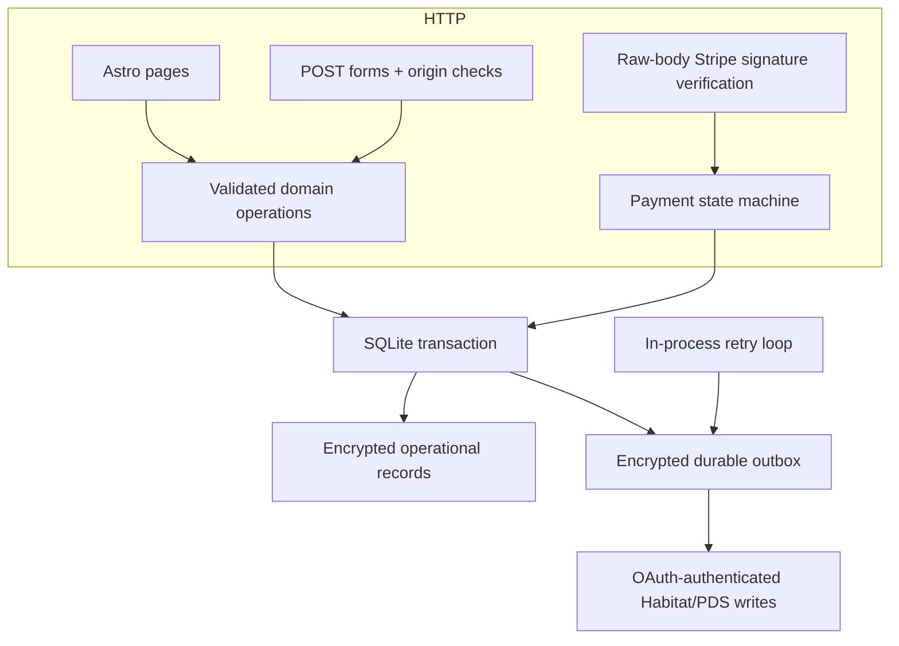
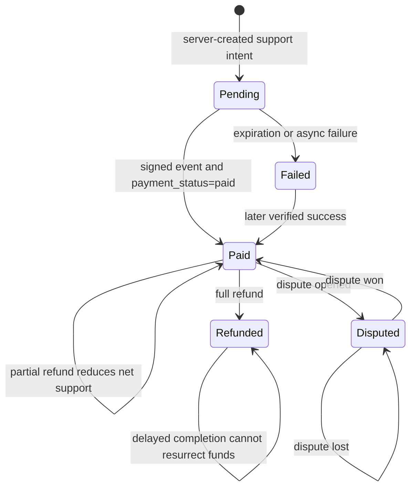
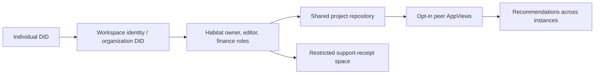

# Architecture 🌿

Feedme separates the HTML experience, domain decisions, provider adapters, and operational persistence. A creator should be able to understand and change the application without adopting a frontend framework.

## Rendering and hosting

Astro compiles components to HTML. There are no hydrated components, React dependencies, client-side routers, or checkout scripts. Navigation and mutations use links and forms. A small homepage calculator previews relative project allocations; the server independently validates and recomputes the submitted split. Native post videos have an optional player that dynamically loads HLS support after a play action. Tailwind compiles at build time, and the illustrations are small inline SVGs. Canonical metadata and server-rendered content are available before any JavaScript could run.

The server performs the operations a static host cannot: OAuth callbacks, session handling, secret-bearing Checkout creation, private reads, and webhook verification. Production consists of one Node process and one durable directory. `scripts/start.mjs` starts the built server and drains the outbox approximately every 30 seconds; completion-based scheduling avoids overlap. The studio can also request an immediate drain.

Authenticated navigation appears on all pages, so HTML currently uses `private, no-store`. Static CSS and media can be served by a CDN. A later read-only public renderer could cache anonymous pages with explicit invalidation. Do not cache a studio response or session-aware page as public HTML.

## Identity

The SDK resolves identities through the configured trusted Habitat host. Its public PDS proxy brokers OAuth with the actual identity provider. The standard Node client handles PKCE, DPoP, discovery, and token refresh. Feedme additionally binds callback completion to an expiring browser nonce. It never accepts a bare `?did=` callback as proof of login.

OAuth state, refresh credentials, the client signing key, app sessions, and local records are persisted with AES-256-GCM in live mode. Opaque session cookies are HttpOnly and Secure over HTTPS. A fixed owner DID in the environment authorizes every studio mutation; display handles do not confer authority. Same-origin POST checks protect cookie-authenticated actions. Logout removes the browser session; the creator’s OAuth grant remains available for background record synchronization.

The current Habitat resolver trusts the Habitat instance’s identity claims. The current broad `transition:generic` grant is isolated in the adapter; replace it with granular permissions once the selected Habitat/PDS combination supports the required space and public record operations reliably.

## Payments

The supporter’s amount is parsed as integer USD cents. Homepage tips can allocate that total across multiple projects in one Checkout; [split support](split-support.md) describes the per-project projections and refund accounting. Hosted Checkout is created on the configured connected account with an idempotency key and a server-persisted intent. Billing details remain with Stripe. The raw-body signature, connected account, amount, currency, mode, and intent reference are checked before updating support. Recurring Checkout binds a subscription without settling support; verified paid invoices produce independent contribution records using the original split and privacy choices. Stripe Customer Portal handles payment-method changes and cancellation. See [recurring support](recurring-support.md). Event IDs deduplicate deliveries inside the same transaction as records and outbox entries. Refund amounts are cumulative; dispute closure cannot be undone by a late opening event.

The success page never writes payment state. The public feed counts only confirmed public support, net of refunds, excluding disputed amounts. Public acknowledgment deletion is best effort across the network; remote copies cannot be recalled.

## Consistency and portability

SQLite is the application’s operational source for rendering and payment reconciliation. Habitat/private space records and public PDS records are asynchronous portable copies. This is a write-through architecture, not a complete bidirectional AppView or remote recovery system. A full re-indexer is future work; until then, back up the database and encryption key.

The outbox coalesces writes by destination, collection, and record key. A revision number prevents an older in-flight write from deleting a newer queued update. Stable record keys make retries safe. Remote delete of an already-absent acknowledgment succeeds. A failure leaves the item in the queue and stops that drain; manual retry and the production loop use the same path. An unavailable Habitat instance does not discard a verified payment.

## Deliberate first-release limits

- One owner, one connected account, USD one-time, monthly, and yearly tips, a single application replica.
- No automatic group payouts, peer indexing, remote import, or Bitcoin checkout.
- Images are HTTPS URLs; uploads and video processing need separate storage and moderation work.
- A shared demo is intentionally editable by anyone using its demo login.
- Operator acceptance of real OAuth and test payments is required before live use. Provider contract fixtures cannot prove service interoperability.

## Evolving toward organizations and federation

Add workspace IDs to authorization and payment ownership before adding multiple members. Finance access must be a Habitat space permission, not just a hidden page. A recommendation should carry both an identity DID and a current HTTPS support URL; DID resolution can later verify the association. Treat remote content as untrusted, and add provenance, block lists, rate limits, and deletion handling before aggregating peers.
