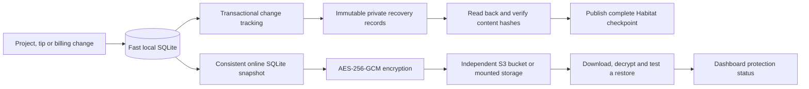
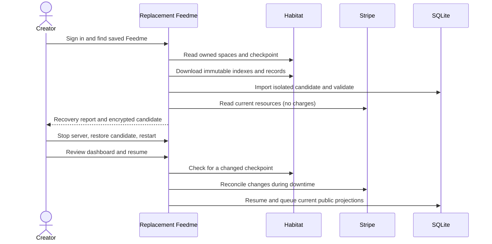

# Backups and recovery 🛟

SQLite serves pages and applies verified payment events. Habitat holds complete private recovery checkpoints. Encrypted, versioned backups protect earlier states against accidental deletion, corruption, and server loss. **Keep one active Feedme server per creator and space.** Habitat recovery is available for checkpoints created by this version; older per-project receipts cannot reconstruct complete billing.



## One-time setup

1. Use Node **24 LTS**, one application replica, and a persistent `DATA_DIR`. Start with `pnpm start` or the Docker image so the background worker runs.
2. Sign in as the creator and connect private Habitat storage in **Settings**. Existing installations backfill complete recovery records on their next sync. New storage setup first checks for an existing saved Feedme and directs you to recovery if one exists.
3. Generate a **separate** backup encryption key:

   ```sh
   node -e "console.log(require('crypto').randomBytes(32).toString('hex'))"
   ```

   Put it in `BACKUP_ENCRYPTION_KEY` and save a copy in a password manager outside this server. This key decrypts complete backups, including their original database encryption key. Keep old backup keys if you rotate it: older files still need their original key. Do not reuse `DATA_ENCRYPTION_KEY`.

4. Configure an S3-compatible destination:

   ```dotenv
   BACKUP_S3_BUCKET=my-private-backups
   BACKUP_S3_PREFIX=feedme/my-creator/
   BACKUP_S3_REGION=us-east-1
   BACKUP_S3_ACCESS_KEY_ID=YOUR_SCOPED_ACCESS_KEY
   BACKUP_S3_SECRET_ACCESS_KEY=YOUR_SECRET
   # Optional for another S3-compatible service:
   BACKUP_S3_ENDPOINT=https://YOUR_STORAGE_ENDPOINT
   BACKUP_S3_PATH_STYLE=false
   ```

   Use a unique prefix for each installation. Scope access to that prefix with `s3:PutObject`, `s3:GetObject`, `s3:ListBucket` and `s3:DeleteObject`. AWS workload credentials can replace the two explicit key variables. The bucket must be private. No infrastructure is provisioned automatically.

   Alternatively set `BACKUP_DIR=/mnt/independent-backups`. A directory on the same VPS protects against some mistakes, **not loss of the VPS**. A network mount needs its own availability and durability guarantees. S3 takes precedence when both are configured.

5. Restart, open **Dashboard → Data & backups**, and choose **Back up now**. Check that a verified backup and complete Habitat checkpoint appear. Leave the worker running: snapshots run about every 15 minutes, retries after failures no more than once a minute, and full remote-checkpoint verification about once a day. The development server does not run a timer; use the buttons or an authenticated `/api/sync` scheduler.

No Habitat, Stripe, or backup operations run in the GitHub Pages demo. Its protection screen is explicitly illustrative.

## What “protected” means

| Indicator | What has been verified |
| --- | --- |
| Awaiting sync | A committed local change still needs remote synchronization. |
| Complete checkpoint | Every referenced private record and index was saved and read back successfully before the checkpoint was published. |
| Full remote verification | The checkpoint and all referenced records were downloaded again, hash-checked, and schema-checked. |
| Verified backup | The stored encrypted file was downloaded byte-for-byte, decrypted, restored into a temporary database, checked with SQLite integrity checks, and all encrypted rows decoded. |

A locally saved change is not automatically protected from server loss. Changes after the last complete checkpoint or snapshot may be lost. New Stripe Checkout sessions wait until the complete allocation/privacy intent has reached a verified checkpoint. Already-running subscriptions continue at Stripe during outages; their renewals are recovered by querying Stripe resources after restoration.

Backups retain the **96 most recent files**, plus one per **30 distinct days** and **12 distinct months**. Retention only runs after a newly written file passes restore verification. A bucket's lifecycle policy may shorten that history; configure it accordingly. S3 versioning/object lock can add independent protection, but Feedme does not configure them or delete noncurrent object versions. Failed retention is reported as a backup error.

Sync and backups serve different purposes. A bad edit can propagate to Habitat; an earlier encrypted snapshot can preserve the previous state. Habitat's immutable data records retain previous values, but only the latest complete checkpoint is advertised. There is currently no automatic Habitat garbage collection or historical-checkpoint browser. Plan private-space retention accordingly.

## Restore from Habitat on a new server

1. **Stop the old writer**, if it still exists. Deploy the same/current Feedme version with your handle, the same `HABITAT_URL`, a fresh `DATA_ENCRYPTION_KEY`, a `BACKUP_ENCRYPTION_KEY` for staging, and Stripe credentials for the same connected account. A new public URL needs a new OAuth sign-in.
2. Sign in as the creator. Open **Data & backups → Find my Feedme**. Choose an owned space with a complete checkpoint. Multiple spaces are shown individually; nothing is silently adopted. Older spaces without checkpoints require a database backup or an upgrade/sync on the original server.
3. Select **Prepare recovery preview**. Feedme imports a separate database, checks record hashes, schema versions, owner/space identities, allocation totals, project/subscription references and share-link mappings, then reads Stripe's current checkout, subscription, invoice, charge/refund and dispute state. This can take time for a large history. It never issues charges or modifies subscriptions.
4. Review the project/payment/subscription counts. Stop the replacement server, then run the exact command displayed on the page:

   ```sh
   pnpm data restore --file /absolute/path/to/candidate.fmbak --owner did:plc:YOUR_DID
   ```

   The command requires the staging backup key and current deployment configuration. It decrypts into a separate file, re-encrypts local values using the destination key, validates again, reconciles Stripe again, retains the stopped previous database, and atomically replaces the main file. It refuses to run while a Feedme process owns that directory.

5. Restart, sign in again, and review the dashboard. **Checkout, publishing and webhooks remain paused.** Choose **Review checks & resume** after confirming the previous writer is stopped. Feedme checks Stripe again and refuses to overwrite a different/newer Habitat checkpoint. A new recovery preview is needed if the remote checkpoint changed. Public projections are then rebuilt from validated records; old queued posts and stale payment projections are not replayed.



Restoration deliberately clears OAuth grants, browser sessions, signing credentials and checkout capabilities. Named supporters can sign in again; anonymous subscribers can use Stripe's own billing-portal/email recovery. Keep Stripe API/webhook secrets in your deployment secret manager. `.env` files, bucket credentials, uploaded external media, DNS, and deployment configuration are not backed up. Images and videos currently remain references to their original hosts.

## Restore an encrypted backup

With the app stopped and deployment variables loaded:

```sh
pnpm data list
pnpm data restore --object feedme-TIMESTAMP-UUID.fmbak --owner did:plc:YOUR_DID
# Or use a previously downloaded file:
pnpm data restore --file /secure/path/snapshot.fmbak --owner did:plc:YOUR_DID
```

`pnpm data backup --owner did:plc:YOUR_DID` also creates and verifies an offline snapshot; normal online backups use the dashboard/worker. CLI commands load `.env` if present. In the Docker image, use `node --import tsx scripts/data.ts ...` in a **one-off container with the same data volume and secrets, after stopping the application container**. Do not execute restoration inside a running application container.

The original row encryption key is sealed inside the backup. The separate `BACKUP_ENCRYPTION_KEY` therefore restores a snapshot even if the original row key was lost, and values are re-encrypted using the new server's `DATA_ENCRYPTION_KEY`. Without the backup key, an encrypted file cannot be restored; authenticated Habitat recovery may still work.

The previous database is retained under `DATA_DIR/recovery/previous-*.sqlite` with its **old** row key. It is a local rollback copy, not an independent backup; retain that key if keeping the file. If the existing database is too corrupt to open/checkpoint, preserve its main file **and WAL/SHM sidecars** outside the active data directory before restoring. Do not copy only the main file of a running WAL database.

An older backup can lack intents for payments created afterwards. Stripe cannot reconstruct private allocation and consent details; recovery fails closed instead of inventing them. Use a newer checkpoint/snapshot. Stripe reconciliation scans resources rather than relying on webhook replay: the [Events list API only retains 30 days](https://docs.stripe.com/api/events/list).

## Implementation and boundaries

- Transactional SQLite triggers track inserts, updates and deletes for an explicit allowlist of logical records and settings. Credentials, sessions and caches are excluded from Habitat.
- `fund.feedme.recovery` records are immutable and addressed by the SHA-256 of canonical JSON. They contain versioned, locally validated domain data, including full root payments, allocation/activity IDs, Checkout/payment/invoice/account/subscription links, drafts and share mappings.
- `fund.feedme.recoveryIndex` shards list at most 500 immutable record keys. `fund.feedme.checkpoint/self` references those shards and commits to the count and sorted logical-key/content-hash inventory. The former complete checkpoint remains usable if a write fails midway. Retries reuse the exact pending checkpoint, including its timestamp.
- Public records still use separate explicit projection allowlists. Recovery records and financial receipts are rejected by the public outbox boundary. Habitat is permissioned storage, **not end-to-end encryption**; its host can read these private records.
- Import reads explicit record keys rather than relying on `listRecords` pagination that the reviewed Habitat implementation ignores. `listSpaces` cursors are bounded and repeated cursors rejected. A saved checkpoint is the authority for membership in a recovery snapshot, not every historical record in a space.
- Local sync receipts persist hashes, provider CIDs and timestamps. Immutable recovery writes are read back. Unexpected checkpoint edits cause a conflict; daily verification pauses an unchanged local checkpoint if another writer replaced it. This is detection, **not distributed fencing**: the current Habitat API has no compare-and-swap. Never run two writers for the same space, even on different disks/hosts.
- An exclusive SQLite transaction on a separate sentinel file prevents simultaneous normal app/restore access to one data directory. The operating system releases it after process exit, including a forced container shutdown; no stale PID file needs clearing. Never delete the sentinel file while a writer is running. Use a filesystem with working SQLite locks. This cannot fence separate data volumes, old app versions or external tools that ignore the lock.
- Built-in limits: 256 MiB SQLite snapshots, 64 MiB logical Habitat recovery, 100,000 logical records and 100,000 scanned Stripe resources. Recovery fails visibly at these limits. For larger installations, extend and load-test these paths or use an independent SQLite backup tool.
- No incremental remote-edit ingestion or multi-master merge is implemented. Private snapshots include local copies of public project/profile/update records; arbitrary edits made directly on the public PDS are not automatically merged into SQLite. Bluesky posts and follows continue to live on AT Protocol.
- Real Habitat OAuth/private-space behavior and S3 storage permissions still require operator acceptance. Fixture tests do not establish provider interoperability.

The adapters were checked against [Habitat's pinned API contracts](https://github.com/habitat-network/habitat/tree/85654a07dec6931925763e66c835f65d0cdf1e30/lexicons/network/habitat/space), [Node's SQLite online backup API](https://nodejs.org/api/sqlite.html#sqlitebackupsource-db-path-options), and [SQLite's backup semantics](https://sqlite.org/backup.html). The backup API requires Node 22.16+ or 23.8+; Node 24 LTS is recommended.

## Verification checklist

- [x] Transaction rollback also rolls back private change tracking; credentials never enter a Habitat snapshot.
- [x] Interrupted writes preserve the previous complete checkpoint; lost responses retry without self-conflicts.
- [x] Corruption, missing records, incorrect owners and malformed/partial inventories fail recovery.
- [x] Backup round trip includes WAL commits and re-encrypts records using a new row key.
- [x] Wrong keys, corrupted ciphertext and existing destination files are rejected.
- [x] Failed readback never starts retention; recent/daily/monthly retention is tested.
- [x] Stripe recovery finds missing bindings, preserves allocation/consent, applies refunds/disputes, reconstructs a renewal once, and honors cancellation without issuing charges.
- [x] Paused recovery rejects checkout, billing mutations and webhooks; creator-only recovery remains available.
- [x] The offline CLI refuses an active writer, preserves the previous database, and leaves the original intact on failure.
- [x] A forced process exit releases the writer lock automatically; restart and restoration succeed afterwards.
- [ ] Real Habitat sign-in, space permissions, checkpoint download and clean-server restore.
- [ ] Real S3-compatible provider upload/readback, scoped permissions, retention and recovery-key drill.
- [ ] Stripe test-mode recovery after lost webhook delivery and multiple missed renewals.
