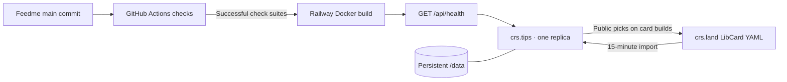

# Christopher’s Feedme deployment

As of **2026-10-07**, the personal Feedme backend is running on Railway using the real `crs48/LIBCard` catalog. Its canonical address is **https://crs.tips**; Railway has verified the domain and issued its HTTPS certificate. The separate **https://crs.land** LibCard remains on its current host.

The [short DNS guide](crs-tips-dns.md) records the Vercel ALIAS and verification records. Some local resolvers may temporarily retain the previous Vercel addresses.

## Automatic deployment

The `crs-tips` Railway service is connected to `crs48/feedme`, branch `main`, with **Wait for CI enabled**. Railway builds successful main commits with the repository Dockerfile. No additional GitHub deployment token or duplicate deploy workflow is needed. GitHub’s existing [Check Feedme](../.github/workflows/ci.yml) workflow checks types, tests, static export, LibCard contracts, deployment packaging, and the container.



Railway waits for GitHub Actions check suites on the commit, not just individual jobs. Failed workflows skip the deploy. Inspect deployment status and the deployed commit after a merge; a green GitHub check alone does not prove deployment success. [Railway autodeploy documentation](https://docs.railway.com/deployments/github-autodeploys).

This automatic tracking of `main` is specific to Christopher’s instance. Other self-hosters can continue using numbered releases. Disable autodeploy before an upgrade that requires manual migration or restore work; preserve a verified backup and use the [release procedures](releases.md).

## Resources

[Open the Railway service](https://railway.com/project/20a3c02a-2960-458b-9e67-187bef03bd43/service/5b273103-7f29-45aa-a5e5-6a97a0ba3860?environmentId=da0ff641-b2cf-4ee4-af5e-a41777b80e44).

| Resource | Value |
| --- | --- |
| Project | `feedme` · `20a3c02a-2960-458b-9e67-187bef03bd43` |
| Environment | `production` · `da0ff641-b2cf-4ee4-af5e-a41777b80e44` |
| Service | `crs-tips` · `5b273103-7f29-45aa-a5e5-6a97a0ba3860` |
| Volume | `crs-tips-volume` · `f2efd504-e33b-4ad5-ae0f-e4a22b8f1e06`, mounted at `/data` |
| Replicas | One; sleeping disabled for background synchronization |
| HTTP | Port `4321`, health check `/api/health` |
| Diagnostic address | `https://crs-tips-production.up.railway.app` |

The diagnostic address serves the application, but forms and OAuth are bound to `https://crs.tips`. Use the canonical address for sign-in and support once DNS/TLS are ready.

The following non-secret configuration is already saved in Railway:

```dotenv
FEEDME_MODE=live
PUBLIC_URL=https://crs.tips
BLUESKY_HANDLE=crs.land
LIBCARD_REPO=crs48/LIBCard
LIBCARD_REF=main
DATA_DIR=/data
HOST=0.0.0.0
PORT=4321
HABITAT_URL=https://pear.habitat.network
TIP_AMOUNTS=11,22,44,88
BACKUP_DIR=/data/backups
```

Independent `DATA_ENCRYPTION_KEY` and `BACKUP_ENCRYPTION_KEY` values were generated and stored directly in Railway, without printing or committing them. Save both in your password manager. Never regenerate them during a redeploy: existing encrypted data depends on them.

Local encrypted backups are configured on the same persistent volume. They help recover local changes but do not survive loss of that volume. Configure an off-server S3-compatible destination and verify restore before accepting payments; [data recovery](backups-and-recovery.md) describes the process.

## Verified and remaining

- [x] First Railway deployment reached `SUCCESS` for `ecd2ea6` (`88934f91-8d23-47fa-a93c-b11f55130af3`).
- [x] Diagnostic health endpoint returns HTTP 200, app version `0.1.0`, database schema `2`.
- [x] Homepage imports Christopher’s real name and LibCard links.
- [x] Public LibCard endpoint returns HTTP 200, canonical `https://crs.tips`, and public caching.
- [x] Unauthenticated Studio access redirects to sign-in; this is live identity mode, not a shared editable demo.
- [x] Main-branch deployment trigger has `checkSuites: true`; one replica and persistent volume are configured.
- [x] Verify custom-domain DNS and Railway’s active HTTPS certificate.
- [x] Verify the canonical LibCard GET/HEAD contract over TLS using the current public DNS address. The local resolver still caches the previous Vercel addresses; the ordinary `pnpm check:libcard-origin https://crs.tips` command should be rerun after that cache expires.
- [ ] Sign in as `crs.land`, create private Habitat storage, and verify recovery.
- [ ] Configure restricted Stripe sandbox credentials in an isolated installation, complete webhook setup, and run [payment acceptance](hosting.md#live-acceptance-checklist).
- [ ] Back up the encryption keys separately; configure and test off-server backups.
- [ ] Optionally add card-side tip actions: use the existing target IDs shown in Feedme Studio as LibCard `feedme.id` values, enable its `feedme` block pointing to `https://crs.tips`, refresh Feedme, then rebuild LibCard.

Feedme now includes all LibCard links and socials as selectable targets by default, even without source `feedme` objects. Hide exceptions in Studio. `LIBCARD_DEFAULT_SUPPORT=explicit` restores the older behavior where this catalog initially contained only `creator`. No aspirations or support totals are invented. Stripe credentials and private Habitat storage are not configured, so the server cannot issue a charge-capable checkout yet. DNS activation does not by itself enable payments.

### Personal Stripe account configuration

The `crs-tips` production service uses `STRIPE_MODE=own-account` and `STRIPE_ENVIRONMENT=live`. Set `STRIPE_ACCOUNT_ID` to the live account owning its restricted key. Store `STRIPE_SECRET_KEY` and the **Your account** webhook's `STRIPE_WEBHOOK_SECRET` only in Railway Variables. The account-mode code is covered by automated tests; completing provider sandbox acceptance still requires its separate credentials and recovery space. See [Stripe setup](stripe-setup.md).
