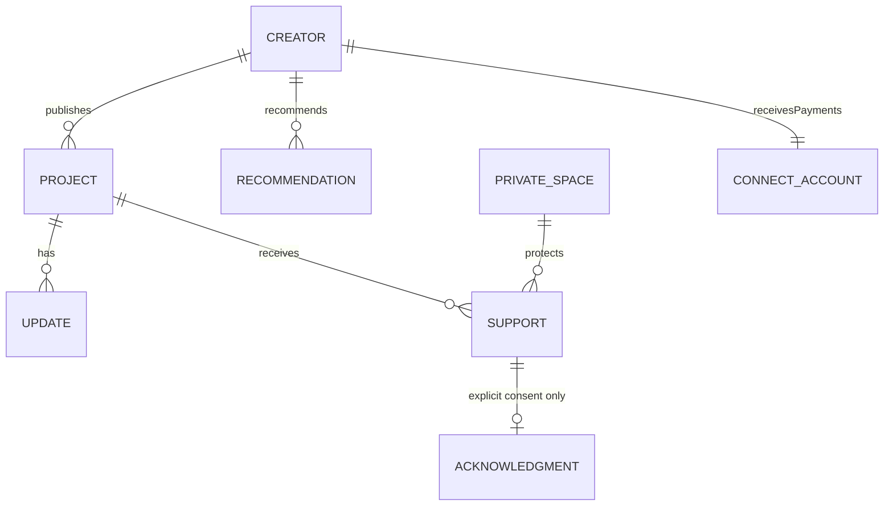
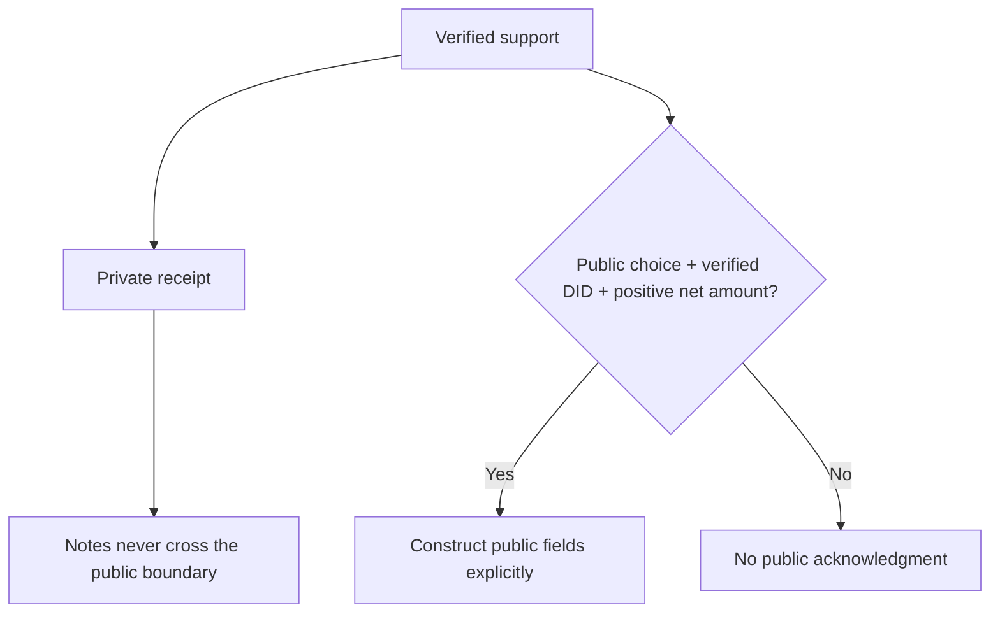

# Data model and Habitat contracts

Reviewed against Habitat revision [`85654a07dec6931925763e66c835f65d0cdf1e30`](https://github.com/habitat-network/habitat/tree/85654a07dec6931925763e66c835f65d0cdf1e30), using `@habitat-network/habitat` **0.1.0**. Habitat labels its repository as under active development. Pin and validate upgrades deliberately.

## Record locations

| Collection | Location | Fields and meaning |
| --- | --- | --- |
| `social.feedme.profile` / `self` | Public PDS | Creator display name, handle, biography, location, website |
| `social.feedme.project` | Public PDS | Title, summary, body, category, project/ongoing kind, status, aspiration, image/link, creation time |
| `social.feedme.update` | Public PDS | Project key, text, creation time |
| `social.feedme.recommendation` | Public PDS | Friend name, optional DID, support URL, explanation |
| `social.feedme.acknowledgment` | Public PDS, explicit consent only | Creator DID, project AT URI, supporter DID, net amount, currency, timestamp |
| `social.feedme.support` | Habitat permissioned space only | Project key, gross amount, visibility, optional supporter DID, note, payment state, refund/dispute state, payment intent reference |
| `app.bsky.feed.post` | Public PDS, separate explicit creator opt-in | Short update with an external project link card |
| Credentials, sessions, Connect account, checkout state, subscription/customer/invoice references, webhook IDs | Local encrypted operational store | Provider-specific operational details; never public records |

`social.feedme.receipts` identifies the private space modality. All `social.feedme.*` identifiers are draft names, not a claim of domain ownership or registered lexicon discovery. The JSON schemas under `lexicons/` are validated using the AT Protocol Lexicons library in tests.

DIDs identify people; handles are display values that can change. Amounts are integers in USD cents. A target is an aspiration and does not gate payout. Ongoing buckets such as rent or writing use the same project model with `kind=ongoing`; this does not imply a recurring subscription.

## Implemented Habitat interface

1. Pass `new HabitatIdentityResolver(HABITAT_URL)` to `NodeOAuthClient`.
2. Restore the authenticated owner session and call its `fetchHandler` so DPoP and refresh remain under the maintained SDK.
3. Create private storage with `network.habitat.simplespace.createSpace`, the owner DID, the receipts modality, `policy=member-list`, and the currently supported open app policy. User membership still restricts access; “open” here is app access, not public user access.
4. Persist the actual returned space URI. Habitat can be the space authority; do not construct a URI assuming the creator is the authority.
5. Write private records using `network.habitat.space.putRecord` with `{space, repo, collection, rkey, record}`. Omit `validate`, which the reviewed implementation does not support. Validate Feedme records locally.
6. Write public records using `com.atproto.repo.putRecord` through the resolved PDS proxy. Use `deleteRecord` to remove consented acknowledgments when net support becomes zero.

The proposal’s `com.atproto.space.*` endpoints are not substituted for the implemented Habitat namespace. Private records do not go on the ordinary public repo or firehose. Failure to write private storage leaves a durable retry item and never falls back to public storage.

## Privacy projections

An anonymous receipt omits the supporter DID even if an upstream object accidentally contains it. A public acknowledgment never contains notes, checkout IDs, payment intent IDs, connected accounts, or billing details. Public totals omit anonymous/private tips entirely. The operator and Habitat host can access plaintext as part of service operation; this is access-controlled storage, not end-to-end encryption.

## Sources

- [Habitat identity and proxy integration](https://github.com/habitat-network/habitat/blob/85654a07dec6931925763e66c835f65d0cdf1e30/api-docs/docs/space-proxy/getting-started.mdx)
- [Implemented endpoints and deviations](https://github.com/habitat-network/habitat/blob/85654a07dec6931925763e66c835f65d0cdf1e30/api-docs/docs/space-proxy/endpoints.mdx)
- [Space create schema](https://github.com/habitat-network/habitat/blob/85654a07dec6931925763e66c835f65d0cdf1e30/lexicons/network/habitat/simplespace/createSpace.json)
- [Private record write schema](https://github.com/habitat-network/habitat/blob/85654a07dec6931925763e66c835f65d0cdf1e30/lexicons/network/habitat/space/putRecord.json)
- [AT Protocol data model](https://atproto.com/specs/data-model)

## Social and project-log records

See [social protocol](social-protocol.md) for actor-owned native follows, project subscriptions, and explicit tip posts. See [project content](project-content.md) for Markdown descriptions, native post associations, media rendering, and `social.feedme.activity` timeline projections. Anonymous activity requires separate consent and includes only project and date; private receipts never become public records.
