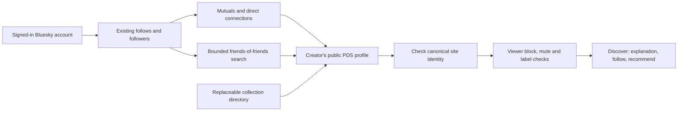

# Discovering the Feedme network

Feedme uses the `fund.feedme` namespace, controlled by **feedme.fund**. Profiles, projects, and recommendations belong in each author's public AT Protocol repository. Receipt notes, payment details, and private support relationships never participate in discovery.

## For creators

1. Set `BLUESKY_HANDLE` to your account and complete live sign-in.
2. In **Dashboard → Settings**, import your Bluesky profile and leave **List my profile in Feedme discovery** checked.
3. Save the profile or publish a project. Both queue `fund.feedme.profile/self` with your configured HTTPS `PUBLIC_URL` as `feedmeUrl`. Public project publication and the profile marker are committed atomically.
4. Production background sync publishes the records; **Sync records** verifies an initial write. Discovery starts after the PDS write, not from a local draft or Checkout redirect.
5. Your instance serves `/.well-known/feedme` with its configured DID and canonical origin. Discovery checks that this matches the profile's repository owner before displaying its payment-site link.

Clearing the discovery checkbox publishes `discoverable: false`. Compliant clients stop listing it after their cache expires (five minutes here). The profile and previously copied records remain public; this preference is not private storage or retroactive erasure. Saving a draft alone does not publish a discovery marker.

## Finding people



`/discover` offers Your network, Mutuals, Following, Followers, Friends of friends, Explore, and direct handle/DID search. Suggestions do not create follows or endorsements. Every follow uses the acting account's OAuth grant and native `app.bsky.graph.follow` records.

- Direct discovery reads at most 1,000 follows and 1,000 followers per scan, paginating Bluesky's graph API. Incomplete scans are labeled. Candidates are checked 24 at a time; **Check next 24 accounts** continues the candidate list.
- Friends of friends reads up to six followed accounts per circle, prioritizing mutuals, and the first 100 follows of each. **Search next circle** continues across your follows. It says *Followed by…*, not *Recommended by…*: following someone is not an endorsement. Counts describe this bounded search, not an exhaustive network-wide count.
- Explore uses `com.atproto.sync.listReposByCollection` for `fund.feedme.profile`, 24 repositories per page. `DISCOVERY_RELAY_URL` defaults to `https://relay1.us-east.bsky.network`; an operator may choose another supporting relay. The relay is a discovery source, not the authority for profile data. Coverage can be incomplete or delayed.
- A known DID is resolved to its current PDS. Handle lookup uses Bluesky's public identity endpoint. A typed handle does not grant administration rights.
- Valid public profiles, PDS endpoints, and viewer-specific graph snapshots are cached for five minutes; explicit `RecordNotFound` results for one minute. Provider failures are not cached as absence.
- Before showing suggestions, Feedme hydrates profiles in the viewer's Bluesky context. Blocked, blocking, muted, or hidden/explicitly labeled accounts are excluded. Failed visibility checks withhold suggestions. Anonymous Explore applies public label checks but has no personal mute/block context.
- Custom PDS and Feedme-site requests require public HTTPS endpoints. DNS results are checked and pinned to the connection, redirects are rejected, and response size/time are bounded. No discovery request is made to a private IP, metadata service, or credential-bearing URL.

This release queries the existing relay and public repositories directly; it does not require each installation to run a full firehose indexer. A future shared indexer can use Tap's collection signaling, backfill, and verified updates. It must remain replaceable. Public discovery cannot guarantee a complete instantaneous list of every isolated PDS.

## Portable recommendations

**Recommend this creator** appears on creator pages, project pages, after a confirmed tip, and on discovery cards. The user reviews an explanation and explicitly confirms publication. `fund.feedme.recommendation` lives in the recommender's PDS; its `did` field identifies the recommended creator. The server obtains the name and canonical URL from that creator's validated profile, rather than trusting form-supplied URLs.

Returning to an existing recommendation updates its record. Removing it deletes matching canonical and legacy records from the actor's repository. **Your recommendations** allows removal even when the target site is offline. The host creator's circle only changes for the creator's own recommendations, not for visitors'. The existing background sync refreshes public circles from the creator's PDS approximately once per minute; homepage rendering uses the last successful local snapshot, so recommendations made through another client appear on their own site; pending local edits take precedence.

When the signed-in recommender has their own discoverable Feedme, **Recommend on my Feedme** hands off only the target DID to their canonical site. That site requires its own login session and a fresh confirmation. Credentials, cookies, payment amounts, and private tip notes are not forwarded. A recommendation is separate from a Bluesky post and does not automatically appear in the Bluesky timeline.

## Official schema publication

The authority account is pinned to the DID resolved from **@feedme.fund** on 2026-09-27:

```text
did:plc:vbaugrge5ekw4tlghov4ydhi
```

The domain currently uses Vercel DNS. Add:

| Name | Type | Value |
| --- | --- | --- |
| `_lexicon` on `feedme.fund` | TXT | `did=did:plc:vbaugrge5ekw4tlghov4ydhi` |

On a live HTTPS Feedme instance, sign in as **@feedme.fund**, visit `/protocol`, review the nine schemas, and choose **Publish official schemas**. Each is written to `com.atproto.lexicon.schema` with its NSID as the record key. Only the pinned authority DID may perform this action; being an instance administrator is insufficient. Repeat publication is an upsert at the same record keys. Other creators need neither this account nor DNS access.

Schema JSON is available under `/lexicons/fund.feedme.profile.json` and equivalent paths. Local schema files and a publication button are not proof of DNS/PDS publication. Verify both before announcing protocol resolution as live:

```sh
dig +short TXT _lexicon.feedme.fund
```

Resolve the authority's current PDS and read `com.atproto.lexicon.schema/fund.feedme.profile`; it must contain the checked-in schema. No automatic bot reply or mention-to-project ingestion is included in this discovery change.

## Migration from the prototype

The one-time database migration republishes locally known public profiles, published projects, recommendations, and updates under `fund.feedme.*`. It strips unrecognized fields with explicit schemas and never publishes drafts. Newly initialized installations wait for a profile save or project publication.

Existing `social.feedme.project` records are left in place for old AT links. Project follows read both namespaces, identify the same creator/project pair, and remove matching follows from their original collections. Project feeds recognize both generations of hashed tags. Only canonical collections receive new follows and projects. Old project records are compatibility snapshots; they are not kept as the authoritative changing record.

Old public payment acknowledgments and activities are queued for deletion so refunds cannot leave stale visible amounts in the prototype namespace. Their canonical replacements use the existing consent allowlists. The stored Habitat space URI is retained, including a legacy modality URI; no new private space is silently adopted. Existing private records are not moved into public repositories. Take a normal encrypted database backup before updating a live instance, and keep sync running until the migration queue drains.

## Sources

- [AT Protocol Lexicon authority and publication](https://atproto.com/specs/lexicon)
- [Collection discovery API](https://github.com/bluesky-social/atproto/blob/main/lexicons/com/atproto/sync/listReposByCollection.json)
- [Bluesky follows](https://github.com/bluesky-social/atproto/blob/main/lexicons/app/bsky/graph/getFollows.json) and [followers](https://github.com/bluesky-social/atproto/blob/main/lexicons/app/bsky/graph/getFollowers.json)
- [Tap collection discovery and backfill](https://github.com/bluesky-social/indigo/blob/main/cmd/tap/README.md)
