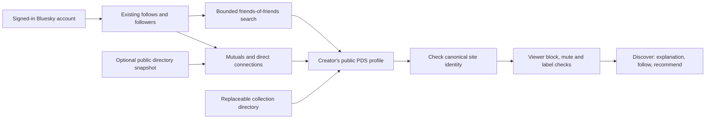

# Discovering the Feedme network

Feedme uses the `fund.feedme` namespace, controlled by **feedme.fund**. Profiles, projects, and recommendations belong in each author's public AT Protocol repository. Receipt notes, payment details, and private support relationships never participate in discovery.

## For creators

1. Set `BLUESKY_HANDLE` to your account and complete live sign-in.
2. In **Dashboard → Settings**, import your Bluesky profile and leave **List my profile in Feedme discovery** checked.
3. Review the displayed DID and HTTPS address, then choose **Save & publish profile**. This atomically saves the local profile and queues `fund.feedme.profile/self` with your configured `PUBLIC_URL` as `feedmeUrl`. Importing a profile, signing in, restarting, restoring, or publishing a project alone does not announce a site.
4. Production background sync publishes through Habitat’s Space Proxy using the public PDS API. **Sync records** can send the queued change immediately. Settings distinguishes **Awaiting sync**, **Published to your PDS**, and **Found in directory**. Publication compares the reviewed record CID before writing, so a newer remote preference or address cannot be silently overwritten.
5. Your instance serves `/.well-known/feedme` with its configured DID, canonical origin, profile URI, and live/demo mode. The directory verifies the reciprocal PDS/site declaration during its next successful scan. Explicit demos are excluded. A website check is neither a payment-readiness check nor an endorsement.
6. Once published, **Share your Feedme** opens a suggested `#Feedme` launch post in Bluesky’s composer for your review. Nothing is posted automatically.

Clearing the discovery checkbox publishes `discoverable: false`. Personal-instance clients recheck after their five-minute cache expires. The official directory removes it on the next successful observation/build; scheduled jobs can be delayed. An unchanged static deployment and previously downloaded exports cannot revoke old public copies. The profile and previously copied records remain public; this preference is not private storage or retroactive erasure. A different advertised address or a previously disabled listing requires explicit confirmation in Settings. If the remote profile cannot be read, publication waits until it can be checked.

## Finding people



`/discover` offers Your network, Mutuals, Following, Followers, Friends of friends, Explore, and direct handle/DID search. Suggestions do not create follows or endorsements. Every follow uses the acting account's OAuth grant and native `app.bsky.graph.follow` records.

- Direct discovery reads at most 1,000 follows and 1,000 followers per scan, paginating Bluesky's graph API. Incomplete scans are labeled. Candidates are checked 24 at a time; **Check next 24 accounts** continues the candidate list.
- Friends of friends reads up to six followed accounts per circle, prioritizing mutuals, and the first 100 follows of each. **Search next circle** continues across your follows. It says *Followed by…*, not *Recommended by…*: following someone is not an endorsement. Counts describe this bounded search, not an exhaustive network-wide count.
- Explore starts with candidate DIDs from the optional public snapshot, then continues through `com.atproto.sync.listReposByCollection` for `fund.feedme.profile`, 24 repositories per page. Snapshot URLs are never accepted as payment-site authority; each candidate goes through the normal PDS/site and viewer-visibility checks. `DISCOVERY_RELAY_URL` defaults to `https://relay1.us-east.bsky.network`; an operator may choose another supporting relay. The relay is a discovery source, not the authority for profile data. Coverage can be incomplete or delayed.
- A known DID is resolved to its current PDS. Handle lookup uses Bluesky's public identity endpoint. A typed handle does not grant administration rights.
- Valid public profiles, PDS endpoints, and viewer-specific graph snapshots are cached for five minutes; explicit `RecordNotFound` results for one minute. Provider failures are not cached as absence.
- Before showing suggestions, Feedme hydrates profiles in the viewer's Bluesky context. Blocked, blocking, muted, or hidden/explicitly labeled accounts are excluded. Failed visibility checks withhold suggestions. Anonymous Explore applies public label checks but has no personal mute/block context.
- Custom PDS and Feedme-site requests require public HTTPS endpoints on port 443. DNS results are checked and pinned to the connection, redirects are rejected, and response size/time are bounded. No discovery request is made to a private IP, metadata service, or credential-bearing URL.

This release queries the existing relay and public repositories directly; it does not require each installation to run a full firehose indexer. A future shared indexer can use Tap's collection signaling, backfill, and verified updates. It must remain replaceable. Public discovery cannot guarantee a complete instantaneous list of every isolated PDS.

## The public creator directory

[feedme.fund/creators/](https://feedme.fund/creators/) lists real, discoverable creators. The separate `/demo/discover/` community remains fictional. Static cards and pagination work without JavaScript; a small enhancement searches names, handles, and websites across all pages. Avatars come from each creator's DID-matched Bluesky profile and use only its HTTPS CDN avatar endpoint. Initials remain as a fallback for missing, labeled, or unavailable images; the fictional demo still uses local images.

The [nightly collector](../scripts/collect-directory.ts) enumerates candidate DIDs from the relay, rechecks previously known accounts, and accepts optional DID-only [bootstrap hints](../directory/README.md). It resolves each current PDS, reads `fund.feedme.profile/self`, checks public Bluesky moderation, verifies current handles in both directions, and fetches the matching website declaration. No creator’s database, private Habitat space, graph, or payment data is read.

The [public JSON export](https://feedme.fund/directory/v1.json) contains only allowlisted profile fields and observation times. Sites that fail verification lose their outbound link. Confirmed opt-outs, missing records, identity mismatches, explicit demos, and suppressed accounts disappear from the next export. Provider failures keep old timestamps, remove active links, and mark coverage partial. Listings expire if discovery consent has not been checked for seven days; site checks older than 48 hours are marked stale. JavaScript also removes expired website links when an old static page is opened. Without JavaScript, absolute check times remain visible; an undeployed static page cannot update itself.

Current limits are 5,000 retained candidate DIDs, 1,000 creator checks, five relay pages of 200 candidates, four workers, one in-flight request per origin, five seconds per request, and ten minutes per run. New and previously known candidates share the budget. A 429 or 503 cools that provider for the rest of the run; the next scheduled run retries. Profile/declaration reads are capped at 64 KiB and exported JSON at 2 MB. Retained state is capped at 15 MB, below the 16 MB restore limit; oversized observations are reduced to DID/retry bookkeeping and coverage is marked partial. Capacity and scan failures produce partial-coverage notices. These are bounds, not measured capacity guarantees; a live index remains optional.

The Pages workflow retains public collector state for seven days as a workflow artifact and restores it only from a successful run of its trusted default-branch workflow. Missing/expired state starts a bounded cold scan. Names and bios are not committed into Git history. Maintainer-reviewed suppression DIDs and the report route live in [directory policy](../directory/README.md). Public directories apply public labels; personal blocks and mutes require the viewer’s session on their chosen instance.

Personal instances default to `DIRECTORY_URL=https://feedme.fund/directory/v1.json`. Set `DIRECTORY_URL=off` to disable it or supply another public HTTPS snapshot URL. Snapshots must match schema version 1 and be under 48 hours old; they are cached for five minutes. The server downloads the same public file for everyone and performs connection matching locally. No viewer identity or follow list is sent to the directory. Direct lookup, relay discovery, and graph scans remain available during directory outages.

Bluesky itself does not provide a Feedme membership search filter. The optional launch post makes the creator’s link searchable through normal posts and `#Feedme`; a hashtag or mention is never proof of membership. We do not run a custom Bluesky feed or `profiles.feedme.fund` service in this release. See the [implementation plan and remaining live checks](plans/creator-directory/README.md).

Reciprocal declarations establish a public PDS/site claim over HTTPS, not independent repository-signature verification or continuous control of a domain. A new domain owner could copy an old declaration while the PDS still advertises it; directory verification cannot detect that case.


## Portable recommendations

**Recommend this creator** appears on creator pages, project pages, after a confirmed tip, and on discovery cards. The user reviews an explanation and explicitly confirms publication. `fund.feedme.recommendation` lives in the recommender's PDS; its `did` field identifies the recommended creator. The server obtains the name and canonical URL from that creator's validated profile, rather than trusting form-supplied URLs.

Returning to an existing recommendation updates its record. Removing it deletes matching canonical and legacy records from the actor's repository. **Your recommendations** allows removal even when the target site is offline. The host creator's circle only changes for the creator's own recommendations, not for visitors'. The existing background sync refreshes public circles from the creator's PDS approximately once per minute; homepage rendering uses the last successful local snapshot, so recommendations made through another client appear on their own site; pending local edits take precedence.

When the signed-in recommender has their own discoverable Feedme, **Recommend on my Feedme** hands off only the target DID to their canonical site. That site requires its own login session and a fresh confirmation. Credentials, cookies, payment amounts, and private tip notes are not forwarded. A recommendation is separate from a Bluesky post and does not automatically appear in the Bluesky timeline.

## Official schema publication

The authority account is pinned to the DID resolved from **@feedme.fund** on 2026-09-27:

```text
did:plc:vbaugrge5ekw4tlghov4ydhi
```

The domain currently uses Vercel DNS. Add:

| Name | Type | Value |
| --- | --- | --- |
| `_lexicon` on `feedme.fund` | TXT | `did=did:plc:vbaugrge5ekw4tlghov4ydhi` |

On a live HTTPS Feedme instance, sign in as **@feedme.fund**, visit `/protocol`, review the nine schemas, and choose **Publish official schemas**. Each is written to `com.atproto.lexicon.schema` with its NSID as the record key. Only the pinned authority DID may perform this action; being an instance administrator is insufficient. Repeat publication is an upsert at the same record keys. Other creators need neither this account nor DNS access.

Schema JSON is available under `/lexicons/fund.feedme.profile.json` and equivalent paths. Local schema files and a publication button are not proof of DNS/PDS publication. Verify both before announcing protocol resolution as live:

```sh
dig +short TXT _lexicon.feedme.fund
```

Resolve the authority's current PDS and read `com.atproto.lexicon.schema/fund.feedme.profile`; it must contain the checked-in schema. No automatic bot reply or mention-to-project ingestion is included in this discovery change.

## Migration from the prototype

The one-time database migration republishes locally known published projects, recommendations, and updates under `fund.feedme.*`. It strips unrecognized fields with explicit schemas and never publishes drafts. Profiles require a deliberate save in Settings. After upgrading or restoring, review the current PDS address and discovery preference there before republishing. Any old queued profile without a reviewed record version remains unsent with a Settings review message; saving replaces that queue entry. This protects remote opt-outs and a newer canonical site from a restored database.

Existing `social.feedme.project` records are left in place for old AT links. Project follows read both namespaces, identify the same creator/project pair, and remove matching follows from their original collections. Project feeds recognize both generations of hashed tags. Only canonical collections receive new follows and projects. Old project records are compatibility snapshots; they are not kept as the authoritative changing record.

Old public payment acknowledgments and activities are queued for deletion so refunds cannot leave stale visible amounts in the prototype namespace. Their canonical replacements use the existing consent allowlists. The stored Habitat space URI is retained, including a legacy modality URI; no new private space is silently adopted. Existing private records are not moved into public repositories. Take a normal encrypted database backup before updating a live instance, and keep sync running until the migration queue drains.

## Sources

- [AT Protocol Lexicon authority and publication](https://atproto.com/specs/lexicon)
- [Collection discovery API](https://github.com/bluesky-social/atproto/blob/main/lexicons/com/atproto/sync/listReposByCollection.json)
- [Bluesky follows](https://github.com/bluesky-social/atproto/blob/main/lexicons/app/bsky/graph/getFollows.json) and [followers](https://github.com/bluesky-social/atproto/blob/main/lexicons/app/bsky/graph/getFollowers.json)
- [Tap collection discovery and backfill](https://github.com/bluesky-social/indigo/blob/main/cmd/tap/README.md)
