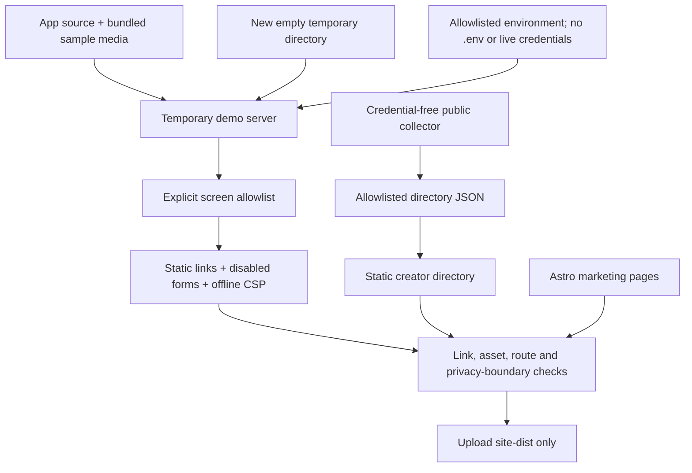

# Product site, creator directory, and static demo

The official Pages site is **https://feedme.fund**. It introduces the product, links to setup instructions, and lets visitors browse the creator, project, social, billing, support-card, and studio screens. All identities, notes, and payment records under `/demo/` are fictional. `/creators/` is a separate real public directory, with a versioned export at `/directory/v1.json`. It requires no server on Pages.

The [LibCard overview](https://feedme.fund/libcard/) explains opted-in links, picks, unconditional tips, and public statistics with a labeled fictional example. The [connection guide](https://feedme.fund/libcard/setup/) covers configuration in both repositories, aspirations, refreshes, and verification. Both are static, accessible from the homepage and mobile navigation, and ship no JavaScript or provider requests. They explain the integration without activating a live checkout on Pages. Technical details remain in [the LibCard reference](libcard.md).

## Build and preview

Use Node 24 and pnpm 10.11.1:

```sh
pnpm install --frozen-lockfile
pnpm check
pnpm test
pnpm build:site
pnpm preview:site
```

Ordinary builds do not contact the network and show a waiting-for-first-scan directory. To supply real public observations, collect separately:

```sh
pnpm directory:collect
DIRECTORY_SNAPSHOT_PATH=output/directory/snapshot.json pnpm build:site
# Future scans can preserve candidates and the scan cursor:
pnpm directory:collect --previous output/directory/state.json
```

The collector also accepts `--relay`, `--policy`, and `--output`. Outputs under ignored `output/` are schema-validated public JSON, not application backups. Do not point these options at a creator's private data directory. Missing prior state starts cold; malformed state fails the build rather than silently replacing it.

Open http://127.0.0.1:4322. `site-dist/` is the only deployable Pages artifact. The normal `pnpm dev`, `pnpm build`, and `pnpm start` commands still run the self-hosted app.

The landing page ships no application JavaScript. Demo screens retain the app's small UI enhancements plus a separate browser controller. It intercepts forms, filters fictional financial records with the same domain functions as the server, and stores selected edits in `sessionStorage`. Reset clears this tab's changes. Without JavaScript, all screens can be read and forms are disabled. Provider connections and media imports remain disabled. Local project edits have a text preview; public project pages and the shared PNG remain fixed examples. Follows and posts are local previews, not a replacement for the live social feed.

## Isolation boundaries



The exporter cannot select an existing database or live origin. A preload guard rejects outbound `fetch` calls in the temporary demo server. It logs in to fictional demo accounts and exercises the real demo checkout to create the sample receipt and public card. The temporary database is removed afterward. No `.env`, sessions, SQLite files, OAuth keys, or server bundle are copied to the artifact. The client data is an explicit projection of controlled fixtures. On the static demo, CSP blocks network fetches, form submissions, and remote embeds. Inputs are rendered with `textContent`, and typed private tip notes are not saved or posted.

## Official deployment

[pages.yml](../.github/workflows/pages.yml) runs on main pushes, manual dispatch, and nightly at **08:17 UTC**. It installs with a frozen lockfile, runs type checks and tests, builds both app and site, validates the artifact, and deploys with GitHub's Pages action. Nightly builds refresh sample dates **and the real public creator directory**. They restore the last successful public collector state, collect and verify current advertisements, build JSON and HTML together, and retain a seven-day state artifact. Only the public collector contacts the network; the fictional demo exporter remains isolated. Live posts, payments, and private Habitat sync still belong to the live server.

The workflow serializes deployments and uses pinned action revisions. Source outages produce partial-coverage warnings and preserve old observation times, while confirmed withdrawals still take effect. GitHub can delay schedules and disable them after 60 days of inactivity in a public repository; use manual dispatch to refresh when needed. If no build completes, static HTML cannot immediately revoke a previous listing. See [directory freshness and bounds](discovery.md#the-public-creator-directory).

The workflow is restricted to `crs48/feedme`. Copies made from the template do not claim the official domain or deploy automatically. A copy can opt in by changing the repository guard and site URLs. A project subpath also needs a consistently configured base path; this exporter currently targets a domain root.

Enable **Settings → Pages → Source: GitHub Actions**, then set the custom domain to `feedme.fund`. Custom Actions deployments use the Pages setting/API for the domain; a `CNAME` artifact alone does not configure it.

At the DNS provider, replace conflicting apex records with these GitHub Pages A records:

| Host | Type | Value |
| --- | --- | --- |
| `@` | A | `185.199.108.153` |
| `@` | A | `185.199.109.153` |
| `@` | A | `185.199.110.153` |
| `@` | A | `185.199.111.153` |

Keep the Bluesky handle verification TXT record (`_atproto`) and all unrelated records. Do not change the entire nameserver delegation just to point the website at Pages. Verify domain ownership in GitHub account settings, check DNS, and enable **Enforce HTTPS** once GitHub has issued the certificate. Do not call the custom domain live until HTTPS actually serves the new site.

Official references: [custom workflows](https://docs.github.com/en/pages/getting-started-with-github-pages/using-custom-workflows-with-github-pages), [custom-domain DNS and HTTPS](https://docs.github.com/en/pages/configuring-a-custom-domain-for-your-github-pages-site/managing-a-custom-domain-for-your-github-pages-site).

## Release boundary

The product is an early public preview under MIT. A passing demo, test suite, or Pages deployment does not validate real Stripe Connect onboarding, live OAuth, Habitat permissions, payouts, or cross-instance behavior. Complete the [live acceptance checklist](hosting.md#live-acceptance-checklist) on an HTTPS staging instance with test accounts before accepting real support.
