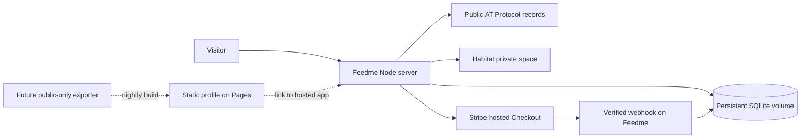

# Hosting and first-run setup

The quickest preview is a single Node process. A real instance also needs HTTPS, a persistent data directory, a Habitat-backed identity connection, and a Stripe Connect platform configuration. No external database is required for the first release.

The [README deployment buttons](../README.md#host-it) cover Render, Railway, Fly.io, Coolify, Dokploy, Docker Compose, and a disposable Koyeb demo. Render has a checked-in Blueprint; Railway currently has guided setup and a template recipe. No hosted instance is provisioned just by adding these files to the repository.

While the repository is private, deployers need access and must grant their host's GitHub integration access. A button does not bypass that requirement. Copies made with [Use this template](https://github.com/crs48/feedme/generate) should update the explicit repository URLs in the README's Render and Koyeb buttons. Provider accounts, paid resources, and Stripe onboarding are still the operator's responsibility.

## Static hosting and GitHub Pages

The app uses Astro's Node server adapter, native POST forms, server-held OAuth credentials, verified payment webhooks, and a SQLite database. Public records on AT Protocol and private records in Habitat do not replace this operational server. GitHub Pages cannot execute it; [Pages is static hosting](https://docs.github.com/en/pages/getting-started-with-github-pages/what-is-github-pages).



The dotted path is a possible future extension, not a feature of this release. A static exporter would need an explicit public-data allowlist and links back to the backend for sign-in/support. The current GitHub Action runs checks on pushes and pull requests; it does not rebuild a public feed nightly or deploy to Pages. Do not upload `dist/` as a Pages site: it contains a server build, not a working static application. Keep private records and credentials out of all static artifacts.

## Local preview

```sh
pnpm install
cp .env.example .env
pnpm dev
```

Use `http://127.0.0.1:4321` consistently, including in `PUBLIC_URL`. The application checks form origins, so switching between `localhost` and `127.0.0.1` without changing configuration will reject submissions. Leave `FEEDME_MODE=demo` to try simulated support and a shared editable studio. Preview state is isolated in `demo.sqlite`.

## Live configuration

| Variable | Value |
| --- | --- |
| `FEEDME_MODE` | `live` |
| `PUBLIC_URL` | Your HTTPS origin; optional on supported hosts when using their generated domain |
| `OWNER_DID` | Your permanent AT Protocol DID, not your handle |
| `DATA_ENCRYPTION_KEY` | 64 hex characters, generated once and backed up separately |
| `DATA_DIR` | Persistent writable directory; `/data` in the supplied deployment configurations |
| `HABITAT_URL` | Trusted Habitat host; defaults to `https://pear.habitat.network` |
| `STRIPE_SECRET_KEY` | Connect platform secret key; use a test key first |
| `STRIPE_WEBHOOK_SECRET` | Signing secret for this Connect webhook endpoint |
| `HOST` | `0.0.0.0` in containers; loopback behind a host reverse proxy |
| `PORT` | `4321` or the hosting platform’s assigned port |
| `SYNC_SECRET` | Optional stable random 32+ character bearer token for an external scheduler |
| `TIP_AMOUNTS` | Optional four distinct USD suggestions, comma-separated; defaults to `11,22,44,88`. The second value is prefilled on homepage and project forms. |

For example, set `TIP_AMOUNTS=5,15,35,75` in `.env` or your deployment environment to change the suggestions and prefill $15. Each value must be between $1 and $1,000 with up to two decimal places; supporters can still type a custom amount. Restart the app after changes; no rebuild is needed. These settings change new forms, not existing subscriptions.

Generate the encryption key locally:

```sh
node -e "console.log(require('crypto').randomBytes(32).toString('hex'))"
```

Store it in the deployment’s environment or secret manager. The live app refuses to run without HTTPS, a syntactically valid owner DID, and this key. Do not rotate the key by simply replacing the environment value: existing encrypted records would become unreadable. Key migration is not implemented yet.

When `PUBLIC_URL` is absent, Feedme uses `RENDER_EXTERNAL_URL`, `RAILWAY_PUBLIC_DOMAIN`, `KOYEB_PUBLIC_DOMAIN`, or `FLY_APP_NAME` (in that order), then falls back to loopback for local development. An explicit `PUBLIC_URL` always wins. Set it for custom domains, and do not paste the localhost value from `.env.example` into a hosted deployment. The origin comes from trusted environment settings, never inbound request headers. These provider variables are documented by [Render](https://render.com/docs/environment-variables), [Railway](https://docs.railway.com/variables), [Koyeb](https://www.koyeb.com/docs/build-and-deploy/environment-variables), and [Fly.io](https://fly.io/docs/machines/runtime-environment/).

Deployment configurations omit `FEEDME_MODE` so the app initially uses its default demo mode. Add `FEEDME_MODE=live` and the live secrets in the host dashboard when ready; the Render Blueprint will not overwrite those operator-added values. The Koyeb preview button deliberately sets `FEEDME_MODE=demo`. A demo studio is shared and editable by visitors; never use it for real receipts or private project information.

### Connect identity and private storage

1. Make the HTTPS origin reachable and verify `/api/health`.
2. Verify `/oauth-client-metadata.json` and `/jwks.json` return JSON publicly. These contain public client metadata and public keys, not private secrets.
3. Sign in using your handle. Your authenticated DID must match `OWNER_DID` to use the studio.
4. In the studio, choose **Create private storage**. Feedme creates a new member-list Habitat space and saves the returned URI. Only the creator is an initial member. Feedme never adopts an arbitrary existing space whose permissions it has not established.
5. Create your profile and first project. Choose **Sync records** to verify the first public write. Production `pnpm start` also retries automatically every 30 seconds.

Habitat’s own service can be self-hosted separately. Feedme is TypeScript and does not embed Habitat’s Go server. The current SDK delegates identity verification to the configured Habitat instance; use an instance you trust. See the [upstream setup](https://github.com/habitat-network/habitat) and [proxy integration](https://github.com/habitat-network/habitat/blob/85654a07dec6931925763e66c835f65d0cdf1e30/api-docs/docs/space-proxy/getting-started.mdx).

### Connect payments

1. Configure your Stripe platform for Connect and use **test mode** credentials first.
2. In the studio, choose **Connect with Stripe**. Feedme creates a Standard connected account with an idempotency key and redirects to Stripe-hosted onboarding. Banking and identity-verification details stay on Stripe.
3. Register `https://support.example.com/api/stripe/webhook` as a **connected-account** event destination using API version `2026-08-26.dahlia` (matching the installed Stripe SDK) and copy its signing secret into `STRIPE_WEBHOOK_SECRET`.
4. Subscribe to `checkout.session.completed`, `checkout.session.async_payment_succeeded`, `checkout.session.async_payment_failed`, `checkout.session.expired`, `charge.refunded`, `charge.dispute.created`, `charge.dispute.closed`, **`invoice.paid`, `invoice.payment_failed`, `customer.subscription.created`, `customer.subscription.updated`, and `customer.subscription.deleted`**. Existing installations must add the invoice and subscription events before offering recurring support.
5. Enable eligible payment methods on the connected account. Checkout selects methods dynamically; card wallets such as Apple Pay and Google Pay depend on account, currency, device, and Stripe eligibility. Feedme does not promise every method on every checkout.
6. Follow the acceptance checklist below, then replace test credentials and webhook configuration when ready for real payments.

Checkout verifies both `charges_enabled` and `payouts_enabled`. Feedme makes direct charges to the connected account and sets no application fee. Stripe processing and applicable Billing fees still apply. Refunds and disputes are managed from Stripe’s dashboard; webhooks update Feedme. The current release offers USD one-time, monthly, and yearly support. Before opening the first recurring Checkout, Feedme creates a connected-account Customer Portal configuration with invoice history, payment-method updates, cancellation at the end of the period, and email login enabled. See [recurring support](recurring-support.md) for accounting and recovery details.

Stripe supports [stablecoin payments](https://docs.stripe.com/payments/stablecoin-payments) subject to eligibility. Bitcoin requires a separate future integration. Do not advertise Bitcoin as a Stripe checkout option.

## VPS with Node

```sh
pnpm install --frozen-lockfile
pnpm build
pnpm start
```

Run under your preferred process supervisor and keep `.env` out of source control. Put Caddy or another HTTPS reverse proxy in front:

```caddy
support.example.com {
    reverse_proxy 127.0.0.1:4321
}
```

Set `PUBLIC_URL=https://support.example.com`, and retain the application’s same-origin checks. Run as an unprivileged user. Persist the complete `DATA_DIR` through upgrades.

## Docker Compose

```sh
cp .env.example .env
docker compose up --build -d
docker compose logs -f feedme
```

The application binds on port 4321 inside its container, is published on host loopback, and stores data in the `feedme-data` named volume. Configure HTTPS on the host for live mode. The entrypoint initializes the data directory's ownership as root, then uses `gosu` to run Node as UID/GID 1000. It does not recursively change existing files. If you previously ran the app as root, migrate ownership of its data files before switching images. When overriding the container user, make the mount writable by that user yourself. Use `docker compose down` without `-v` when upgrading to retain the database.

## Render

1. Click [Deploy to Render](https://render.com/deploy?repo=https%3A%2F%2Fgithub.com%2Fcrs48%2Ffeedme). For a private repository, install Render's GitHub App with access to it. You can also select **New → Blueprint** and choose your own copy.
2. Review [render.yaml](../render.yaml): one Docker web service on the paid `0.5c-512mb` plan, a 1 GB persistent disk at `/data`, and `/api/health`. Persistent disks require paid compute; this Blueprint intentionally does not use the free plan.
3. Deploy and open the generated HTTPS URL. Feedme reads `RENDER_EXTERNAL_URL`, so forms and OAuth metadata use the actual hostname immediately.
4. For a custom domain, configure it in Render and set `PUBLIC_URL` to that origin. Add the live variables above when ready. Generate `DATA_ENCRYPTION_KEY` yourself as 64 hex characters: Render's `generateValue` produces base64 and is not compatible with this key format.
5. Keep one instance and retain the disk. Source auto-deploys are disabled so a push to the upstream repo does not unexpectedly update every user's instance. Enable them only for a repository whose updates you control.

Official references: [deploy button/private repositories](https://render.com/docs/deploy-to-render), [Blueprint fields](https://render.com/docs/blueprint-spec), [persistent disks](https://render.com/docs/disks), and [generated secret format](https://render.com/docs/configure-environment-variables).

## Railway

1. Open [New project](https://railway.com/new), select **GitHub repository**, and choose your Feedme copy. Authorize the repository in Railway's GitHub integration if it is private. [railway.json](../railway.json) selects the Dockerfile and `/api/health`.
2. Attach a persistent volume at **`/data` before storing any data you want to keep**. The container entrypoint handles a fresh root-owned mount and drops to the Node user. Keep the default container entrypoint.
3. Generate a public HTTP domain targeting port **4321**. The Dockerfile sets `HOST=0.0.0.0`, `PORT=4321`, and `DATA_DIR=/data`; if you override `PORT`, update the domain's target port too. Feedme reads `RAILWAY_PUBLIC_DOMAIN` automatically. Set `PUBLIC_URL` only for a custom domain.
4. Keep exactly **one replica**. There is no distributed OAuth lock or shared database in this release.
5. Deploy, verify the health endpoint, and complete the studio setup.

The README's Railway button opens this guided workflow. `railway.json` configures a service's build and deployment; it does **not** create a volume or domain on its own. See [Railway volumes](https://docs.railway.com/volumes) and [config as code](https://docs.railway.com/config-as-code).

### Railway template recipe

A saved Feedme Railway template has not been created or published. To create one without making the GitHub repo public, open [Workspace → Templates](https://railway.com/workspace/templates) → **New Template**, add one GitHub service pointing to your Feedme repository, and configure:

| Setting | Template value |
| --- | --- |
| Source | Your Feedme GitHub repository, `main` branch |
| Build | Existing Dockerfile and `railway.json` |
| Public networking | HTTP domain, target port `4321` |
| Volume | `/data` |
| Replicas | `1` |
| `HOST` / `PORT` / `DATA_DIR` | `0.0.0.0` / `4321` / `/data` |
| `DATA_ENCRYPTION_KEY` | `${{secret(64, "abcdef0123456789")}}` |

Leave real DIDs, Stripe keys, and webhook secrets out of the reusable template. Omit `FEEDME_MODE` for an initial demo and `PUBLIC_URL` to use the generated domain. Save the template, copy Railway's generated share URL, and use that URL for the official Deploy on Railway button. Templates can remain unlisted; marketplace publication is separate. A template referencing this private repository still requires deployers to grant Railway access to the source. See [Railway's template guide](https://docs.railway.com/templates/create).

## Fly.io

Install [flyctl](https://fly.io/docs/flyctl/install/) and authenticate, then run from your copy of the repo:

```sh
fly launch --no-deploy --ha=false
```

Keep the settings from [fly.toml](../fly.toml), choose a unique app name and region, and skip adding Postgres or Redis. Check `fly volumes list`: if `feedme_data` is not present, create it in the app's chosen region with `fly volumes create feedme_data --size 1 --region YOUR_REGION`. Then:

```sh
fly deploy --ha=false
fly status
```

Confirm exactly **one Machine** and one volume. `--ha=false` prevents the redundant Machine that would otherwise have an independent SQLite database. The config keeps the Machine running for background synchronization, binds port 4321, and uses `/api/health`. `FLY_APP_NAME` supplies the generated HTTPS origin. Set live credentials with Fly secrets; use `PUBLIC_URL` for a custom domain. Redeploy with `--ha=false`, and do not scale horizontally or delete the volume.

This is a guided CLI deployment, not an app-specific one-click button. See [Fly app configuration](https://fly.io/docs/reference/configuration/), [deploy behavior](https://fly.io/docs/launch/deploy/), and [volumes](https://fly.io/docs/volumes/overview/).

## Coolify

On an existing Coolify server, create a Git-based application and connect your Feedme repository through a GitHub App or deploy key. Choose **Dockerfile** as the build pack with the repository root as context. Set the application port to **4321**, add a persistent volume with destination **`/data`**, and keep one replica on that server. Configure an HTTPS domain, `PUBLIC_URL`, and then the live variables when ready. Keep the image's entrypoint and start command.

The README button opens these instructions; it is not a published Coolify catalog service. See [GitHub sources](https://coolify.io/docs/applications/sources/github/overview), [build methods](https://coolify.io/docs/applications/choose-deployment-method), and [persistent storage](https://coolify.io/docs/core/persistent-storage/storage-mounts/overview).

## Dokploy

On an existing Dokploy server, create an **Application**, select your GitHub repository, and use the Dockerfile build type. Add a named volume at **`/data`** in **Advanced → Volumes/Mounts**, keep **one replica**, and route your HTTPS domain to container port **4321**. Set `PUBLIC_URL` and the live variables when ready. Keep the deployment on the server holding the volume and retain the image's entrypoint/start command.

The README button opens these instructions; no catalog template has been registered. A single Dockerfile application avoids relying on the local-only `.env` file referenced by `compose.yaml`. See [Dokploy application storage and replicas](https://docs.dokploy.com/docs/core/applications/advanced).

## Koyeb demo

The README's [Koyeb button format](https://www.koyeb.com/docs/build-and-deploy/deploy-to-koyeb-button) selects this repository, its Dockerfile, `FEEDME_MODE=demo`, and port 4321. Authorize GitHub access for private source. Feedme detects `KOYEB_PUBLIC_DOMAIN`. Review availability of the free instance in your account and the cost of any alternative before deploying.

Treat it as a disposable preview: the button does not provision a volume and changes disappear when its filesystem is replaced. [Koyeb volumes](https://www.koyeb.com/docs/reference/volumes) are currently described as public preview for testing, with one-instance and region restrictions; they cannot attach to free or eco instances. Use Render, Railway, Fly.io, or a VPS for real support instead. Do not simply switch this preview to live mode.

## Backups and operations

- Back up the data volume and `DATA_ENCRYPTION_KEY` separately. Without the key, live record values and OAuth credentials cannot be read.
- Stop the service before a filesystem backup, or use SQLite’s online backup API. Copying only the main database while WAL writes are active is not a safe backup.
- Keep the owner DID, Connect account, client URL, and encryption key stable through deploys. If the public URL changes, sign in again; OAuth grants are tied to client identity.
- The studio shows pending writes and failed attempts. Background retries are active with `pnpm start`/Docker; the development server uses manual sync.
- If using an external scheduler, POST to `/api/sync` with `Authorization: Bearer <SYNC_SECRET>`. No other internal job endpoints are exposed.
- Set appropriate reverse-proxy request limits for a public launch. Review the initial app’s privacy copy and add operator contact, retention, and payment terms.

## Live acceptance checklist

These require your provider accounts and were not executed as part of the local build.

- [ ] Real owner sign-in through Habitat, then repeat after an app restart.
- [ ] A different DID can sign in but cannot mutate studio state.
- [ ] Create a member-list space and verify another identity cannot read its receipts.
- [ ] Publish a project, read it from the actual public PDS, and confirm private notes are absent.
- [ ] Finish Stripe test onboarding and confirm the connected account’s charge/payout readiness.
- [ ] Complete a test Checkout and receive a verified connected-account webhook.
- [ ] Replay the webhook; totals must not increase twice.
- [ ] Complete monthly and yearly test Checkouts with an uneven project split. Use a Stripe test clock to advance a renewal, replay the invoice event, and verify that only successful payments increase totals once.
- [ ] Trigger a failed renewal, then recover payment; confirm no contribution is counted until settlement. Refund one renewal and verify that other periods remain intact.
- [ ] Open Manage support, update a payment method, cancel future renewals, and confirm the verified subscription event updates the local state without removing earlier tips. Test Stripe email recovery from another browser.
- [ ] Test asynchronous success/failure, partial/full refunds, and disputes.
- [ ] Disable Habitat temporarily; payments persist and queued writes succeed after reconnection.
- [ ] Restart/redeploy with the volume retained; data and signing keys survive.
- [ ] Test backup and restore with the same encryption key.

## Validation performed locally

Type checks, production build, deterministic payment/privacy/storage tests, lexicon contract validation, and browser flow checks run locally. The Render Blueprint validates against its official JSON Schema, and the Fly configuration parses with matching port/mount settings. GitHub Actions builds the Docker image and verifies health, non-root execution, generated-origin OAuth metadata, and SQLite persistence across container replacement. The local Docker daemon is unavailable. Deployments on the named hosting providers and real service interoperability remain unverified; see the checklist above and the [verification report](verification.md#deployment-setup).
