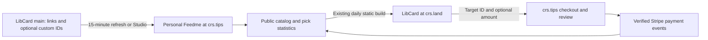

# LibCard contract verification and activation

Status: **2026-10-07**. Christopher’s personal Feedme backend is deployed on Railway with canonical origin **`https://crs.tips`**. Custom-domain DNS/TLS are configured; payment activation is pending. Some local resolvers may still cache the previous Vercel addresses. See [the deployment notes](crs-tips.md) and [quick DNS guide](crs-tips-dns.md). The static `feedme.fund` site remains a separate demo.

## Compatible implementations

Feedme’s feature is merged into `main` through [PR #2](https://github.com/crs48/feedme/pull/2), merge commit `1402b85`. LibCard’s implementation originated on `claude/libcard-feedme-integration-13bddf`, through `fed406d`, and is also merged into its `main`:

- `a4bd17b`: alternate-config builds via `LIBCARD_CONFIG`.
- `1748230`: optional Feedme schemas, tip actions, public-signal captions, and bounded build-time fetch.
- `fed406d`: [LibCard integration documentation](https://github.com/crs48/LIBCard/blob/main/docs/FEEDME.md).
- `f20e1fd`: merge of [LibCard PR #67](https://github.com/crs48/LIBCard/pull/67) into `main`.

GitHub’s comparison confirms `fed406d` is contained in LibCard’s remote `main`. Feedme’s PR passed GitHub checks, including the static export, deployment bundle, and container persistence checks, before merging. Neither repository’s creator configuration was changed during contract verification. The personal backend has since been deployed; all source links are now selectable in Feedme by default. The separate LibCard client still needs explicit IDs for card-side tip actions.



## Verified contract

| Boundary | Feedme behavior |
| --- | --- |
| Custom source IDs | Permanent unique slug IDs, at most 99 source targets plus creator, optional trimmed blurb, whole-dollar aspiration from 0 to 1,000,000. |
| Other source keys | `status`, `theme`, `site`, `statuses`, `cardMode`, `analytics`, `footer`, `seo`, `meta`, `contact`, and the top-level `feedme` settings do not break import or overwrite deployment settings. |
| Managed records | Consumer fixture creates creator/link/social records; $3,000 source aspiration becomes 300,000 internal cents. Hidden and removed targets are omitted publicly. |
| Endpoint | `/api/public/libcard`; GET/HEAD; explicit public field allowlist; successful `Cache-Control: public, max-age=60`; no redirect in the built application router. |
| Unavailable | Disabled returns 404; first import unavailable returns 503; both remain uncached through middleware. |
| Origin | Deployment configuration is authoritative. `PUBLIC_URL=https://crs.tips/` normalizes to `https://crs.tips`; inbound Host headers cannot override it. |
| Amounts | URL dollars with two decimal places work from $1.00 through $1,000.00; missing amount uses the configured second suggestion. |
| Selection | `presence=1` selects only Presence; bare `/checkout` selects nothing. |
| Diagnostics | Studio identifies native target-ID collisions and invalid field paths without exposing source snippets, native project titles, or provider error bodies. Last-good catalog remains usable. |

The API shape is unchanged. **LibCard does not need a mirrored contract change** for these Feedme fixes.

The consumer’s JSON example has future/unknown fields and an API-only target to test forward compatibility. It is a parser fixture, not actual payment history. Feedme checks its own narrower serialization allowlist separately; those extra fields are not added to the endpoint.

## Local verification checklist

- [x] Import LibCard’s exact committed `enabled.config.yaml`; verify kinds, IDs, blurbs, and aspiration units.
- [x] Ignore source presentation/global settings without losing consumed link or social fields.
- [x] Validate generated responses against LibCard’s documented constraints and its committed response example.
- [x] Run the actual LibCard `fed406d` consumer parser against Feedme responses with both zero signal and a paid public pick split, using `https://crs.tips` as the configured origin.
- [x] Exercise two-decimal URL amounts across every supported cent value, configured-default fallback, and an empty general CTA.
- [x] Preserve the previous snapshot after native-ID collisions; persist a safe Studio diagnostic.
- [x] Run built-app HTTP checks for the exact LibCard request, GET/HEAD, redirects, caching, disabled/unavailable responses, and Studio rendering.
- [x] Complete `pnpm check`, `pnpm test` (321 tests), `pnpm build`, and `pnpm check:libcard`.

The fixtures are vendored with provenance in [tests/fixtures/libcard](../tests/fixtures/libcard/README.md). They do not depend on another local checkout, live GitHub, or provider credentials. The HTTP test uses a fresh temporary database and a canonical HTTPS fixture origin through a local test transport; it does not claim to verify TLS or an external reverse proxy.

## Activate crs.tips

Activation steps:

- [x] Merge the compatible LibCard implementation into `main` (PR #67).
- [x] Publish/merge the compatible Feedme implementation (PR #2; all GitHub checks passed).
- [x] Deploy one persistent Feedme instance on Railway, with main-branch autodeploy waiting for GitHub CI.
- [x] Configure DNS/TLS for `crs.tips`; Railway reports verified ownership and a valid certificate. [The quick DNS guide](crs-tips-dns.md) records the setup.
- [ ] Configure live identity, encryption, persistent storage, Stripe Connect/webhook secrets, and private Habitat storage as described in [hosting](hosting.md). Complete provider acceptance with test credentials before enabling real payments.
- [x] Add these public settings alongside the live server configuration:

```dotenv
PUBLIC_URL=https://crs.tips
BLUESKY_HANDLE=crs.land
LIBCARD_REPO=crs48/LIBCard
LIBCARD_REF=main
```

- [x] Verify the initial import through the deployed homepage and public endpoint. The first deployment contained only the synthesized creator. Feedme now makes all source links and socials selectable by default without YAML edits.
- [ ] Review the source in **Dashboard → Projects → From LibCard** after signing in at the canonical origin.
- [ ] From a checkout containing this change, run:

```sh
pnpm check:libcard-origin https://crs.tips
```

This read-only command sends LibCard’s `Accept: application/json` and `User-Agent: LibCard (+https://github.com/crs48/LIBCard)` headers, omits credentials, and uses manual redirect handling. It checks HEAD and GET return 200 directly, JSON content type, public caching, no session cookie, a bounded body, matching origin, and the public schema/allowlist. It exits nonzero for a redirect, 404/503, malformed response, or origin mismatch. A failed endpoint check does not create a payment or alter the catalog.

- [ ] On the compatible LibCard version, optionally add card-side tip actions by copying existing Feedme target IDs from Studio into per-item `feedme.id` values, then add:

```yaml
feedme:
  enabled: true
  origin: https://crs.tips
```

- [ ] Refresh the source in Feedme Studio after the YAML reaches `main`; confirm all intended IDs and kinds in the endpoint, and rerun the origin check.
- [ ] Build/deploy LibCard and verify its general CTA and a “More of this” action lead to the correct unselected/selected checkout. A static build made before Feedme imports new IDs can omit their actions; rebuild after import if necessary.
- [ ] Verify the actual host does not add apex/www redirects or trailing-slash redirects to `/api/public/libcard`, and that it preserves the cache policy. The local router test cannot prove host/proxy behavior.

Payment readiness and endpoint compatibility are separate checks. A healthy public API can contain zero signal; it does not prove a connected Stripe account can charge or that Habitat recovery is configured.

## Deferred funding-progress extension

LibCard currently renders public pick shares, not funding bars. Do not change that interpretation: `publicShareMillis=750` means 75% of raw public picks, not 75% funded.

A later public API proposal should specify effective aspiration after local overrides (whole USD), an explicit public-support total (with its currency, period, cent units, and refund/dispute rules), and hidden/archived behavior. Any funding total must exclude anonymous and private gifts; using an all-payment total would reveal information through changes in the public aggregate. Never include per-payment amounts, identities, notes, or private recovery records. Publish and verify that extension separately before changing LibCard’s progress UI; no extension is required for this integration.
