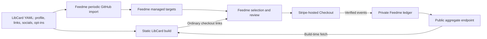

# Implement optional Feedme integration in LibCard

> Update (2026-10-07): Feedme now makes all LibCard links and socials selectable by default; `LIBCARD_DEFAULT_SUPPORT=explicit` preserves the original policy below. See [current LibCard documentation](libcard.md). The separate LibCard client still uses explicit IDs for its card-side actions.

Use this document as the implementation prompt for the AI working in the **LibCard repository**. It is self-contained; no previous conversation is required.

**Handoff completed:** LibCard has since implemented this prompt through `fed406d`. For current status, verified behavior, and the intended `https://crs.tips` deployment, use the [contract and activation checklist](libcard-activation.md). The deployment notes below describe the original handoff.

## Objective

Add an optional Feedme integration to LibCard. A creator can mark individual links and socials as things they would like support for. Visitors can open those destinations as usual, or choose **“More of this”** to open the creator’s Feedme checkout with that target selected. LibCard can also display aggregate public pick statistics fetched during its static build.

All money goes to the creator as an unconditional tip. The selection suggests where the supporter would like the creator to spend their energy. It is not a purchase, restricted donation, or promise to deliver a project.

Implement the LibCard engine, configuration schema, UI, tests, and documentation. Keep LibCard static, fast, themeable, and usable without JavaScript. Feedme remains responsible for checkout, identity, payment verification, privacy, accounting, and recovery.

## Read this first: implementation and deployment status

As of **2026-10-06**, the Feedme implementation is committed locally on `codex/libcard-picks`, through `4f08402` (`feat(libcard): show complete link catalog with icons and goals`). At the last verification it had **not been pushed, merged into `main`, or deployed**. Recheck this status before activation; do not assume a feature exists on a public host because it works in a local preview.

- Feedme repository: [crs48/feedme](https://github.com/crs48/feedme).
- LibCard repository: [crs48/LIBCard](https://github.com/crs48/LIBCard).
- `crs.land` is the creator’s LibCard site and Bluesky handle.
- `feedme.fund` currently hosts the public Feedme marketing site, directory, and isolated static demo. It is **not an established personal payment origin** for this integration.
- The local Feedme preview at `http://127.0.0.1:4401/` reads the real LibCard catalog but simulates payments. Its auto-generated `preview-…` IDs and randomized sample goals/support are demonstration data. Never copy them into production configuration or display them as real fundraising activity.
- No production personal Feedme origin has been selected in this prompt. `https://creator-feedme.example` below is a placeholder.

Implement and test now using fixtures. Public activation depends on deploying the matching Feedme backend, checking its endpoint, and configuring the actual personal origin. Do not invent that origin or silently enable the maintainer’s live card against a demo. Real Stripe/Habitat acceptance is also a separate Feedme deployment task.

## Architecture and ownership



LibCard owns titles, destinations, icons, GitHub repository metadata, optional blurbs, and source aspirations. Feedme imports those fields from raw `libcard.config.yaml`; it does not scrape the rendered card or import its theme. Feedme refreshes the source roughly every 15 minutes and retains its last good import on failure.

Feedme owns target availability, local hiding and aspiration overrides, payment state, and public signal calculations. LibCard consumes only the public allowlisted endpoint. No Stripe credentials, Habitat client, SQLite database, payment webhook, or authenticated Feedme API belongs in LibCard.

## Inspect the current repository before editing

Read its `AGENTS.md`, current design guidance, and existing components. Preserve unrelated work and the owner’s `libcard.config.yaml`, `public/` assets, and custom themes. This is a shared optional engine feature, not a special page for one creator.

Relevant starting points:

| File | Purpose |
| --- | --- |
| `src/lib/schema.mjs` | Shared configuration schema; extend link and social shapes here. |
| `scripts/generate-schema.mjs` | Generates editor-facing `libcard.schema.json`; do not hand-edit the generated schema. |
| `src/content.config.ts`, `src/lib/config.ts` | Configuration loading and inferred types. |
| `src/pages/index.astro` | Compose the profile, links, socials, and integration state. |
| `src/components/LinkButton.astro` | Preserve existing link, icon, status, and GitHub companion behavior. |
| `src/components/SocialRow.astro`, `Profile.astro` | Add accessible social tip actions and the general creator CTA. |
| `src/lib/github.ts` and adjacent tests | Existing examples of build-time fetching and request coalescing. |
| `.github/workflows/deploy.yml` | Existing scheduled builds. |
| `README.md`, `docs/UPGRADING.md` | Setup and compatibility documentation. |

Paths may evolve; inspect the actual checkout. The current [source schema](https://github.com/crs48/LIBCard/blob/main/src/lib/schema.mjs) has strict link/social objects and existing status metadata that must remain intact. It does not yet accept nested Feedme opt-ins. Use the installed Zod version and existing JSON Schema generator conventions; do not copy Feedme’s Zod APIs blindly into LibCard.

## 1. Configuration contract

Add an optional top-level `feedme` block and optional per-link/per-social `feedme` objects. Update the source schema first, regenerate JSON Schema, and ensure both runtime validation and editor autocomplete understand them.

Example configuration excerpt, for documentation and test fixtures:

```yaml
feedme:
  enabled: true
  origin: https://creator-feedme.example

links:
  - label: 75m of Presence aka Coaching
    url: https://crs.coach/
    icon: heart
    feedme:
      id: presence
      blurb: More hours in the room with people.
      aspiration: 3000

  - label: A project with source code
    url: https://example.com/project
    github: https://github.com/example/project
    stars: build
    feedme:
      id: open-source
      blurb: More time maintaining this project.

  - label: Résumé
    url: https://example.com/resume.pdf
    # No feedme object: an ordinary link, with no tip action.

socials:
  - platform: x
    label: My writing on X
    url: https://x.com/becomingbabyman
    feedme:
      id: x
      blurb: More of this voice.

  - platform: github
    url: https://github.com/example
    # Remains an ordinary social link.
```

Rules:

- Missing global configuration, or `enabled: false`, means **no Feedme fetch, UI, or extra client script**. Default to disabled. Existing configurations must still work unchanged.
- `enabled: true` requires a valid HTTPS origin. Accept an optional trailing slash and normalize it with `URL`; reject credentials, non-root paths, queries, and fragments. Production configuration must not point at localhost. Tests can inject a mocked fetch without changing this contract.
- Per-item opt-in fields are `id`, optional `blurb`, and optional `aspiration`. Reject unknown fields in these new nested objects so typos are actionable.
- IDs match `/^[a-z0-9][a-z0-9-]{0,63}$/`, are unique across links **and** socials, and must not be `creator` or `amount`. Validate duplicates at the whole-document level with useful field paths. Do not lower-case or otherwise silently rewrite an invalid ID.
- Support at most **99 opted-in source items**. Ordinary untippable links/socials do not count toward that limit. Feedme synthesizes the extra `creator` target itself; never add it as a source item.
- `blurb` is plain text, trimmed, at most 240 characters; omission is equivalent to an empty blurb.
- `aspiration` is an optional integer **in whole USD dollars**, from 0 through 1,000,000. Omission or zero means no source aspiration. Reject negative, fractional, or string values.
- Missing per-item `feedme` always means untippable, even with global integration enabled. Never infer opt-in from a platform, URL, label, or presence of a GitHub repository.
- Preserve all existing labels, icons, link statuses, GitHub star options, blocks, themes, card mode, and destination behavior. Do not replace the full link list with only tippable items.

IDs are persistent payment references: keep them when changing a title or destination. Changing an ID creates a new target in Feedme and archives the old one. Feedme detects collisions with native project IDs during import; document its Studio diagnostics rather than attempting to query private projects from LibCard.

## 2. Public API: use the shipped contract exactly

Fetch `new URL('/api/public/libcard', configuredOrigin)` during an enabled build. A successful response currently has this shape:

```json
{
  "creatorName": "Christopher Smothers",
  "origin": "https://creator-feedme.example",
  "defaultAmountCents": 2200,
  "targets": [
    {
      "id": "creator",
      "label": "Just Christopher",
      "url": null,
      "kind": "creator",
      "publicCount": 1,
      "publicShareMillis": 250
    },
    {
      "id": "presence",
      "label": "75m of Presence aka Coaching",
      "url": "https://crs.coach/",
      "kind": "link",
      "publicCount": 1,
      "publicShareMillis": 750
    }
  ]
}
```

Semantics:

- `defaultAmountCents` is Feedme’s configured second tip suggestion in USD cents. The normal default is 2200, but **do not hardcode $22** into generated checkout links.
- `publicCount` is the number of distinct eligible parent payments selecting a target. It is neither the number of picks nor the number of unique people. A recurring paid invoice can contribute another payment.
- `publicShareMillis` is a target’s share of accumulated **raw picks** among live targets. **750 means 75%, 250 means 25%, and 1 means 0.1%.** The endpoint values total exactly 1000 when there is signal, or all zero when there is none. Do not recalculate this using `publicCount`.
- Eligible signals come from verified, paid, public, identified gifts with positive net value and stored picks. Private/anonymous gifts, pending payments, disputes, full refunds, and legacy payments without picks are excluded. Partial refunds retain the pick signal while net value remains positive.
- All live targets appear, including zero-signal targets. Hidden and archived targets are absent. The endpoint already renormalizes across live targets.
- Responses contain no individual payment amounts, supporter identities, notes, payment-provider IDs, or source documents. Do not request or infer them.
- Success is publicly cacheable for 60 seconds. Disabled integration returns 404; an instance without its first successful import returns an uncached 503. Treat both as unavailable for the static consumer.

Validate the response into a small local public type: bounded strings, at most 100 targets, unique valid IDs, recognized kinds, nonnegative safe-integer counts, and integer shares from 0 to 1000 with a total of 0 or 1000. Validate `defaultAmountCents` as an integer within Feedme’s current $1–$1,000 range. Require the normalized response origin to match the configured origin. Ignore unknown response fields for forward compatibility, but reject malformed required fields and fall back gracefully.

Join results to locally opted-in items by **stable ID and matching kind**, never by label or destination URL. Keep the local configuration authoritative for presentation and ordinary destinations. Do not render an API-only target as a new LibCard link. The synthesized `creator` is available for the general creator action.

## 3. Build-time fetch and graceful failure

Add a small, testable module such as `src/lib/feedme.ts`. Separate pure response parsing and URL construction from network access. Reuse one promise per normalized origin during the build, including failed results, so individual components do not each fetch the endpoint.

Use a five-second timeout and a 256 KiB response-body limit, enforced while reading even if `Content-Length` is absent. Fetch without credentials, cookies, or authorization headers. Never forward LibCard’s `GITHUB_TOKEN` or another environment secret to the configured origin. Reject redirects to another origin; a redirect failure can use the ordinary unavailable fallback.

Network errors, timeouts, oversized bodies, non-success HTTP responses, invalid JSON, or invalid response fields must **not fail the card build**. Emit one concise build diagnostic without secrets. Invalid local configuration should still fail normal config validation.

| Situation | Tip actions | Public numbers |
| --- | --- | --- |
| Global setting absent/disabled | None | None; no fetch |
| Successful API response; opted-in ID is live | Show target action with endpoint default amount | Show validated values, including genuine zero signal |
| Successful response omits an opted-in ID | Hide that target’s tip action; preserve its ordinary destination | None for that target |
| API unavailable or malformed | Keep ordinary tip links for locally opted-in IDs; omit `amount` | Omit numbers entirely; failure is not zero |

The general creator CTA remains available whenever global integration is enabled. Feedme validates selections again at checkout, including when a static link becomes stale after the build.

The existing [LibCard deployment workflow](https://github.com/crs48/LIBCard/blob/main/.github/workflows/deploy.yml) already rebuilds daily. Reuse that schedule; **do not add another scheduler**. Explain that the card’s displayed numbers are a build-time snapshot, not a live counter. No browser fetch, CORS workaround, polling script, or external badge service is needed.

## 4. Checkout links and UI

Use URL APIs, not concatenation:

```ts
export const tipUrl = (
  origin: string,
  id: string,
  defaultAmountCents?: number,
): string => {
  const url = new URL('/checkout', origin);
  if (defaultAmountCents !== undefined) {
    url.searchParams.set('amount', (defaultAmountCents / 100).toFixed(2));
  }
  url.searchParams.set(id, '1');
  return url.href;
};
```

- **“More of this”** opens this link for the selected item. Give it an accessible name such as “Support more of Presence.” Keep it separate from the existing destination and GitHub actions; never nest anchors or make visiting a link secretly select a tip.
- **“Give to {name}”** opens `new URL('/checkout', origin)` with no query parameters, so the visitor starts unselected and chooses on Feedme. Use the local profile’s name for consistent card presentation.
- If a separate “Just {first name}” shortcut is useful, explicitly select `creator=1`. Do not confuse that shortcut with the general unselected CTA.
- URL amounts are **dollars**, so 2200 cents becomes `amount=22.00`. On fetch failure omit the parameter and let Feedme supply its current default.
- Always construct checkout URLs from the validated configured origin, never an item destination or an untrusted response host. LibCard’s Astro `base` must not be prepended to an external Feedme URL.
- The broader Feedme prefill contract supports `/checkout?amount=22&presence=1&x=3&creator=1`, with integer counts 0–9. First release needs only ordinary single-target links; defer a client-side pick cart.

Render the integration in the existing card style. All original links and socials remain visible with their full titles, icons, statuses, and existing GitHub stars. Add a compact companion action to opted-in link rows and an accessible equivalent beside opted-in socials. Keep the social layout readable on narrow screens instead of adding tiny indistinguishable icon buttons.

Public signal copy can be **“75% of public picks · 1 public tip”**. Use correct pluralization and at most one decimal place for percentages. If a small meter is useful, label it explicitly as public pick share, not dollars raised. Genuine zero signal can read “No public picks yet”; unavailable data should have no numeric claim.

Use the explanatory copy **“They get all of it. Where you placed it is a suggestion.”** near the creator CTA. Blurbs may be rendered as escaped text where they help explain a target. Do not inject YAML or API strings as HTML.

Retain keyboard navigation, visible focus, screen-reader labels, and roughly 44px touch targets. Check long labels, many social links, light/dark themes, mobile widths, and card mode. Do not introduce React, a payment form, an iframe checkout, or extra client JavaScript for this feature.

## 5. Aspirations and goal progress: an explicit boundary

Accept and document `feedme.aspiration` now: Feedme already imports it. A creator can also set an override in Feedme under **Dashboard → Projects → From LibCard**: blank inherits the source, zero hides the aspiration, and a positive whole-dollar value overrides it.

**The current public API does not expose effective aspirations or monetary support totals.** The newer Feedme visit can show those locally, but that does not make them available in the public contract above.

For this first LibCard integration, keep aspiration metadata available for Feedme and omit goal-progress UI on the card. Document the follow-on: Feedme would need a separately reviewed, privacy-preserving public API extension exposing the effective aspiration and an explicitly defined public funding total before LibCard can show truthful funding bars or over-goal rainbow effects.

Do not substitute `publicShareMillis` for funding progress, scrape Feedme HTML, query private endpoints, infer private gifts, or invent response fields. Randomized aspirations/support belong only in clearly labeled test/demo fixtures, never on the real creator’s card. This limitation must not block the supported tip links and public pick statistics from shipping.

## 6. Documentation and setup flow

Update README setup and upgrading guidance, and add a focused integration guide covering:

1. Upgrade LibCard to a version with the new schema before adding nested opt-in fields.
2. Deploy the matching **server-backed** Feedme version with the normal Bluesky administrator, Stripe, Habitat, HTTPS, and persistence configuration. A static Feedme Pages demo cannot process payments.
3. Configure Feedme with `LIBCARD_REPO=owner/repository` and optionally `LIBCARD_REF=main`.
4. Choose permanent IDs and add the global origin plus explicit link/social opt-ins to LibCard. All users get the same optional feature; do not hardcode `crs.land`.
5. Commit the creator’s chosen YAML changes. Refresh the source in Feedme Studio or wait for the import; check the public endpoint for those IDs.
6. Build/deploy LibCard. Demonstrate target-specific and general checkout links. Explain the daily snapshot cadence and unavailable-data behavior.

Include the units, reserved IDs, stable-ID lifecycle, opt-in limit, public-statistic definitions, local aspiration overrides, and the difference between the public `feedme.fund` demo and a personal Feedme backend. Existing disabled installations need no migration or payment configuration.

Do not rewrite the owner’s personal YAML to enable everything. Use fixtures for implementation and clearly marked excerpts for documentation. Keep generated schema and the repository’s engine-update process compatible.

## 7. Required verification

Add meaningful tests using mocked responses and fixture configurations. Test the feature independently of the public Feedme deployment. Check these off only after verification:

- [ ] Existing config remains valid; absent/disabled configuration causes no fetch and no Feedme markup/script.
- [ ] Valid link and social opt-ins work; malformed/reserved/duplicate IDs, more than 99 opt-ins, invalid aspirations/blurbs, and invalid origins fail with useful messages.
- [ ] Regenerated JSON Schema exposes the new properties and required constraints. Document-level uniqueness remains enforced by runtime validation where JSON Schema cannot express it.
- [ ] Source labels, icons, statuses, GitHub links/counts, ordinary untippable items, themes, blocks, and card mode retain their existing behavior.
- [ ] Valid API responses render real counts; 750 becomes 75%, 1 becomes 0.1%, and all-zero signal is distinguished from unavailable data. Counts are labeled as payments/tips, not unique supporters.
- [ ] Invalid shares/counts, duplicate IDs, excessive target/body counts, mismatched origin, malformed JSON, timeout, network failure, 404, 503, and cross-origin redirects exercise the fallback without failing the build.
- [ ] Multiple consumers issue at most one request per origin, including failure paths; no cookies, tokens, or private request headers are sent.
- [ ] Locally unopted and API-only targets never gain tip actions. A known unavailable ID loses its action but keeps its ordinary destination. Failure keeps configured tip links without numeric claims.
- [ ] URL tests cover configured amounts other than $22, cents-to-dollars conversion, omitted amount on failure, creator selection, the unselected general CTA, and an Astro deployment with a non-root base path.
- [ ] Rendered HTML works with JavaScript disabled, uses separate valid anchors, escapes labels/blurbs, and provides descriptive focusable actions. Verify mobile/desktop layouts and long labels in representative themes.
- [ ] No funding-progress bar or simulated support leaks into the production card. No Feedme secrets, private data, browser polling, or second scheduler are added.
- [ ] README/setup/upgrading/integration docs and generated schema match the implementation.

Use the current package scripts; at this writing the checks are:

```sh
pnpm generate:schema
pnpm typecheck
pnpm test
pnpm build
```

Inspect the generated diff and built HTML, including an enabled fixture and the unchanged disabled configuration. Run browser checks for the UI when available. Use conventional commits with detailed bullet descriptions. Report what was implemented, checks actually run, and any remaining activation prerequisite separately from code completion.

## Feedme references for cross-checking

If working on the same machine, the Feedme checkout is `/Users/crs/Code/feedme`. These files define the implemented side of the contract:

- `docs/libcard.md`: configuration, ingestion, demo distinctions, and integration contract.
- `src/lib/libcard-schema.ts`: accepted source fields, IDs, aspirations, and metadata validation.
- `src/lib/libcard-public.ts`, `src/pages/api/public/libcard.ts`: response allowlist and aggregate behavior.
- `src/lib/picks.ts`: URL prefill parsing and pick semantics.
- `src/lib/config.ts`: deployment origin and configured tip suggestions.
- `docs/plans/0001_[_]_LIBCARD_PICKS.md`: original Feedme implementation plan; use current code/docs when later changes differ.

Do not assume these files are already on the repository’s public default branch. If you cannot access the feature branch, the explicit contract in this prompt is sufficient for fixture-backed LibCard implementation; confirm the deployed endpoint before enabling a real card.
