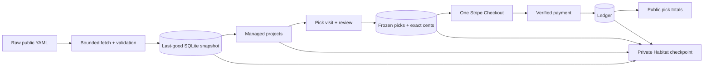

# LibCard picks

Feedme can use a public [LibCard repository](https://github.com/crs48/LIBCard) as the source of a creator’s name, links, and socials. Supporters pick what they want to see more of and give one unconditional tip to that creator. Picks are suggestions, not restricted funds or promises of delivery.

## Turn it on

Keep your existing Bluesky administrator, Stripe, Habitat, HTTPS, and backup settings. Add these settings to the Feedme server, then restart:

```dotenv
LIBCARD_REPO=your-name/your-libcard
LIBCARD_REF=main
```

`LIBCARD_REF` is optional. Leave `LIBCARD_REPO` unset to keep the existing percentage-based project page. Disabling the feature retains imported records and historical payments; managed targets do not enter the native percentage selector.

Try the built-in offline fixture without any credentials:

```sh
FEEDME_MODE=demo LIBCARD_REPO=example/libcard pnpm dev
```

By default, demo mode uses its checked-in fictional fixture regardless of the repository name. It never fetches GitHub or charges Stripe. Without the setting, `pnpm dev` and the isolated GitHub Pages demo keep their existing behavior.

To preview a real public LibCard with simulated payments, opt into GitHub as the demo source:

```sh
FEEDME_MODE=demo LIBCARD_REPO=crs48/LIBCard LIBCARD_DEMO_SOURCE=github BLUESKY_HANDLE=crs.land pnpm dev
```

This reads the real name, avatar, bio, links, socials, icons, GitHub companion repositories, and first text block from `libcard.config.yaml`. Set `BLUESKY_HANDLE` to the matching creator for the demo’s displayed handle. Authentication remains fictional, and Stripe, Habitat, and AT Protocol writes remain simulated. The banner explicitly labels simulated tips.

The real-source demo makes every link and social available to try with simulated picks (up to 99 plus the creator; additional links still appear as full rows). Stable `preview-…` IDs and `demoOnly` metadata distinguish these sample targets from explicit source opt-ins. The original snapshot is unchanged. Live mode accepts only explicit source opt-ins, never these generated demo targets.

Every row displays its full source title and bundled icon, with a separate destination link and pick button. GitHub companion links and `star`/`stars` settings retain their meaning. `build` and `badge` counts are both fetched server-side from the public GitHub API and cached for six hours; Feedme does not load third-party badge images or transmit visitor data. Failed requests keep the last known count or show “—” when no count is available. Zero is a real count, never a fallback. Requests are deduplicated, limited to four concurrent workers and 99 repositories, with a four-second request timeout, eight-second batch deadline, and 64 KiB response cap. The checked timestamp appears in the badge tooltip. Icons are bundled from LibCard under its [MIT license](../licenses/LIBCard.txt).

Demo goal bars use deterministic pseudo-random aspirations and support when no goal is configured. Values stay stable across refreshes and are labeled **Sample**; some intentionally exceed the aspiration and show rainbow overflow. These amounts are view data only: they create no supporter/payment records and never contribute to accounting, receipts, or public pick signals. **Dashboard → Projects → From LibCard** can override the goal: a positive amount replaces the sample/source value, 0 hides it, and blank inherits. In live mode, bars appear only for actual source/local aspirations and show verified public support, excluding private and anonymous gifts.

The real-source demo uses `DATA_DIR/demo-libcard.sqlite`, separate from the offline fixture’s `demo.sqlite` and live `feedme.sqlite`. It starts with no fictional projects, supporters, updates, or recommendations. For a different creator, use a fresh `DATA_DIR` to keep simulated history separate. A homepage, checkout, public-API, or Studio visit checks for updates at most every 15 minutes, including under `pnpm dev`; `pnpm start` also refreshes in the background. Failed fetches keep the last-good snapshot, or show unavailable if no import has succeeded. `LIBCARD_DEMO_SOURCE=fixture` is the default; the isolated GitHub Pages export always retains its offline fixture regardless of this setting.

In live mode, `pnpm start` checks for refresh work through the existing synchronization loop. The initial check runs within about 30 seconds, then the LibCard importer checks at most every 15 minutes. You can also use **Dashboard → Projects → From LibCard → Refresh LibCard**. When running a live development server without `pnpm start`, use the manual refresh or your authenticated `/api/sync` scheduler.

## Opt links and socials into tipping

Only an explicit nested `feedme` object makes an item tippable:

```yaml
profile:
  name: Christopher Smothers
  tagline: Making room for things that matter.
  avatar: /avatar.jpg
  location: San Francisco
links:
  - label: 75m of Presence aka Coaching
    url: https://crs.coach/
    feedme:
      id: presence
      blurb: More hours in the room with people.
      aspiration: 3000
  - label: Résumé
    url: https://example.com/resume.pdf
socials:
  - platform: x
    url: https://x.com/becomingbabyman
    feedme: { id: x, blurb: More of this voice. }
```

**LibCard compatibility:** its existing strict link/social schemas must first be updated to accept nested `feedme` fields. That separate-repository follow-on is not implemented by this Feedme change. Do not add these fields to an older LibCard installation that rejects them. Feedme can consume the configuration and provides an offline fixture for testing the contract now.

IDs are permanent lowercase slugs (letters, digits, hyphens, at most 64 characters; start with a letter or digit). One namespace covers links and socials; `creator` and `amount` are reserved. At most 99 opted-in source items are supported. Feedme synthesizes the hundredth possible target, `creator`, labeled “Just {first name},” with no destination URL. Renaming an ID creates a new target and archives the old one; historical tips retain their original IDs.

In live mode and the offline fixture, unopted links remain visible without pick controls. This includes résumé, phone, email, and social links unless explicitly opted in. HTTP(S), `mailto:`, `tel:`, and `sms:` destinations are allowed; executable/unsupported schemes fail import. Aspirations are optional whole USD amounts; zero or omission means no live aspiration. The visit shows the dollar goal and progress from public support; receipts and shares retain their quiet aspiration labels. Money always goes to the same connected creator account.

Avatars must be HTTPS or relative paths beneath the repository’s `public/` directory. `/avatar.jpg` resolves to `https://raw.githubusercontent.com/your-name/your-libcard/main/public/avatar.jpg`. Invalid schemes, traversal and credential-bearing avatar URLs are dropped. Feedme reads profile name/tagline/location and the first text block as a short sanitized Markdown note. It does not scrape the website or import themes.

## Refresh, local settings, and recovery



The catalog importer fetches raw GitHub YAML, without authentication or cloning. Requests have a five-second timeout and 256 KiB body limit; normalized data is capped at 128 KiB. Duplicate YAML keys, aliases, duplicate target IDs, invalid opt-ins, and native project ID collisions fail the whole import. A transaction applies the new snapshot and target changes together. ETags are used when available; older snapshots without icon/repository fields get an unconditional refresh when upgrading. Studio labels the content SHA-256 accurately, not as a Git commit SHA. Optional GitHub star counts are a separate disposable cache; a metadata outage never rejects a valid catalog.

GitHub failures keep serving the last good snapshot. Before the first successful import, the visit and API report unavailable rather than substituting a different target list. Missing source IDs are archived, never deleted. Reappearing IDs retain their creation date and local settings.

Studio’s **From LibCard** panel shows source/ref, fetch status, revision, and live/archived targets. Labels, destinations and blurbs are read-only. You may hide targets locally or override their aspirations: blank inherits, zero removes, a whole-dollar value overrides. The creator cannot be hidden. Hiding also removes the item from Feedme’s public target list; it never edits the LibCard repository. Existing recurring gifts retain their original picks until canceled.

Managed projects, original payment picks, overrides, and the last-good snapshot are covered by private Habitat checkpoints and encrypted SQLite backups. Restore preserves them even when GitHub is unavailable. Draft forms/review tokens and fetch-error status are temporary operational state, not portable data. Migration 2 adds snapshot recovery tracking; restore with this or a compatible newer Feedme release, not a pre-feature binary.

Imported targets and their target-referencing acknowledgments are not published to AT Protocol in this release. Local supporter views, private receipts and opt-in public share cards still work. Explicit public posts may share a card link. Stable target IDs leave room for a later protocol integration.

## Picking, review, and payment

All counts start at zero. “All of these, equally” assigns one pick to every live target; “Just them” assigns one only to the creator. Add up to nine per target and remove picks using its selected mark. With JavaScript disabled, ordinary integer inputs and server-side shortcuts produce the same result.

The four `TIP_AMOUNTS` suggestions and custom input are independent of picks. The second suggestion remains the default. Empty gifts are rejected. Counts are converted directly to cents using largest remainders, with target-ID tie breaking. For example, one pick and three picks divide $22 into $5.50 and $16.50. Selected targets that round to zero cents still retain their original picks.

A separate Feedme review shows exact amounts, frequency, privacy and note before Stripe. Editing and signing in preserve the browser-bound draft for one hour. A target disappearing before confirmation requires a new review, never silent redistribution. Final confirmation freezes the original picks as well as monetary allocations and consent; retries reuse the payment intent.

Stripe receives one creator line item for the full amount, including recurring gifts with more than 20 selected targets. Feedme keeps the detailed allocation. Signed provider events verify account, amount and currency before confirming payment. A success redirect is not payment evidence. Each verified recurring invoice copies the original picks into its own payment record.

## Public API and prefill contract

`GET /api/public/libcard` requires no authentication. It returns only this allowlisted structure (example with two live targets):

```json
{
  "creatorName": "Christopher Smothers",
  "origin": "https://creator-feedme.example",
  "defaultAmountCents": 2200,
  "targets": [
    { "id": "creator", "label": "Just Christopher", "url": null, "kind": "creator", "publicCount": 1, "publicShareMillis": 250 },
    { "id": "presence", "label": "75m of Presence aka Coaching", "url": "https://crs.coach/", "kind": "link", "publicCount": 1, "publicShareMillis": 750 }
  ]
}
```

`kind` is `creator`, `link`, or `social`. All live targets appear, including zero-signal targets, in creator/link/social source order. `origin` comes from trusted deployment configuration. `defaultAmountCents` is the second configured suggestion in USD cents.

- `publicCount` counts distinct paid public identified payments that selected the target, not the number of picks.
- `publicShareMillis` weights the accumulated raw counts, independently of dollars. Nine picks on one target and one on another produce 900/100, even if the second tip was larger. Values total exactly 1000 across live targets, or are all zero before eligible signal.
- Private, anonymous, pending, failed, disputed, fully refunded, and legacy payments without original picks contribute nothing. Partial refunds retain the original picks while net value is positive. Each verified recurring invoice counts once; duplicate events do not add contributions.
- Archived/hidden targets are omitted and remaining live weights are renormalized.

No individual payment amounts, notes, identities, provider IDs, or source documents are returned. Successful GET/HEAD responses have a 60-second public cache; other session-aware pages remain private. Disabled mode returns 404. No successful import returns an uncached 503. Consumers fetch server-side during their builds.

Prefill uses dollars and integer counts:

```text
/checkout?amount=22&presence=1&x=3&creator=1
```

Unknown, hidden, archived, repeated, noninteger, and out-of-range pick parameters are dropped. Invalid/repeated amounts use the configured default. If nothing valid remains, no target is implicitly selected. Posted forms instead reject invalid fields before review. When disabled, `/checkout` redirects to the normal homepage.

## LibCard follow-on (separate repository)

After the Feedme endpoint ships, update LibCard’s source schema and generated JSON schema to accept the opt-ins above and this global block:

```yaml
feedme:
  enabled: true
  origin: https://creator-feedme.example
```

Absent/disabled means no request, tip UI, or extra script. Enabled builds fetch `/api/public/libcard`; the existing daily workflow refreshes it. Show public marks only for returned IDs. On failure, hide numbers and keep ordinary links from locally opted-in IDs, omitting the amount to use Feedme’s default.

```ts
const tipUrl = (origin: string, id: string, defaultAmountCents?: number) => {
  const url = new URL('/checkout', origin);
  if (defaultAmountCents !== undefined)
    url.searchParams.set('amount', (defaultAmountCents / 100).toFixed(2));
  url.searchParams.set(id, '1');
  return url.href;
};
```

“More of this” uses that builder. “Give to {name}” links to `/checkout` without a query. An optional future browser enhancement may accumulate counts and navigate with them; no-JS remains ordinary anchors. LibCard must never collect card details or embed Checkout.

## Verification

Run `pnpm check`, `pnpm test`, `pnpm build`, then `pnpm check:libcard`. The HTTP smoke test starts an isolated built demo with outbound fetch disabled, exercises ordinary forms without JavaScript, then removes its temporary data. It covers review/edit/sign-in, exact amounts, duplicate submissions, privacy, public totals, share PNGs and Studio overrides. CI also runs the existing isolated GitHub Pages export with the feature unset.

Real Stripe test-account and Habitat-provider acceptance is still required before treating a deployment as production-tested; automated checks use provider fixtures and the local demo.
