# LibCard-backed picks on Feedme

Implement the approved optional LibCard mode. The public LibCard repository supplies profile presentation and explicitly opted-in links/socials; Feedme owns checkout, payment accounting, and private recovery. Native percentage-based support remains available when `LIBCARD_REPO` is unset. The separate LibCard implementation is a later pass, blocked on shipping the Feedme endpoint.

## Approved architecture

```mermaid
flowchart LR
  YAML[Public LibCard YAML] --> Parser[Validate and normalize]
  Parser --> Snapshot[(SQLite last-good snapshot)]
  Snapshot --> Targets[Managed Project records]
  Targets --> Picks[Integer pick form]
  Picks --> Allocation[Exact cents]
  Allocation --> Review[Browser-bound Feedme review]
  Review --> Stripe[One direct-charge Checkout]
  Stripe --> Events[Verified payment events]
  Events --> Ledger[(Ledger with original picks)]
  Ledger --> Public[Allowlisted public signal]
  Targets --> Public
  Public --> API[Public LibCard endpoint]
  API --> LibCard[LibCard build and daily refresh]
  Snapshot --> Recovery[Private Habitat recovery]
  Targets --> Recovery
  Ledger --> Recovery
```

- Config: `LIBCARD_REPO=owner/name`, optional `LIBCARD_REF=main`; disabled means existing behavior. Demo mode uses a checked-in offline fixture only when configured.
- Fetch raw GitHub YAML without auth or cloning; five-second timeout, 256 KiB input limit, duplicate keys rejected, aliases disabled. Validate consumed data, retain ETag/content hash and last-good normalized snapshot, refresh every 15 minutes and from Studio.
- Read name, tagline, location, safe avatar, links, socials, and a short text block. Do not import themes or overwrite the native profile/Bluesky identity.
- Opt-in: `feedme: { id, blurb?, aspiration? }` on a link or social. Stable lowercase ID maps to `Project.id`. One shared namespace, at most 99 source targets plus `creator`; reserve `creator` and `amount`. Reject native collisions and duplicate IDs atomically.
- Synthesize `creator`, label `Just {first name}`, null URL. Never initially selected or hidden. Source removals archive, not delete; source return preserves local overrides. Native edit/publish paths must reject managed targets.
- Keep original positive integer picks (1–9) on each parent Support, through idempotency, renewal, refunds, and private recovery. Imported records and target-referencing acknowledgments do not publish to AT Protocol in this release.
- Extend recovery schemas, tracked portable snapshot, and restore relationship checks, including zero-cent picked targets. Append a numbered migration; do not modify an already-shipped migration.

## Supporter and public contracts

Start empty; “All of these, equally” assigns one to each live target; “Just them” assigns creator only. Tap to add, selected mark to remove, cap nine. Render a check / ×2…×9 plus quiet derived percentages. Keep all unselected and untippable links visible. Use ordinary integer HTML fields without JavaScript and progressively enhance those fields.

Choose amount once with existing four presets/custom, default second. Amount changes preserve picks. Empty selections cannot proceed. Derive allocations directly from counts, floor cents, and assign remaining cents by descending remainder then stable ID. Do not convert through rounded percentages.

Add `/checkout` with tolerant `?amount=22&presence=1&x=3&creator=1` prefill, strict posted forms, and `/checkout/review` before the existing `/api/checkout`. Preserve drafts during editing/sign-in using opaque browser-bound tokens, never private query data. Revalidate identity and live targets at final confirmation; never silently reallocate. Use one creator line item for the full gift, preserving the detailed allocation in Feedme. Keep existing Stripe verification; redirects are not proof of payment.

Copy: **Give this to {name}.** **They get all of it. Where you placed it is a suggestion.** Aspirations are quiet dollar text; no campaign mechanics or progress bars in this mode.

`GET /api/public/libcard` is unauthenticated, explicitly allowlisted, cached for 60 seconds, and returns `creatorName`, trusted `origin`, `defaultAmountCents`, and live `targets[]` with `id`, `label`, `url`, `kind`, `publicCount`, `publicShareMillis`. Disabled returns 404; first-import unavailability returns 503. Keep other pages privately cached.

Public count is unique eligible payments containing a target. Share is accumulated raw picks across paid public identified payments, independent of dollars, normalized over live targets to exactly 1000 (or all zero). Exclude private/anonymous, legacy no-picks, unpaid, full refunds and disputes. Partial refunds retain original signal while net value is positive. Each verified recurring invoice counts once.

## Verification and implementation checklist

- [x] Configuration, normalized YAML parser, offline fixture, bounded refresh, atomic import, last-good behavior (unit tests).
- [x] Persistence, full private recovery round trip, numbered tracking migration, publishing guards.
- [x] Pick allocation, prefill, plain forms, review/edit/sign-in, idempotency, recurring propagation.
- [x] Accessible visit, read-only Studio source panel, local overrides, quiet receipts/share cards.
- [x] Public payment-level aggregation, contract/default amount and endpoint status tests.
- [x] Documentation: `.env.example`, README, ingest/public contract, split support, admin, recovery.
- [x] Final validation: `pnpm check`, `pnpm test`, `pnpm build`; no-JS/mobile/browser checks and legacy static demo regression.
- [ ] LibCard follow-on after endpoint release: strict schema + generated JSON schema, opt-in build fetch/public marks/links, docs, failure tests. **Outside this Feedme change.**

### Test coverage to complete

Parser limits, IDs, unsafe links/avatar paths, ignored theme data, source removal/reappearance and overrides; conditional/coalesced refresh and outages; recovery with GitHub unavailable; exact-cent ties, cap nine, zero cents; plain forms/shortcuts and retained amount/picks; expired or wrong-browser drafts, sign-in return, duplicate confirmation, target eligibility changes; public privacy boundaries and cache isolation; verified renewals/refunds/disputes and duplicate events; malformed/archived prefills; opt-in demo and unchanged disabled percentage/GitHub Pages demo.

## LibCard follow-on

In `crs48/LIBCard`, later, add `feedme: { enabled: true, origin: https://creator-feedme.example }` and accept nested target opt-ins in the strict link/social schemas before creators add them. Fetch `/api/public/libcard` at build time using the existing daily workflow. Failure omits numbers but keeps local opted-in links working; omit amount to let Feedme supply its default. Disabled means no UI/request/script.

Build links with `new URL('/checkout', origin)` and `URLSearchParams`: “More of this” sets `amount=(defaultAmountCents/100).toFixed(2)` when known and `{id}=1`; “Give to {name}” has no query. Show public marks only for endpoint-returned targets. Optional later client-side picking navigates with the same counts; no-JS stays ordinary anchors. Never collect card details or embed Checkout. Target publishing to AT Protocol remains a further follow-on.

## Verification result

- `pnpm check`: no errors, warnings, or hints.
- `pnpm test`: 293 tests passed across 42 files.
- `pnpm build` and `pnpm build:site`: passed; static verification checked 50 HTML pages and 2,138 local links/assets with LibCard disabled.
- `pnpm check:libcard`: passed against the built app using isolated data, outbound fetch disabled, and ordinary HTTP forms (no browser JavaScript).
- Desktop/browser interaction and a 390px mobile viewport checked; no horizontal overflow. Verified 1:3 picks, changing the amount, public monthly review, sign-in return, simulated receipt, and quiet aspiration share image.
- `node scripts/build-deployment.mjs --check`: passed. No deployment or live payment was performed.

See [the operator guide and exact public contract](../libcard.md) for setup and the separate LibCard follow-on. Provider tests use fixtures; real Stripe test-account and Habitat acceptance remain an operator deployment check.
