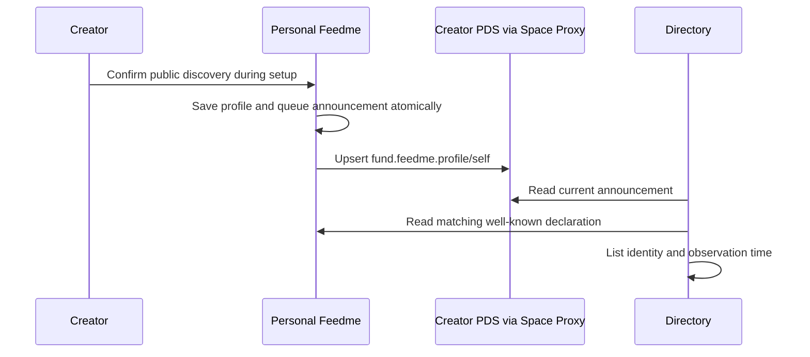

# 01 · Publication and identity

## Objective and dependencies

Make a creator's existing public profile the sole announcement of their canonical Feedme site. Reuse existing OAuth through Habitat and the durable outbox. Do not require an additional registry account, DNS record per creator, or a new signing key.

Relevant files: [profile lexicon](../../../lexicons/fund.feedme.profile.json), [model](../../../src/lib/model.ts), [repository](../../../src/lib/repository.ts), [Habitat adapter](../../../src/lib/habitat.ts), [settings](../../../src/pages/studio/settings.astro), [instance declaration](../../../src/pages/.well-known/feedme.ts), and [protocol publishing](../../../src/lib/protocol.ts).

## Announcement contract

Keep the singleton record `at://<creator-did>/fund.feedme.profile/self`. Its existing fields are sufficient; a new `fund.feedme.instance` collection is unnecessary for one site per DID. This illustrative record includes the current required profile fields:

```json
{
  "$type": "fund.feedme.profile",
  "name": "Example Creator",
  "handle": "creator.example",
  "bio": "Small projects, supported by my community.",
  "location": "",
  "website": "",
  "feedmeUrl": "https://support.creator.example",
  "discoverable": true
}
```

The repository owner DID is the identity. Never use the mutable `handle` field as authorization. Prefer a currently resolved and verified handle for display. Preserve legacy behavior for an absent `discoverable` field; new announcements should write the preference explicitly.

The site responds at `/.well-known/feedme`:

```json
{
  "protocol": "fund.feedme",
  "did": "did:plc:aaaaaaaaaaaaaaaaaaaaaaaa",
  "url": "https://support.creator.example",
  "profile": "at://did:plc:aaaaaaaaaaaaaaaaaaaaaaaa/fund.feedme.profile/self"
}
```

The implementation adds an optional `mode: "live" | "demo"` to this HTTP document, not the PDS schema. Exclude explicit demos; classify old endpoints without `mode` as identity-checked with unspecified deployment mode. A claimed live mode cannot establish that payments work. Do not add application versions, account secrets, payment configuration, or periodic heartbeat timestamps.

## Setup and update behavior



- Make publication part of the first explicit setup completion; login alone is not consent to publish a new site. Keep the existing clearly labeled discovery checkbox. A default can be checked, but the creator confirms it before publication.
- Display which DID and HTTPS origin will be advertised. Require the configured creator identity and a real HTTPS origin; development/demo processes must never advertise themselves.
- Reuse profile save. Project publication deliberately does not rewrite the announcement. Change the singleton only when public profile, origin, or preference changes; do not write on every boot, timer tick, or page view.
- On canonical URL change, show the stale published address and provide a deliberate republish action. Keep one writer per creator, matching the current app's constraints. Starting a restored server must not overwrite a different current announcement silently.
- Read any existing marker during setup reconciliation. If it has `discoverable: false` or a different canonical site, preserve it until the creator explicitly resolves the difference. This is a narrow setup check, not a general inbound sync implementation.
- Verify a newly announced site from an external environment before marking setup healthy. Public directory inclusion remains asynchronous and may be moderated.
- Opt-out writes `discoverable: false`. Confirmed PDS `RecordNotFound` also withdraws membership. An offline website is a reachability failure, not withdrawal.
- `/.well-known/feedme` should use short cache freshness (proposed five minutes) and represent the configured canonical origin consistently. Reject redirects during verification; a domain move requires updating the PDS marker.

Publishing this marker does not publish a Bluesky timeline post. Keep the optional announcement described in [step 04](04-social-discovery.md) a separate action.

## Authority and interoperability

Verify `_lexicon.feedme.fund` and the official schema records using the [existing publication procedure](../../discovery.md#official-schema-publication) before claiming interoperability. Domain ownership alone does not prove the schemas have been published. Normal creators do not need access to the authority account.

Public PDS reads and private Habitat storage are distinct. This marker follows the existing public `com.atproto.repo.*` publishing path through the Space Proxy. Directory readers need only public repository APIs and the website declaration. They must never call private-space endpoints or copy a creator's database.

Initial verification establishes a reciprocal PDS/site claim using trusted identity resolution and TLS. Repository signatures are not verified by the current `getRecord` reader. Record CIDs are useful version identifiers, but storing one alone is not signature verification. [AT Protocol sync](https://atproto.com/specs/sync) provides the basis for stronger verified ingestion in the optional service.

This is not proof of ongoing control by the same website operator. A reassigned domain can reproduce the publicly known declaration while an old PDS marker still points there. Periodic fetches do not solve that attack. Keep directory links distinct from payment authorization and describe verification narrowly. If stronger hosting continuity becomes a requirement, evaluate a per-installation public key authorized in the creator's PDS and challenge signatures from the site; that would add key lifecycle and migration work and is outside the minimal directory contract.

## Implementation

Implemented in `profile-publication.ts`, Settings, the transactional outbox, and the existing public Space Proxy adapter. The reviewed PDS CID becomes `swapRecord`; a retry only acknowledges a lost successful response when the current remote value exactly matches the intended public record. Imports remain local until reviewed. Restores and protocol migration do not automatically republish the profile.

## Validation and checklist

- [x] Extend profile/outbox tests for reviewed publication, remote opt-out conflicts, and lost-response retries. Restarts no longer enqueue a profile through migration.
- [ ] Test that a draft, demo startup, failed login, or incomplete setup never announces an instance.
- [x] Test URL changes, handle mismatch, changed PDS endpoints, mismatched DIDs, and absent optional mode.
- [ ] Exercise two externally reachable test sites: confirm each PDS points only to its own matching declaration.
- [ ] Verify `@feedme.fund` schema authority publication separately from creator publication.
- [x] Document that a verified domain association is neither a payment guarantee nor an endorsement.
