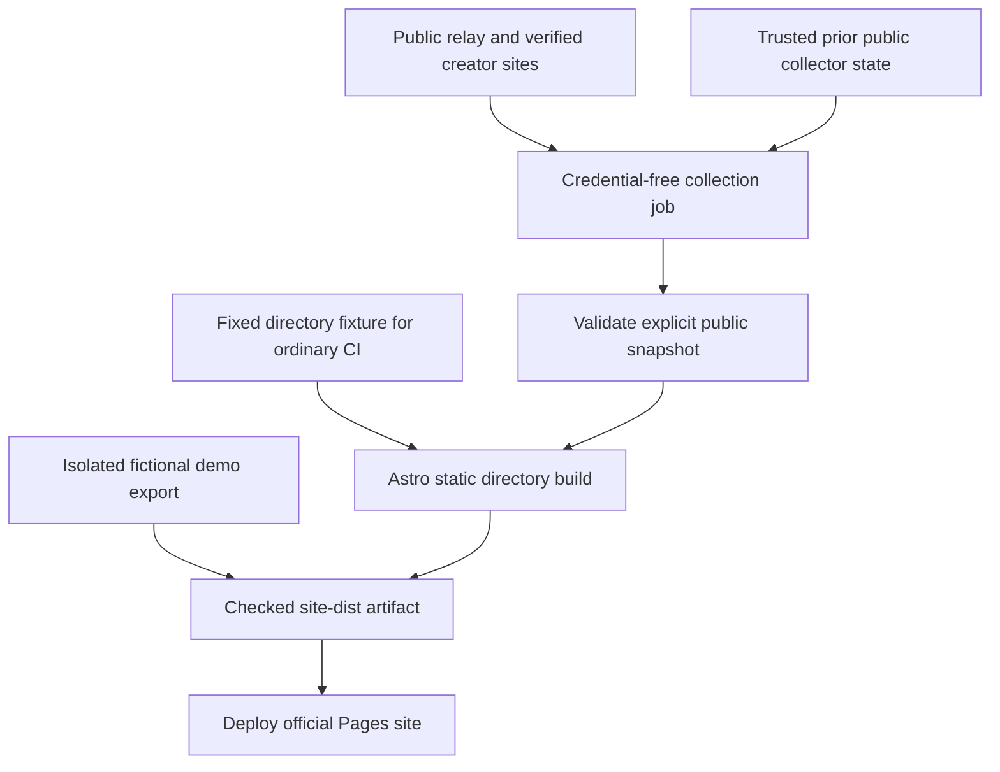

# 03 · Static directory on GitHub Pages

## Objective and dependencies

Ship the smallest useful directory at `feedme.fund/creators/`, using the verified snapshot from [step 02](02-collection-and-verification.md). Keep the existing landing page and fictional demo alongside it. No continuous server is needed for this phase; collection runs during a scheduled build.

Relevant files: [Pages workflow](../../../.github/workflows/pages.yml), [site configuration](../../../astro.site.config.mjs), [site layout](../../../site/layouts/Site.astro), [demo exporter](../../../scripts/export-demo.mjs), [artifact checks](../../../scripts/check-static-site.mjs), and [Pages guide](../../github-pages.md).

## Build separation

Implemented `scripts/collect-directory.ts`, public-only `src/lib/directory-*.ts` collection modules, `site/pages/creators/index.astro`, and generated `/directory/v1.json`. The separate directory-hints adapter is allowed to cache snapshots in the personal instance database. Avoid generating thousands of individual profile pages in v1; link to the creator's own site, where canonical content lives.

Run network collection only in the trusted official Pages workflow, with no creator OAuth, Habitat, Stripe, backup, or app-database credentials. Keep network collection separate from `pnpm build:site`; ordinary builds and pull-request CI consume a validated fixture or explicit snapshot and never crawl the network. Do not weaken `scripts/demo-offline.mjs` or the exporter's clean temporary database/environment boundary.

The fictional demo's offline resource rules remain unchanged. Real directory cards use the current DID-matched Bluesky profile's avatar as a decorative background, with an initial underneath for missing or failed images. The snapshot only accepts Bluesky's HTTPS CDN avatar endpoint; arbitrary image hosts, credentials, query strings, and SVG paths are excluded. The artifact checker verifies each directory avatar against that allowlisted snapshot. This avoids a separate download/transcode pipeline; a visitor needs CDN access to see photos. Older snapshots without avatars continue to render initials.

## Refresh, persistence, and failure

- Start with the existing nightly 08:17 UTC schedule plus maintainer manual dispatch. Distinguish a data refresh from rebuilding only code: never advance verification times without observations.
- Restore collector state only from the last successful trusted workflow artifact. If missing or expired, perform a bounded cold scan. Publish truthful partial coverage if the entire set cannot be scanned.
- Generate directory JSON and HTML from the same accepted snapshot, then deploy atomically with the site. Serialize official Pages deployments to avoid an older job overwriting a newer removal.
- Merge independent observations per DID: a partial collection failure must not discard already confirmed opt-outs or identity mismatches. Carry forward only allowed prior cards, preserving their actual old check times.
- On widespread provider failure, preserve the previous usable directory with a freshness warning and no fabricated “all offline” result. If no prior snapshot exists, publish a clear unavailable/empty state. A malformed or unsafe snapshot must never be rendered.
- Known-data expiry still applies to a successful build that cannot refresh upstream. If the entire build cannot run, a static deployment cannot remove expired cards by itself. Render absolute timestamps and a page-level warning; optionally use a tiny clock-based enhancement to mark expired observations. Document this limit rather than promise immediate revocation from an unchanged static site.
- Persist only bounded public collector state, never creator data-directory backups. Do not commit collected names, bios, or historical snapshots into the source repository.

[GitHub documents](https://docs.github.com/en/actions/reference/workflows-and-actions/events-that-trigger-workflows#schedule) that scheduled jobs can be delayed or dropped, and public-repository schedules can disable after 60 days without repository activity. Monitor last successful collection and maintain a manual refresh path. Nightly operation is a target, not an availability guarantee.

## Reader experience

- Landing-page **Explore creators** opens the real directory; **Try the demo** stays fictional.
- Render an accessible list of creator avatars/initials, names, current handles, short bios, safe site links, and verification timestamps. Use “Site checked…” instead of a generic trust badge.
- Server-render a useful first page and static pagination at modest sizes. Add a small local search over a bounded public snapshot for name, handle, and domain. Provide complete browsing without JavaScript; do not display a search form that silently fails without it.
- Use stable alphabetical ordering initially. Avoid donation-based ranking, inferred relationship scores, or “most recently joined” claims without reliable history.
- Add an optional unreachable view explaining that an old announcement is still present. Explicit opt-outs are omitted, not archived as public profiles.
- Display observed creator count and directory generation/scan timestamps. Disclose partial relay coverage and stale data.
- Keep a maintainer reporting link and versioned operator suppression rules. Suppression affects this directory's output; it is not a network-wide ban or a creator-record edit.
- Provide a concise setup explanation: publish your profile in your own Feedme, then wait for a scan. A missing result is not necessarily an installation error. Offer a DID-only bootstrap contribution as a fallback, with normal verification.

Public JSON should have a versioned, documented schema and a bounded size. Personal instances can fetch it server-side, so cross-origin browser API headers are not a launch dependency. At larger sizes, introduce paginated/chunked exports with an atomic manifest before requiring every visitor to download the full dataset. Proposed v1 export cap: 2 MiB uncompressed; hitting it requires an explicit partial result or new format, never silent truncation.

## Validation and checklist

- [x] Extend static artifact checks for real-directory routes, JSON schema, local avatars, freshness text, and demo separation.
- [ ] Test an initial empty scan, stale prior data, explicit withdrawals amid partial failures, and expired workflow state.
- [ ] Test delayed/out-of-order jobs and ensure an older snapshot cannot replace a newer accepted deployment.
- [x] Verify no private database, credentials, receipt fields, or demo user edits enter the directory artifact.
- [x] Review mobile and desktop rendering, keyboard controls, no-JavaScript pagination, long handles, hostile text, and missing avatars.
- [x] Run `pnpm check`, `pnpm test`, `pnpm build`, and `pnpm build:site` with deterministic directory fixtures.
- [ ] Manually verify real creator publication, subsequent nightly inclusion, opt-out removal, and stale-state behavior before launch.
