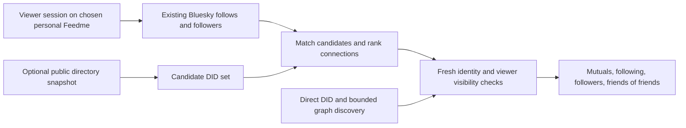

# 04 · Social discovery and Bluesky visibility

## Objective and dependencies

Make the directory useful throughout the network while preserving personal-instance control. This step builds on the public export from [step 03](03-static-directory.md); existing direct discovery remains available independently.

Relevant code: [discovery](../../../src/lib/discovery.ts), [connection ranking and visibility](../../../src/lib/discovery-model.ts), [creator circle](../../../src/lib/creator-circle.ts), [recommendations](../../../src/lib/recommendations.ts), [discovery page](../../../src/pages/discover.astro), and [social actions](../../../src/pages/api/social.ts).

## Reuse the viewer's existing network

- Add an optional directory-source configuration with the official static export as a reasonable default. Support disabling it or choosing another validated public HTTPS source. Do not overload the existing `DISCOVERY_RELAY_URL`, which has a different API contract.
- Cache the export server-side by schema version and observation age. Treat entries as candidate hints, not authorities for payment links or ownership. Revalidate candidates through the existing PDS/site checks before presenting actionable personal-instance suggestions.
- Reuse current viewer graph reads and ordering. Mutuals precede followed accounts, followers, then bounded friends of friends. “Followed by…” remains distinct from an explicit recommendation.
- Initially retain the existing caps: up to 1,000 follows and 1,000 followers, 24 checked candidates per batch, and six followed accounts with up to 100 follows each for a friends-of-friends pass. Report incomplete searches. Grow limits only with measurements and pagination.
- Intersect known-directory DIDs to reduce unnecessary probes, but do not equate non-membership with absence. Offer direct lookup and a bounded “check more connections” fallback for missing, stale, opted-out, or uncovered candidates. Respect current PDS discovery preferences in all paths.
- Apply fresh viewer blocks, mutes, and supported labels after membership/ranking. On visibility failure, withhold affected suggestions. A public snapshot cannot encode a visitor's private moderation context.
- Do not send the viewer's follow list, identity, or private support relationships to the central directory. Fetch a public snapshot and perform intersections on the user's chosen Feedme server. That server already processes the session and is part of the existing trust boundary.
- Keep recommendations as explicit `fund.feedme.recommendation` records in the recommender's repository. Supporting someone, following them, or appearing in the directory must not silently create recommendations.

The static official directory remains anonymous. A “find people I know” explanation should direct users to the discovery screen on their own or another trusted personal Feedme. It should not imply that GitHub Pages already supports login. A future browser-only OAuth implementation would be a separate design, not a prerequisite here.

## Searchability inside Bluesky

The standard [post search schema](https://github.com/bluesky-social/atproto/blob/main/lexicons/app/bsky/feed/searchPosts.json) supports posts, mentions, links, and tags; [actor search](https://github.com/bluesky-social/atproto/blob/main/lexicons/app/bsky/actor/searchActors.json) returns Bluesky profiles. Neither provides a declared Feedme-membership filter. Therefore a public Feedme record alone cannot promise a “Feedme users” result in the stock Bluesky interface.

Offer a creator-reviewed share action after successful PDS publication:

> My Feedme is live: https://support.creator.example — see what I'm working on and what you'd like me to spend more time on. #Feedme

Open Bluesky's composer with suggested text, or use the existing authenticated posting flow only after explicit confirmation. An optional real mention facet for `@feedme.fund` can help humans find launch posts. Do not post at every boot, cross-post every health check, alter someone's Bluesky bio, or make following the official account a membership requirement.

Search results, hashtags, and mentions are supplementary hints. Search pagination can be incomplete, posts can be deleted or outdated, and an unrelated account can use the same tag. Always verify the author's current PDS announcement and site before treating a search result as a directory member. The collector does not need to scrape hashtag search for its primary index.

An optional future **Feedme creators** custom feed could show actual `app.bsky.feed.post` records from verified members, especially explicit project announcements. The [feed skeleton API](https://github.com/bluesky-social/atproto/blob/main/lexicons/app/bsky/feed/getFeedSkeleton.json) is a separate feed service interface; an arbitrary Feedme project record is not automatically a Bluesky post. Building and operating this feed, choosing its content rules, and indexing member posts should be deferred until there is enough activity to justify it.

## Implementation

`directory-hints.ts` validates and caches the replaceable export. Discovery prioritizes known DIDs within existing connection categories, rechecks PDS/site identity, and applies current viewer visibility before showing cards. Explore continues from snapshot pages to relay pages. Settings provides a Bluesky compose intent after confirmed profile publication; it never submits a post.

## Validation and checklist

- [x] Verify discovery with the official directory down, disabled, stale, incomplete, or replaced by another operator's export.
- [x] Test mutual/follow/follower/second-degree ranking and explicit recommendation labels without treating either as endorsement.
- [x] Confirm private viewer context is never sent to the directory, logged into public artifacts, or inferred from tip records.
- [x] Test opt-out, block, mute, and label changes after a snapshot was downloaded.
- [x] Confirm launch text appears for review and nothing publishes without the creator's explicit action.
- [ ] Test that spoofed launch posts, hashtags, and third-party submitted URLs cannot bypass PDS/site verification.
- [x] Document actual Bluesky visibility without promising a native membership badge or exhaustive search.
