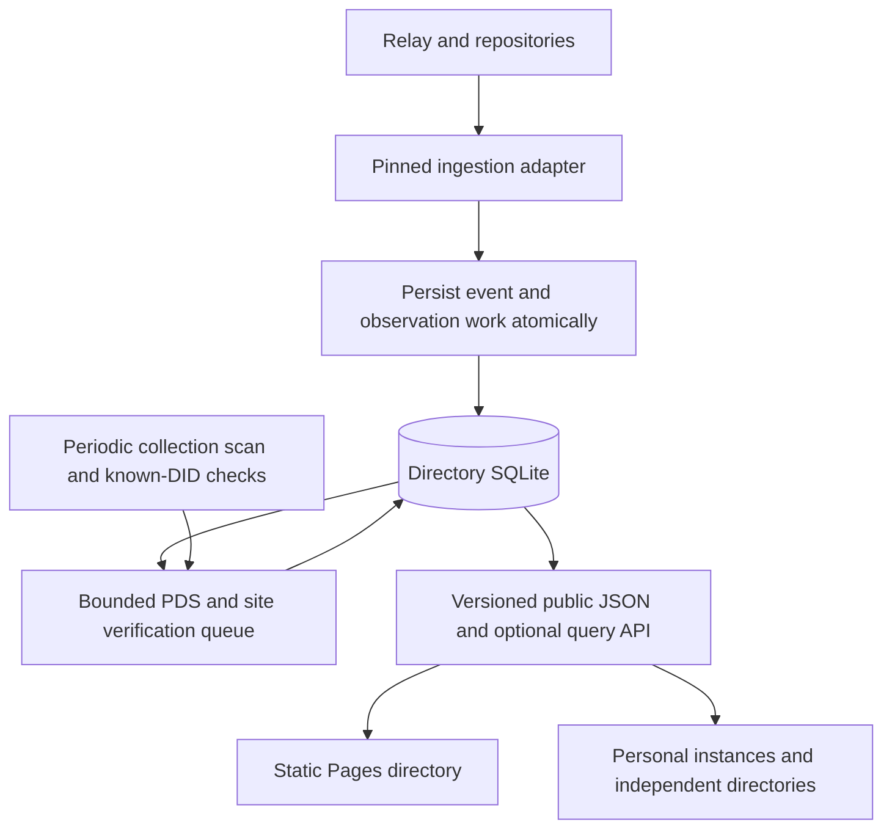

# 05 · Optional continuously running index

## Objective and decision gate

Only introduce `profiles.feedme.fund` if daily collection becomes too stale, cannot complete within its resource budget, or needs prompt withdrawal processing. Record scan duration, transferred bytes, provider errors, creator count, and requested refresh latency first. A nightly static directory can remain the permanent solution for a small network.

This would be a read-only application index, not a new AT Protocol relay. Keep the application code TypeScript, use one small SQLite database for public observations, and keep producing the same snapshot for GitHub Pages and independent clients. Do not add the service as a dependency of checkout, project publishing, or private Habitat recovery.

## Ingestion options

| Option | Benefit | Cost or condition |
| --- | --- | --- |
| Run the existing bounded collector more frequently | Smallest change; same verification model | Polling cost rises with refresh frequency |
| Tap sidecar plus TypeScript consumer | Repository verification, backfill, filtered delivery | Additional Go service, state, and potentially substantial upstream traffic |
| Hosted filtered stream as candidate hints | Potentially lower client traffic | Pin the exact provider/protocol; verify current records and repair gaps independently |

[Tap's documented collection signaling](https://github.com/bluesky-social/indigo/blob/main/cmd/tap/README.md) fits the profile marker. If selected, pin and test a release and start with:

```text
TAP_SIGNAL_COLLECTION=fund.feedme.profile
TAP_COLLECTION_FILTERS=fund.feedme.profile
```

The sidecar handles repository verification/backfill; the TypeScript consumer owns directory policy and site verification. Collection filtering narrows delivered records, but initial repository fetches and upstream relay ingestion still need measurement. Do not advertise this as a tiny filtered upstream socket without evidence. Tap is documented as beta, so run failure/recovery tests on the selected version.

Hosted stream APIs are also versioned. Do not bake an old Jetstream query shape into the protocol contract; confirm the chosen provider's current API, retention, replay, and filtering semantics during implementation. An event is a prompt to re-evaluate membership, not permission to trust an arbitrary URL or assume missing history has been recovered.

## Service shape



- Persist delivery bookkeeping and candidate updates in one transaction, then acknowledge ingestion. For Tap, acknowledge after durable handling so duplicate delivery can be safely deduplicated. Keep site fetches out of the ingestion acknowledgement's critical path by queuing them durably.
- Process creates, updates, deletes, identity changes, and account status changes. Scope cursors/event identifiers to the source. Invalidate PDS/handle caches on identity changes; recheck the current record after migration rather than fetching from a former host indefinitely.
- Keep a periodic collection rescan and known-DID reconciliation independent of the stream. New or missed records, deleted markers, downtime longer than retention, and provider changes must be recoverable without trusting a stream cursor alone.
- Debounce bursts of profile edits by DID. Probe sites on membership/URL changes and on a bounded schedule, not for each unrelated network event. Apply per-origin concurrency and aggregate request budgets.
- Preserve the same public schema, source timestamps, opt-out rules, and moderation separation as the static collector. Proposed service target: reconcile ordinary profile changes within five minutes and check site reachability every six hours; validate costs before committing to these targets.
- Restrict sidecar administration and metrics to private interfaces. Only public directory read endpoints should be exposed. A future `POST /refresh` accepts only a bounded DID hint, is rate limited and deduplicated, and must resolve all URLs independently; it must never accept arbitrary crawl targets or grant listing by itself.
- Keep the directory database rebuildable from public records. Operator suppression decisions, minimal abuse records, and service configuration need separate preservation because they cannot be reconstructed from creator PDSs. Losing the index must never lose creator payment data.

## Decentralization and failure behavior

Any operator can build the same index from the same public record format, use a different relay, maintain a different moderation policy, and expose compatible snapshots. Treat another index's entries as hints and verify selected records directly. Keep direct handle lookup and viewer-network discovery available when every shared index is offline.

The official service can omit or delay results, so it is a convenience and policy-bearing service, not an authority over identity. Independent replicas reduce discovery dependence; HTTPS snapshots alone do not provide cryptographic proof of the listed records. No mesh of unsolicited peer broadcasts or mutual server authentication is necessary for this design.

## Validation and checklist

- [ ] Use measured demand to choose polling, verified ingestion, or a hosted hint stream; document the selected trust/cost model.
- [ ] Pin versions and test duplicate, out-of-order, deleted, invalid, migrated, and deactivated-account events.
- [ ] Kill and restart the consumer before/after database commit and acknowledgement; verify no lost work.
- [ ] Test long downtime, expired cursor, upstream replacement, and rebuilding an empty index with no gaps hidden as completeness.
- [ ] Load-test actual upstream bytes and resource use, not just filtered event counts.
- [ ] Verify sidecar admin endpoints are private and submitted hints cannot become an SSRF or amplification service.
- [ ] Disable the service and verify Pages degrades honestly while personal discovery and all payment operations remain independent.
