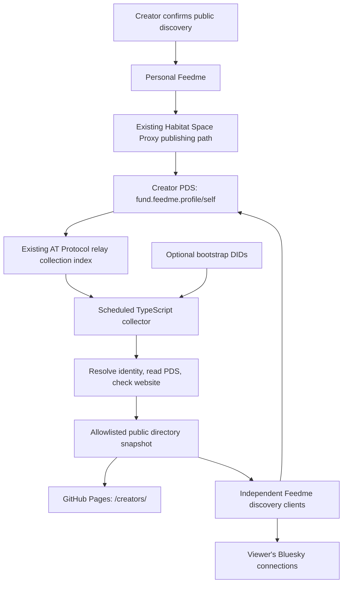

# Feedme creator directory 🌐

**Status: phases 01–04 implemented · 2026-10-02.** The static directory, scheduled public collector, explicit PDS publication, and optional personal-instance discovery hints are implemented. Phase 05 remains deferred. Real-account publication through Habitat and official schema authority resolution remain acceptance checks; the live relay scan currently returns no candidates.

Build `https://feedme.fund/creators/` as a static, searchable directory generated from creators' public AT Protocol records. Start with a scheduled TypeScript collector in GitHub Actions. Keep `profiles.feedme.fund` available for a future continuously running indexer if measured freshness or scale requires it.

Creators publish their presence once, using the identity and publishing connection already needed by their Feedme. Readers and directories discover that presence independently. No creator needs to register with the official directory, edit the Feedme repository, or operate a relay.

## Motivation

A new instance should be easy to find, particularly by people already connected to its creator on Bluesky. Discovery should distinguish three things: an account advertising a Feedme, a website belonging to that account, and that website responding recently. None of these proves that its payment integration is ready or that the creator is trustworthy.

The directory should survive changes of hosting provider and have useful alternatives if the official index becomes unavailable. It cannot enumerate every private, opted-out, or isolated AT Protocol repository. Product copy should say **known public Feedme creators**, with coverage and freshness information, rather than promise an exhaustive global list.

## Starting point before implementation

| Existing piece | What it does | Remaining work |
| --- | --- | --- |
| [Profile lexicon](../../../lexicons/fund.feedme.profile.json), [repository](../../../src/lib/repository.ts) | Profile save or published project queues `fund.feedme.profile/self`, including `feedmeUrl` and discovery preference | Make first-time announcement and subsequent URL changes clear and reliable during setup |
| [Instance declaration](../../../src/pages/.well-known/feedme.ts) | Serves creator DID, origin, protocol, and profile URI | Document compatibility and exclude explicit demo deployments |
| [Public repository reader](../../../src/lib/public-repo.ts) | Resolves current PDS, reads profile, checks the site's matching DID/origin; caches results | Extract a collector-compatible reader that does not initialize the live app database; return structured observations |
| [Discovery](../../../src/lib/discovery.ts), [graph model](../../../src/lib/discovery-model.ts) | Relay collection lookup, handle search, follows/followers, mutuals, bounded friends of friends, viewer moderation | Reuse these paths with a public directory snapshot as an optional accelerator |
| [Public HTTP transport](../../../src/lib/public-network.ts) | Public HTTPS only, DNS validation and connection pinning, bounded requests, no redirects | Preserve these guarantees in collection, media, and optional submission paths |
| [Pages workflow](../../../.github/workflows/pages.yml), [static site](../../../astro.site.config.mjs) | Nightly static product/demo build at 08:17 UTC; no real directory data | Separate public directory collection from the deliberately offline demo export |

The [existing discovery guide](../../discovery.md) documents these foundations. The [foundation plan](../foundation/README.md) and its [data step](../foundation/01-data.md) provide the repository's planning conventions.

A read-only check on 2026-10-02 of the configured relay's `listReposByCollection` endpoint for `fund.feedme.profile` returned `{"repos":[]}`. This confirms that endpoint responded, not that no Feedme exists anywhere. A real profile publication and discovery round trip remains a launch gate. No account, site, or record was published during this research.

## Goals and non-goals

- Automatic directory eligibility after a creator opts into public discovery and publishes their setup.
- Static HTML, useful SEO, accessible mobile browsing, optional small JavaScript search.
- One persistent identity per creator, independent of handles and hosting domains.
- Reachability timestamps, graceful outages, opt-out, and clear moderation rules.
- Portable public exports and direct discovery when the official directory is unavailable.
- Connection-based suggestions without collecting a central database of everyone's social graph.

The initial version does not run a full AT Protocol relay, invent a peer gossip protocol, mirror private Habitat spaces, index tips or donor relationships, require regular PDS heartbeat writes, or implement general SQLite/PDS bidirectional synchronization. It does not add payments or OAuth to GitHub Pages.

## Recommended architecture

The official directory is a replaceable read model. The creator's current PDS record determines their advertised URL and discovery preference; a successful HTTPS check at that URL establishes the reciprocal site claim. SQLite is appropriate for a later continuous indexer, but the directory never needs a creator's operational database, private Habitat space, OAuth credentials, or Stripe credentials.

AT Protocol already defines [`com.atproto.sync.listReposByCollection`](https://github.com/bluesky-social/atproto/blob/main/lexicons/com/atproto/sync/listReposByCollection.json). It supplies candidate DIDs for a collection; the collector must then validate their current records and websites. Coverage is limited to the relay's view of the network. Use independent sources and direct DID lookup as fallbacks, not a claim of total coverage.

| Approach | Role in this plan | Tradeoff |
| --- | --- | --- |
| Scheduled collection lookup → static Pages | First release | Minimal infrastructure; next successful build determines freshness |
| Filtered, continuously running indexer | Optional later phase | Faster updates; an additional service to operate and monitor |
| Hand-maintained handles/domains | Bootstrap hints only | Simple escape hatch; still requires automatic identity verification |
| Peer-to-peer broadcasts | Defer | Adds discovery bootstrapping, spoofing, amplification, and conflict problems already addressed by AT Protocol's identity/repository network |

An optional indexer at `profiles.feedme.fund` would aggregate Feedme records, not replicate the whole Bluesky network. [Tap](https://github.com/bluesky-social/indigo/blob/main/cmd/tap/README.md) provides verified repository synchronization, backfill, and collection filtering, with a TypeScript client. Its operational cost needs measurement; filtering output does not establish that upstream bandwidth is equally small.

## Creator and reader experience

1. Creator deploys Feedme, configures their own handle and canonical HTTPS address, signs in, and confirms the existing discovery preference.
2. Feedme publishes the existing profile marker through the durable outbox. Setup distinguishes **saved locally**, **published to your PDS**, and **found by a directory**.
3. The directory's next successful scan verifies the announcement and site. No pull request is needed.
4. A reader browses real creators at `/creators/`; `/demo/discover/` remains explicitly fictional.
5. On a personal instance, existing network filters prioritize mutuals, follows, followers, and bounded friends of friends. Directory membership helps identify candidates; the viewer's session supplies visibility and relationship context.

Discovery through the protocol and discovery inside the Bluesky application are separate. The standard [post search API](https://github.com/bluesky-social/atproto/blob/main/lexicons/app/bsky/feed/searchPosts.json) searches posts, with link, mention, and hashtag filters; it does not specify a Feedme-membership filter. Offer an optional user-reviewed launch post with the creator's link and `#Feedme`. A post is promotion, not proof of current membership. Do not promise that a custom record creates a new Bluesky profile badge or built-in search facet.

## Execution sequence

| Step | Deliverable | Dependency |
| --- | --- | --- |
| [01 · Publication and identity](01-publication-and-identity.md) | Reliable opt-in announcement and reciprocal domain check | Existing OAuth, profile, and outbox |
| [02 · Collection and verification](02-collection-and-verification.md) | Bounded collector, status model, portable snapshot | Step 01 contract |
| [03 · Static directory](03-static-directory.md) | Real directory on Pages, nightly refresh, last successful data | Step 02 |
| [04 · Social discovery](04-social-discovery.md) | Reuse snapshots in personal instances, launch-post flow | Steps 01–03 |
| [05 · Optional live index](05-optional-live-index.md) | Replaceable service only if required by observed usage | Steps 02–04 plus a demonstrated need |

Steps 01–04 are included in this release. Step 05 is not required and remains deferred. Implementation and operating instructions are in the [discovery guide](../../discovery.md#the-public-creator-directory).

## Risks and decisions to revisit

- **Freshness:** start nightly, matching the existing workflow. A successful nightly schedule implies approximately daily updates, not a 24-hour guarantee. Show observation times; make removal latency explicit.
- **Authority:** initial verification relies on the resolved PDS over HTTPS and a matching website declaration. It is not an independent cryptographic verification of repository commits.
- **Domain reassignment:** a new domain owner can copy an old public declaration while the creator's PDS still advertises that domain. Reciprocal declarations alone cannot detect that case. Do not present them as proof of ongoing operator control; stronger instance-key challenges would be a separate protocol extension if needed.
- **Opt-out and moderation:** remove from subsequent exports on confirmed withdrawal; previous public copies cannot be revoked. The official directory can suppress abuse without changing creators' records or controlling other directories.
- **Site health:** cached declarations can outlive application failures. Say when the site was checked; do not call this a payment readiness check.
- **Growth:** measure scan time, bytes, provider throttling, and number of candidates before moving to a service. Proposed limits in the steps are starting policies, not measured capacity claims.
- **Instance identity:** keep one canonical site per creator DID in v1. Multiple independently branded sites for one DID would require a separate future model.
- **Moderation ownership:** define a maintainer-owned suppression policy and reporting route before publishing a real directory. Generic anonymous browsing cannot honor an unknown visitor's personal blocks.

## Implementation checklist

- [ ] Confirm the publication/opt-out contract with a real test creator and official schema resolution.
- [x] Build and validate the public-only collector with bounded network access.
- [x] Publish the static directory and versioned JSON format without modifying demo isolation.
- [x] Reuse the directory in personal-instance discovery and offer an explicit launch-post action.
- [ ] Evaluate a live index only after collecting operational measurements.

## Validation checklist

- [x] Test first publication, URL migration, handle changes, PDS migration, opt-out, deletion, and rejoining.
- [x] Test outages, partial scans, stale records, domain mismatch, SSRF, and hostile profile content.
- [x] Verify no private records, graph snapshots, sessions, secrets, or financial data enter public outputs.
- [x] Verify static browsing without JavaScript, mobile layouts, accessible search, and honest freshness labels.
- [x] Confirm personal discovery still works with the official directory disabled.
- [x] Run `pnpm check`, `pnpm test`, `pnpm build`, and `pnpm build:site` before implementation ships.

## References

- [AT Protocol collection enumeration](https://github.com/bluesky-social/atproto/blob/main/lexicons/com/atproto/sync/listReposByCollection.json)
- [Repository synchronization and account events](https://atproto.com/specs/sync)
- [Identity and handle resolution](https://atproto.com/specs/handle)
- [Lexicon authority and publication](https://atproto.com/specs/lexicon)
- [Tap synchronization utility](https://github.com/bluesky-social/indigo/blob/main/cmd/tap/README.md)
- [Bluesky post search](https://github.com/bluesky-social/atproto/blob/main/lexicons/app/bsky/feed/searchPosts.json) and [actor search](https://github.com/bluesky-social/atproto/blob/main/lexicons/app/bsky/actor/searchActors.json)
- [GitHub Actions schedule behavior](https://docs.github.com/en/actions/reference/workflows-and-actions/events-that-trigger-workflows#schedule)

External contracts were reviewed on 2026-10-02. Actions are pinned to immutable revisions. Phase 05 interfaces remain proposals.

### Verification record

- 266 tests passed, including public transport DNS pinning, mixed public/private DNS rejection, byte limits, provider cooldown, opt-out and deletion, PDS migration, profile compare-and-swap and lost-response retry, and snapshot fallback with current viewer visibility.
- App and populated static builds passed. The fixture contained 27 synthetic profiles across two static pages; hostile `</script>` text stayed text, search reached page-two results, and unreachable cards had no site link. The fixture stays in ignored local output and is never deployed.
- Browser review at desktop, 390 px, and 320 px found no horizontal overflow. Static HTML inspection verified cards and ordinary pagination without JavaScript.
- Live relay enumeration succeeded with zero candidates. A real creator’s complete PDS → website → directory round trip, opt-out across deployed builds, and official schema publication still need test accounts. Automated adapter tests are not evidence of live Habitat interoperability.
- Current bounds are documented in the discovery guide. Avatars use initials; provider retries wait for the next run; batch AppView reads, richer traffic metrics, and a continuous index remain future optimizations.

The first official [Pages deployment](https://github.com/crs48/feedme/actions/runs/37063517803) and [container/CI checks](https://github.com/crs48/feedme/actions/runs/37063517750) passed. The deployed `/creators/` route correctly shows zero verified creators after a successful empty relay scan.
