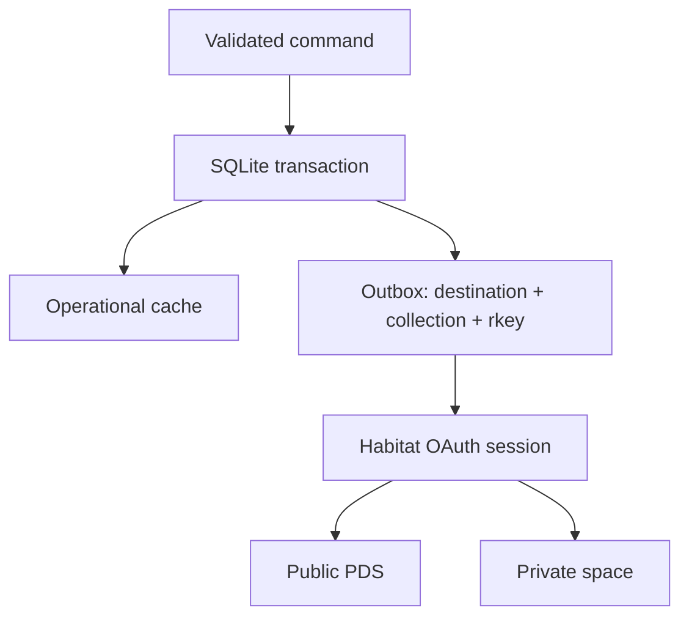

# 01 · Data and Habitat

Use `@habitat-network/habitat`'s identity resolver with the standard Node OAuth client. The resolved Habitat PDS proxy handles public `com.atproto.repo.*` writes; private records use its implemented `network.habitat.space.*` endpoints.

- [ ] Define Zod schemas and draft lexicons for projects, profile, updates, recommendations, support receipts, and acknowledgments.
- [ ] Use integer minor currency units and immutable creator DIDs.
- [ ] Store credentials and local private records in a protected persistent directory.
- [ ] Use separate namespaces for demo and live databases.
- [ ] Persist writes and their outbox entries atomically; use stable record keys for safe retry.
- [ ] Implement private space creation and bounded outbox draining.
- [ ] Validate public acknowledgments with an explicit field allowlist.

The database is an operational store and write-through cache. Backup remains necessary: a full remote re-indexer is later work. Private space authorization is independent of browser login; the owner must create a private space before enabling payments. Never substitute a public PDS record when private writes fail.
