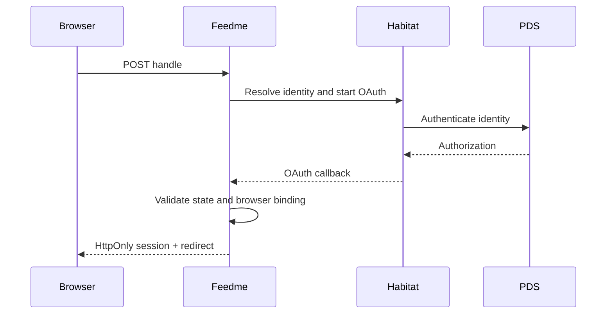

# 02 · HTML product and identity

Render all core interactions as server HTML and ordinary forms. Keep the primary pages usable with JavaScript disabled. Use accessible labels, focus states, canonical URLs, Open Graph metadata, and lightweight inline SVG illustrations.

- [ ] Build creator home, projects, updates, circle, support, success, login, and studio pages.
- [ ] Persist project creation/editing/archiving, updates, recommendations, and profile settings.
- [ ] Authenticate with AT Protocol OAuth through the trusted Habitat instance.
- [ ] Bind OAuth completion to a browser nonce; persist opaque, expiring app sessions.
- [ ] Authorize every studio mutation by the configured owner DID.
- [ ] Show demo mode and unavailable integration states explicitly.
- [ ] Offer explicit Bluesky publication of updates, with a link card to the project.
- [ ] Test responsive layout and no-JavaScript forms.

Organizations are modeled by an eventual workspace DID and role records; initial authorization deliberately has one owner rather than an incomplete multi-admin UI.
