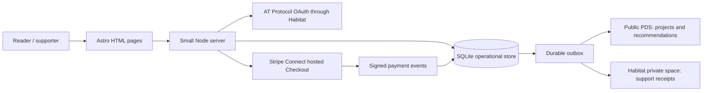

# Feedme foundation 🌱

Build a small, self-hosted home for a creator's work and the people who help make it possible. Support is an unconditional tip directed at a project or an ongoing area of life. A target is an expression of intent, never an escrow condition or a promise of delivery.

The repository was empty on 2026-09-25. This plan folder is named `foundation` for the first working release. The application is TypeScript, pnpm, Astro SSR, and Tailwind CSS, with ordinary HTML forms. React is unnecessary for the initial product.

## Architecture

Public records are deliberately constructed from an allowlist. Private support receipts never become public records by copying or spreading their contents. Public acknowledgment is opt-in and requires a verified DID. Anonymous means no supporter DID in Feedme's record; Stripe and the recipient may still receive billing information. Private spaces provide access control, not end-to-end encryption.

## Steps

1. [Model, persistence, and Habitat](01-data.md)
2. [HTML product and identity](02-product.md)
3. [Payments and release](03-payments-and-hosting.md)

## Initial scope

- [x] Typed public and private records, lexicons, SQLite store, durable synchronization.
- [x] Creator profile, projects, updates, recommendations, and support forms.
- [x] AT Protocol OAuth through Habitat, with secure browser sessions.
- [x] Owner studio for project and recommendation management.
- [x] Stripe Connect onboarding, one-time Checkout, verified webhooks.
- [x] Demo mode that works without external credentials and never charges money.
- [x] Docker, VPS, Railway, CI, tests, and operator documentation.

## Later work

- [ ] Recurring support, cancellation, invoice reconciliation, and supporter portal.
- [ ] Shared organization workspaces and Habitat role-based authorization.
- [ ] Federation discovery/indexing across independently hosted instances.
- [ ] Rich media upload, native Bluesky image/video embeds, and moderation.
- [ ] Bitcoin provider (separate from Stripe's stablecoin payment method).
- [ ] Automatic restore/reconciliation from PDS and Habitat after local data loss.

## Validation

- [x] Type checks and production build.
- [x] Tests for privacy boundaries, integer amounts, duplicate/out-of-order payment events, owner authorization, and outbox retries.
- [x] Desktop and mobile browser checks, including forms with JavaScript disabled.
- [ ] Real Habitat OAuth/PDS/private-space smoke test using an operator account.
- [ ] Stripe test-account onboarding and end-to-end payment/webhook test.

## Decisions and risks

A completely static deployment cannot keep Stripe secrets, accept verified webhooks, or protect private receipts. The default is one small persistent Node process; static assets can be cached anywhere. A static mirror with an external transaction backend remains a future option.

Habitat is experimental. Its current `network.habitat.space.*` endpoints differ from the permissioned-data proposal's `com.atproto.space.*`. Pin the SDK, record the upstream revision, validate records in this app, and treat live interoperability as an explicit acceptance check. Do not infer privacy from a flag on an ordinary public PDS record.

## Research

- [Habitat source at reviewed revision](https://github.com/habitat-network/habitat/tree/85654a07dec6931925763e66c835f65d0cdf1e30)
- [Habitat identity resolver and space proxy](https://github.com/habitat-network/habitat/blob/85654a07dec6931925763e66c835f65d0cdf1e30/api-docs/docs/space-proxy/getting-started.mdx)
- [Habitat endpoint compatibility](https://github.com/habitat-network/habitat/blob/85654a07dec6931925763e66c835f65d0cdf1e30/api-docs/docs/space-proxy/endpoints.mdx)
- [Astro Node adapter](https://docs.astro.build/en/guides/integrations-guide/node/)
- [AT Protocol Node OAuth client](https://github.com/bluesky-social/atproto/tree/main/packages/oauth/oauth-client-node)
- [Stripe direct charges with hosted Checkout](https://docs.stripe.com/connect/direct-charges?platform=web&ui=stripe-hosted)
- [Stripe stablecoins](https://docs.stripe.com/payments/stablecoin-payments)
- [Railway volumes](https://docs.railway.com/volumes)
