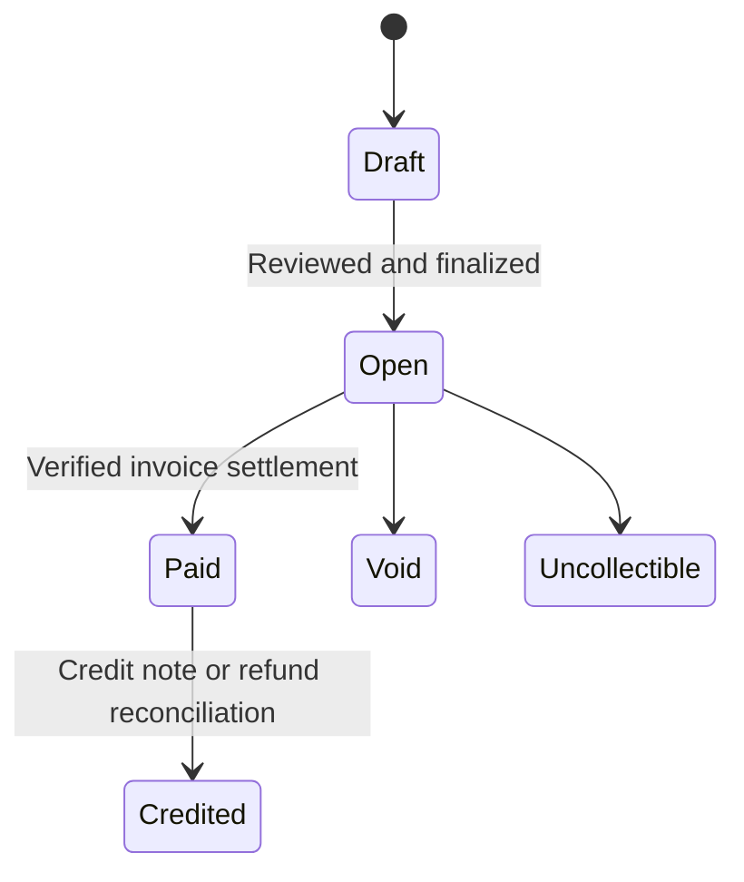

# 02 · Payments and coaching invoices

## Objective and dependency

Preserve the current support experience and give coaching clients ordinary invoices. Depends on the account context in [step 01](01-account-and-sandbox.md).

## Hosted payments

Keep server-created Checkout Sessions with dynamic payment methods, browser-bound intents, exact integer cents, stable idempotency keys, and the private recovery gate. Never use a redirect as proof of payment. Keep monthly/yearly invoices and Customer Portal cancellation working.

Add `integration_identifier` for the supported SDK/API version as described by Stripe's integration guidance, using a fixed flow label with an eight-letter random suffix generated once for that flow. Never regenerate its value on a retry of an existing Checkout intent; changing create parameters under an existing idempotency key is unsafe. Persist/version request parameters if the integration changes while old intents can still be retried.

Do not change community pick counts or tax classification based on a link's title. “Coaching” in a support pick is a suggested area of effort; a purchased coaching session is a separate service with a price and terms.

## Invoicing rollout

1. Start with branded invoices created in Stripe Dashboard. Use the Hosted Invoice Page; the customer enters payment details on Stripe. Those invoices remain managed in Stripe until an explicit Feedme import path exists.
2. If dashboard integration is wanted, add a private `ServiceInvoice` record, separate from `Support`. Bind Stripe invoice/customer/account/environment identifiers and invoice state; store only required customer information.
3. Add an explicit import/association action for existing Stripe invoices. Do not ingest all account invoices or identify customers through matching names/emails alone.
4. Later, add an admin draft form with ordinary POST actions and idempotent API creation. Keep create/review/finalize/send as distinct actions. Do not send invoices, charge saved cards, or enable automatic advancement just because an administrator saved a draft.

A settlement can include cash, credit balance, or out-of-band payment. Preserve the source: `invoice.paid` does not automatically mean a new Stripe charge or a public support signal. Support subscriptions retain their stricter successful-payment requirement.

## Event and recovery design

Extend [webhook.ts](../../../src/pages/api/stripe/webhook.ts) with a separate invoice dispatcher. `invoiceRootId()` and [recurring.ts](../../../src/lib/recurring.ts) remain specific to support subscriptions.

For associated service invoices, handle finalized, paid, payment-failed, voided, uncollectible, credit-note, and refund lifecycle events supported by the selected API version. Retrieve current provider state when ordering is ambiguous. Reconcile invoice payments and credits without assuming one invoice has exactly one PaymentIntent. A credit note and its refund must not reduce the ledger twice.

Include invoice records, event-ordering state, and association metadata in versioned private Habitat recovery. Exclude billing addresses, invoice PDFs/links, and customer identity from public records, directory responses, pick signals, and share cards.

## Acceptance

- [ ] Verify the first Dashboard invoice in the isolated sandbox, without sending it to a real customer.
- [ ] Existing tips, recurring support, private receipts, and public consent remain unchanged.
- [ ] Standalone invoices never become project tips or public pick contributions.
- [ ] Test partial payment, credit balance, out-of-band settlement, voiding, credit-note/refund pairing, retries, and out-of-order events.
- [ ] Confirm unauthorized users cannot read or act on invoice records.
- [ ] Restore associations and invoice balances from private recovery.

Sources: [Dashboard invoicing](https://docs.stripe.com/invoicing/dashboard), [Hosted Invoice Page](https://docs.stripe.com/invoicing/hosted-invoice-page), [invoice integration](https://docs.stripe.com/invoicing/integration), [credit note events](https://docs.stripe.com/api/events/types#event_types-credit_note.created).
