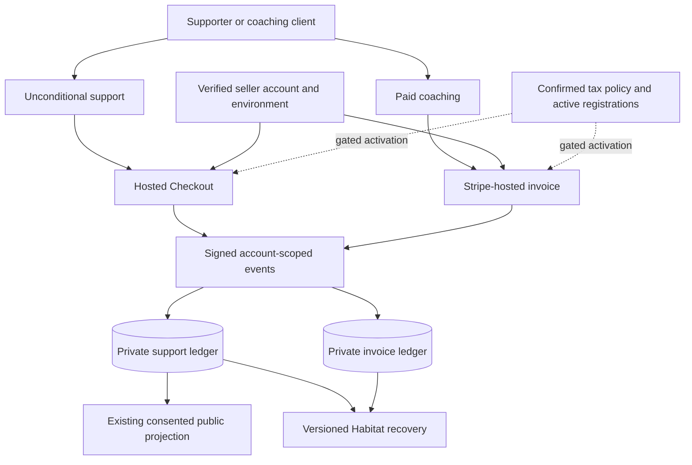

# Stripe Payments, Invoicing, and Tax for Feedme

Review date: 2026-10-07. Reviewed implementation: `47b9d20`. This folder name follows the requested product scope. This is a proposed implementation plan, not a record of enabled Stripe products or completed payment tests.

## Business and recommendation

Christopher Smothers offers coaching and open-source tools/resources at `crs.tips`. Feedme currently collects unconditional support: project and LibCard allocations express preferences, and all money goes to the creator. They are not payouts to multiple sellers or purchases of a promised service.

Keep hosted Checkout for one-time/monthly/yearly support. Start paid coaching invoices in Stripe Dashboard with the Hosted Invoice Page. Add explicit invoice and tax accounting before bringing those flows into Feedme's dashboard. Consider an optional own-account payment mode for personal deployments; retain compatibility with existing Connect installations.

The Stripe plugin's implementation planner was used with this business and codebase context. Its accepted paths were hosted web Checkout, Dashboard invoice creation, branding, Hosted Invoice Page, and eventual webhook-driven reconciliation. Manual invoice creation is a recommended starting default, not a confirmed business process. The planner did not return a dedicated Tax decision tree; the Tax work below is supplemented by Stripe's official Tax documentation retrieved through the plugin.

## Current state and findings

| Area | Observed implementation | Recommended change |
| --- | --- | --- |
| Payments | [payments.ts](../../../src/lib/payments.ts) uses hosted Checkout, dynamic payment methods, stable idempotency, and private recovery before checkout. | Preserve these properties; add explicit environment/account binding. |
| Webhooks | [webhook.ts](../../../src/pages/api/stripe/webhook.ts) verifies raw-body signatures and connected-account ownership. | Add explicit `livemode` validation; route standalone invoices separately. |
| Invoicing | [recurring.ts](../../../src/lib/recurring.ts) reconciles only Feedme subscription invoices. | Paid coaching invoices need their own private model and event path. |
| Tax | Checkout has no `automatic_tax`, tax codes, or tax behavior. The ledger stores one amount. | Model subtotal, tax, charged total, refunds, and credits before enabling tax. |
| Account setup | [payments.ts](../../../src/lib/payments.ts) creates a legacy Standard connected account; each deployment requires a platform key. | Evaluate optional own-account mode for personal hosting. Modernize Connect creation separately, preserving old accounts. |
| Onboarding | [stripe.astro](../../../src/pages/studio/stripe.astro) guides credentials, hosted onboarding, webhook setup, and readiness. | Show the chosen account mode and verified test/live environment. |
| Recovery | [recovery-model.ts](../../../src/lib/recovery-model.ts) and [recovery-stripe.ts](../../../src/lib/recovery-stripe.ts) assume the existing support model and connected account. | Version monetary schemas and restore account context with invoice/tax records. |

### Highest-priority review findings

1. **Tax is not a switch the current ledger can safely enable.** `payments.ts` compares `session.amount_total` with the stored support amount; `recurring.ts` and `recovery-stripe.ts` make equivalent comparisons. Exclusive tax changes the total and causes rejection. Inclusive tax would leave gross proceeds counted as support without separating collected tax. Do not loosen the comparisons; replace them with explicit monetary invariants.
2. **Subscription invoices are not general Invoicing support.** `invoiceRootId()` reads subscription metadata, and `applyBillingEvent()` requires a subscription-create/cycle reason. Standalone coaching invoices are intentionally outside the current ledger. A separate invoice path avoids misrepresenting purchases as community support.
3. **Self-hosted setup can be simpler.** For a single creator, charging that creator's own account is a proposed alternative to configuring both a platform and connected account. It requires deliberate changes across checkout, events, portal, recovery, and credentials—not removal of one account header.
4. **Bind the Stripe environment explicitly.** Signature and account checks exist, but the handler does not explicitly check `event.livemode`. Persist account plus mode and reject mismatches before processing.
5. **Plan Connect modernization, not an emergency account replacement.** Current code uses `type: 'standard'`. Stripe recommends Accounts v2 for new platforms. Existing account/payment IDs must remain valid through any migration.

## Goals and non-goals

- Preserve unconditional support, privacy choices, advisory allocations, and public pick signals.
- Make personal deployment credentials and ownership easy to understand.
- Support paid coaching invoices without publishing customer billing details.
- Enable Tax only with confirmed seller, product classification, registrations, and tested accounting.
- Keep Astro ordinary forms and Stripe-hosted payment pages.
- No marketplace transfers, application fee, embedded card form, tax registration, automatic invoice sending, or live payment is performed by this review.

## Architecture and phases

1. [Choose account mode and establish a sandbox](01-account-and-sandbox.md)
2. [Keep support and coaching invoices distinct](02-payments-and-invoices.md)
3. [Add tax-aware accounting and activation gates](03-tax-and-ledger.md)
4. [Verify recovery and release safely](04-validation-and-rollout.md)

## Decisions still needed

- Own-account mode is implemented and selected for `crs.tips`; existing installations still default to Connect. Live credentials and real sandbox acceptance remain operational prerequisites.
- Should coaching invoices remain in Stripe Dashboard initially, or be drafted inside Feedme? Dashboard is the proposed simplest start.
- Confirm the seller's actual business location, customer markets, taxable offerings, tax registrations, and whether prices include tax. The word “tip” does not establish tax treatment, and test-account settings do not establish live registration status.
- Confirm where restricted credentials will be stored for an isolated sandbox. Plugin authorization does not install credentials into a running Feedme server.

## Implementation checklist

- [x] Use the connected Stripe plugin and its implementation planner.
- [x] Review existing payment, invoice, event, and recovery code.
- [x] Read official Stripe guidance and record phased recommendations.
- [ ] Confirm account mode and sandbox credentials.
- [x] Implement account/environment binding and optional own-account mode.
- [ ] Establish Dashboard invoicing; add a separate private invoice ledger if requested.
- [ ] Implement monetary invariants, recovery migration, and tax readiness.
- [ ] Complete real sandbox acceptance before configuring production.

## Validation checklist

The review baseline passes `pnpm check` (231 files, no diagnostics), `pnpm test` (345 tests), and `pnpm build`. These results cover the current integration, not the proposed invoice/tax changes or a real Stripe payment. All 33 local links across these five plan files were checked.

- [x] Unit-test direct-to-own-account and Connect request/event isolation for supported modes.
- [ ] Exercise card success, decline, authentication, asynchronous payments, and cancellation.
- [ ] Verify renewals, invoice credits, partial payments, refunds, disputes, and duplicate/out-of-order events.
- [ ] Verify no tax, inclusive tax, exclusive tax, exemptions, missing registration, and missing location.
- [ ] Restore private records and reconcile them with Stripe without changing historical public consent.
- [x] Run `pnpm check` (234 files), `pnpm test` (357 tests), and `pnpm build` for the account-mode implementation.

## References

- [Hosted Checkout](https://docs.stripe.com/payments/accept-a-payment?payment-ui=checkout&ui=stripe-hosted)
- [Dashboard invoicing](https://docs.stripe.com/invoicing/dashboard), [Hosted Invoice Page](https://docs.stripe.com/invoicing/hosted-invoice-page), [Invoicing API](https://docs.stripe.com/invoicing/integration)
- [Stripe Tax setup](https://docs.stripe.com/tax/set-up), [Tax on invoices](https://docs.stripe.com/tax/invoicing), [Tax for software platforms](https://docs.stripe.com/tax/tax-for-platforms)
- [Connect recommendations](https://docs.stripe.com/connect/integration-recommendations), [self-hosted integration authentication](https://docs.stripe.com/stripe-apps/plugins/decide-migration)
- [API key security](https://docs.stripe.com/keys-best-practices)
- Existing [foundation plan](../foundation/README.md), [Stripe setup guide](../../stripe-setup.md), and [recovery guide](../../backups-and-recovery.md)
