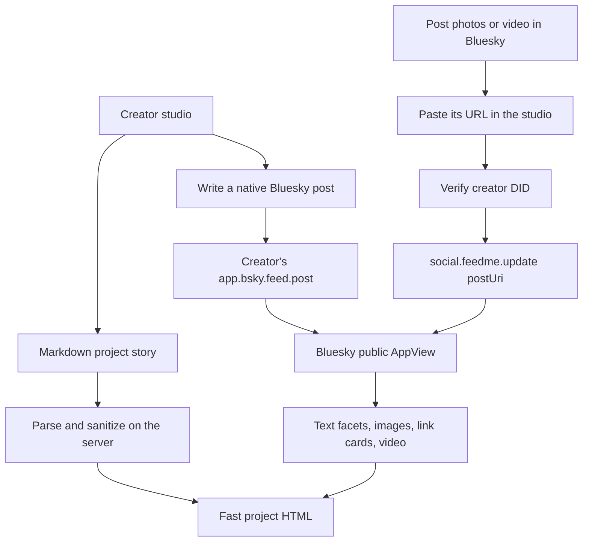
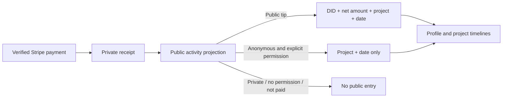

# Project pages as living logs 🌿

A project has a long Markdown story and a stream of native Bluesky posts. The story lives in `social.feedme.project.description`; it can include headings, lists, code, tables, links, and HTTPS images. A standalone Markdown link to YouTube, Vimeo, MP4, or WebM becomes an embedded player. Raw HTML is removed and the generated markup is sanitized.

## Creating a log entry

Publish a short post from the studio to write to Bluesky immediately, with a project link and the stable project tag described in [the social protocol](social-protocol.md). To include photographs or native video, create the post in Bluesky and add its URL to the project in the studio. This reuses Bluesky's upload, processing, accessibility, and conversation tools. Feedme stores a public AT URI association, and renders the current post from the AppView; it does not duplicate its media blobs.

Posts include links, mentions, and hashtags from native UTF-8 facets. Images preserve alt text. Native video uses an HTML video element, with HLS.js fetched only after an explicit play action in browsers needing it. There is always a Bluesky conversation link. Markdown video links also provide a direct viewing link. No React runtime is used.

The public project log requests up to 100 author posts plus 20 associated posts per page, deduplicates by AT URI, filters to the creator DID, and orders newest first. Older-page links continue both streams. An imported post can be added to multiple projects. Missing or hidden posts are omitted rather than resurrected from an old text snapshot. The public AppView cache expires after 30 seconds, so removals can take that long to disappear here. Earlier local-only field notes remain available in a separate archive.

In the signed-in Following page, native tags work across creators. Associated posts from this instance are included as well. Discovering custom associations from arbitrary remote instances requires the future cross-instance indexer. Project-specific push notifications are not implemented.

## Supporter timelines

`social.feedme.activity` records are emitted from the same transaction that updates a verified payment receipt. Their independent random record keys are not receipt or payment IDs. Public tip amounts reflect refunds; full refunds and disputes remove the entry. Anonymous entries require a separate checkbox, omit identity and amount, and never affect public funding totals. Private tips never appear. Existing anonymous tips have no recorded consent and stay hidden.

The server renders twelve entries per page, newest first with a stable tie-breaker. The profile combines all projects; project pages filter before pagination. The UI never receives the original private support record as a timeline item.

## Acceptance checklist

- [ ] Markdown sanitization, safe embeds, and rich text facet tests.
- [ ] Native post media parsing, ownership checks, and pagination tests.
- [ ] Public/anonymous/private timeline and refund behavior tests.
- [ ] Desktop and mobile browser verification, including JavaScript disabled.
- [ ] Production build and type checks.
- [ ] Live Habitat/Bluesky creator and supporter account exercise.

## References

- [Bluesky image views](https://github.com/bluesky-social/atproto/blob/main/lexicons/app/bsky/embed/images.json)
- [Bluesky video views](https://github.com/bluesky-social/atproto/blob/main/lexicons/app/bsky/embed/video.json)
- [Marked](https://github.com/markedjs/marked) and [sanitize-html](https://github.com/apostrophecms/sanitize-html)
- [HLS.js](https://github.com/video-dev/hls.js)
