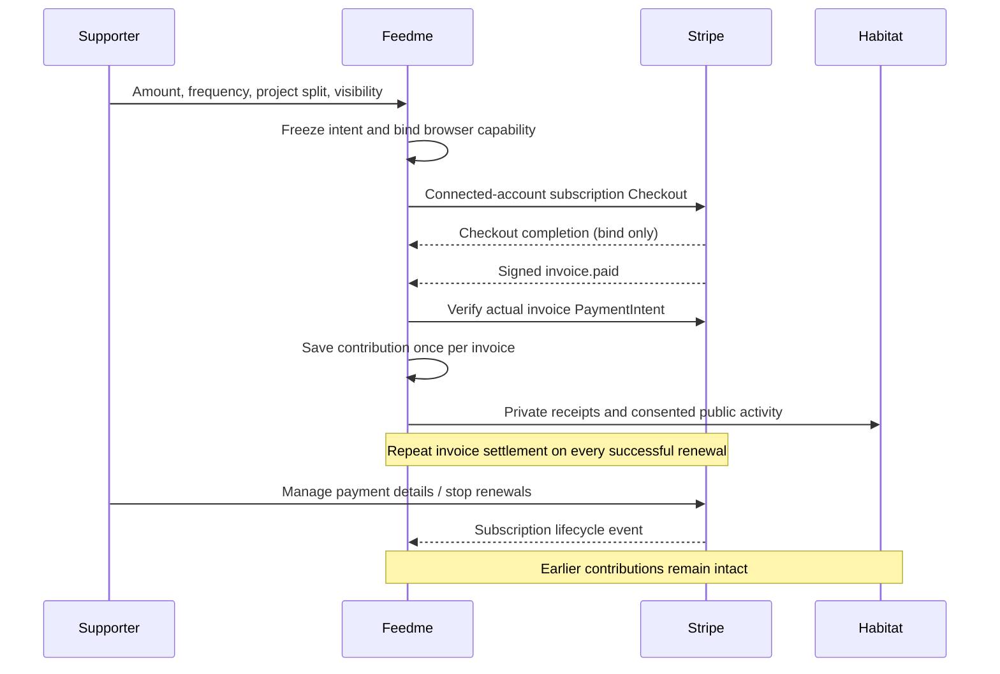

# One-time, monthly, and yearly support

Both the homepage allocator and single-project form default to **one-time** support. Monthly and yearly choices charge the entered total once per period, starting at Checkout. The same project amounts, visibility, anonymous timeline consent, and private note apply to every payment. A $30 monthly total split $20/$10 repeats as $20/$10 each month; $30 yearly means $30 per year, not $30 per month billed annually.

The segmented choices are native radio inputs with CSS selection and explanatory text. They work without JavaScript. The existing homepage calculator adds interval labels to the live total and project amounts. No payment details are collected by Feedme.

## Stripe contract

- One-time Checkout uses `mode=payment` and PaymentIntent metadata. Recurring Checkout uses `mode=subscription`, recurring price intervals `month` or `year`, and subscription metadata. Metadata contains an opaque support ID; it never contains notes, identity, or privacy choices.
- Direct charges and subscriptions belong to the configured connected account. Hosted Checkout retains the shared appearance. Feedme adds no application fee; Stripe processing and applicable Billing fees still apply.
- One-time support allows 100 selected project line items; recurring support allows 20. Amounts remain USD integers, with an overall $1–$1,000 limit per payment.
- There are no trials, coupons, prorations, automatic tax settings, or changes to subscription amounts in this release. To change the total, split, interval, or visibility, stop the old subscription and start a new one. Existing subscriptions keep their chosen projects even if a creator later completes or archives a project; the creator should cancel unwanted subscriptions in Stripe.
- The webhook destination must match the installed SDK API version `2026-08-26.dahlia`. Invoice subscription metadata is read from `parent.subscription_details`; successful payments are retrieved through the Invoice Payments API. See the required event list in [hosting](hosting.md#connect-payments).

## Contribution ledger and privacy

`Support.frequency` is optional for backward compatibility; missing means one-time. The initial intent becomes the first paid invoice's contribution. Subsequent invoice IDs map deterministically to distinct records using a hash of the root support ID and invoice ID. Renewal records reference `recurringRootId`, preserve the frozen project amounts, and receive fresh public activity identifiers.

Signed `invoice.paid` events only settle contributions after the connected-account invoice payment resolves to a succeeded PaymentIntent with matching amount, currency, and customer. The invoice must also match the frozen total, amount due, subscription, and supported billing reason. A Checkout redirect or completed subscription session never increases totals. Manually marking an invoice paid outside Stripe does not count as a verified tip.

Event IDs are deduplicated transactionally with the ledger and outbox. Invoice IDs also deduplicate separate events for the same payment. Failed renewals are recorded without increasing totals; a later successful payment settles that same contribution. Refunds and disputes resolve the exact invoice payment, so they do not alter other periods. An early refund that cannot yet find its renewal record returns a retryable error. Delayed success never restores a fully refunded contribution.

Subscription lifecycle events update local management status only. Updated/created events fetch Stripe's current subscription snapshot; older timestamps are ignored, and a canceled subscription cannot be revived by late events. Canceling does not delete historical support. Every settled renewal follows the same explicit public allowlists as a one-time tip; subscription IDs, customer IDs, invoice IDs, browser capabilities, private notes, and billing schedules are never copied into public records. The private Habitat receipt includes the chosen frequency.

## Managing support

`/billing` is linked from the site footer and recurring receipts. Opening a Stripe portal session requires the original checkout browser or the verified DID attached to a named tip. Customer and account IDs come exclusively from server records. Renewal receipts inherit the root's access capability. Necessary browser cookies and recurring receipt capabilities expire after one year; one-time receipt capabilities expire after seven days.

Before the first recurring Checkout, Feedme creates a Customer Portal configuration on the connected account. It enables invoice history, payment-method updates, cancellation at the end of the current period, and email login; subscription price updates are disabled. Management uses Stripe-hosted pages. The public email login URL provides recovery from another browser, including for anonymous tips. Stripe sends the sign-in email only when the supporter requests it there.

When the same named supporter or browser starts another subscription, Feedme reuses their existing connected-account customer. If separately created Stripe customers share an email, Stripe email recovery may select the most recent active customer; the original browser/identity provides access to each saved subscription. Operators can also assist through the connected-account dashboard.

Demo mode saves the first simulated contribution and a manageable demo subscription. It never schedules future charges. “Stop demo renewals” changes demo subscription state without erasing the first contribution.

## Verification

Automated tests cover interval validation and immutability, exact recurring Checkout prices, the connected account, portal settings and authorization, first-invoice/Checkout ordering, duplicate events and invoice IDs, failed renewal recovery, refund isolation, cancellation ordering, and public privacy projections. Browser verification is recorded in [verification](verification.md). Live Stripe test-account acceptance remains required before receiving payments.

Primary references: [Checkout subscriptions](https://docs.stripe.com/billing/subscriptions/build-subscriptions?payment-ui=checkout), [subscription webhooks](https://docs.stripe.com/billing/subscriptions/webhooks), [Invoice Payments](https://docs.stripe.com/api/invoice-payment/list), [Customer Portal integration](https://docs.stripe.com/customer-management/integrate-customer-portal), and [email portal login](https://docs.stripe.com/customer-management/activate-no-code-customer-portal).
