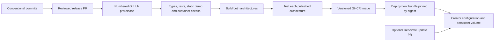

# Releases and upgrades 🌱

Feedme keeps its source repository available as a GitHub template for developers. For self-hosters, the release process produces a small deployment bundle and prebuilt Linux images for Intel/AMD (`amd64`) and ARM (`arm64`). Creator configuration, credentials and SQLite remain outside the application image.

**Until the first release workflow finishes successfully, no official image or deployment asset is available.** Check the [releases page](https://github.com/crs48/feedme/releases) for an attached `feedme-VERSION-deploy.tar.gz` and a green **Publish release images** workflow. A release entry alone does not prove image publication succeeded.

## Install or upgrade

Download a deployment bundle from a specific release. Its `compose.yaml` pins an exact version and content digest; `SHA256SUMS` verifies the downloaded archive. Unpack it and follow its [installation and upgrade instructions](../deploy/README.md). The bundle contains only Compose, example environment configuration, documentation, Renovate configuration and release metadata.

Existing source-template users can switch to images without changing their identity or data, provided they preserve the same configuration, keys and actual data volume. The migration instructions call out Compose project naming. Keep a source fork if you customize application code.

Studio → Settings shows the installed application and database versions and links to releases. `/api/health` includes `version` and `databaseSchema`. The application does not poll GitHub, hold a GitHub admin token, or replace its own server software. Updates are performed by the hosting operator. Automatic upgrades and floating `latest` tags are not enabled.

## Version and compatibility policy

- **Application:** numbered SemVer tags such as `v0.2.0`; `fix:` bumps patch, `feat:` bumps minor. During `0.x`, breaking changes bump minor and need explicit upgrade notes. After `1.0`, breaking changes require major releases. All pre-1.0 versions remain GitHub prereleases. No `latest` image alias is published.
- **SQLite schema:** ordered, transactional migrations in `src/lib/database-migrations.ts`, tracked with `PRAGMA user_version`. Schema 1 adopts the pre-versioning schema without replacing records. Newer schemas fail closed. This is separate from changes to domain JSON records and public protocol schemas, which must also be reviewed for compatibility.
- **Private recovery / backup formats:** currently version 1, independently validated. An app version bump does not automatically bump either format. Keep backward readers or supply an explicit migration before changing them.
- **Public AT Protocol records:** preserve compatibility across independently upgraded creators. A destructive public schema change needs its own protocol rollout; a container upgrade cannot rewrite other people's clients.

The required operator flow is **verified backup → stop old writer → final backup → start new image → migration → health and provider checks**. The app's startup migration does not itself create an off-server backup. Never run overlapping replicas against the same creator/space. A rollback can require restoring a compatible backup and reconciling Stripe, rather than simply switching images.

## Maintainer release process

1. Merge conventional commits into `main`. [Release Please](https://github.com/googleapis/release-please-action) maintains a release PR with `package.json`, the release manifest, deployment image version and changelog updates. The first PR starts after the configured bootstrap commit; earlier prototype work remains documented in the README.
2. Review the release PR and add meaningful upgrade notes: supported starting versions, schema/record changes, required configuration and rollback compatibility. Complete real-provider acceptance before describing any version as production-ready.
3. Check the **Prepare release → check-release-pr** result for the PR's current head. It directly runs the reusable CI workflow because GitHub's built-in token does not trigger a separate PR workflow. If the PR was edited, rerun **Prepare release** (or **Check Feedme** with its branch) before merging.
4. Merge the reviewed release PR. Release Please creates the GitHub prerelease/tag. The same workflow calls publishing directly, avoiding GitHub's suppression of token-generated tag/release events.
5. Publishing validates that the tag is on `main` and matches both version files, then checks, tests, builds the demo and tests the container at that exact tag. It builds a temporary candidate image with SBOM/provenance, runs that image on native amd64 and arm64 runners, and only then publishes the numbered image tag and deployment assets.
6. Verify the workflow succeeded, the image is publicly pullable, and the archive checksum matches. A new GHCR package may initially be private: on its package settings page, change visibility to **Public** for anonymous self-hosted pulls. Source-code visibility does not guarantee package visibility. Do this once, then verify an unauthenticated pull of the release digest.

Release actions are pinned by commit SHA. They run only in `crs48/feedme` on `main`, so copies/forks do not accidentally publish official releases. Checks use read-only permissions; only release preparation and publication receive their necessary write permissions. No long-lived release PAT is required. The repository must allow GitHub Actions to create pull requests under Settings → Actions → General.

To retry a failed publication, prefer **Re-run failed jobs**, which retains the already-built digest. If no numbered image was published, **Publish release images → Run workflow** accepts an existing release tag and reruns all gates. Existing version tags cannot be overwritten with different image contents. Publish a new patch version for rebuilt images or changed dependencies/base layers. Release assets may be reattached for the same verified image if an upload failed.

`pnpm check`, `pnpm test`, `pnpm build` and `node scripts/build-deployment.mjs --check` verify local changes. CI additionally checks the full static demo, non-root container startup, native support-card rendering and SQLite persistence across container replacement. Migration tests cover the old schema, preserved records/outbox/events, idempotency, rollback on failure and refusal of newer schemas. Future schema migrations must add representative previous-release upgrade fixtures before publication.

## Deployment template and notifications

The release archive is the small deployment template: users can run it directly or commit it to a new repository. [Renovate](https://docs.renovatebot.com/modules/manager/docker-compose/) can propose version and digest changes after the operator enables its GitHub App. The included config disables auto-merge. During `0.x`, GitHub marks releases as previews even when their image tag is a plain SemVer number; every update still needs review.

A GitHub template copy does not inherit future upstream commits. The image reference creates that update path without requiring full-source merges. Updates to the deployment wrapper itself (new mounts or environment settings) still need release notes and explicit operator changes. Host-specific one-click source deploy buttons remain available; they are not silently converted to image deployments by this release process.

References: [GitHub container publishing](https://docs.github.com/en/actions/tutorials/publish-packages/publish-docker-images), [Release Please token behavior](https://github.com/googleapis/release-please-action#other-actions-on-release-please-prs), [GHCR visibility](https://docs.github.com/en/packages/learn-github-packages/configuring-a-packages-access-control-and-visibility).
