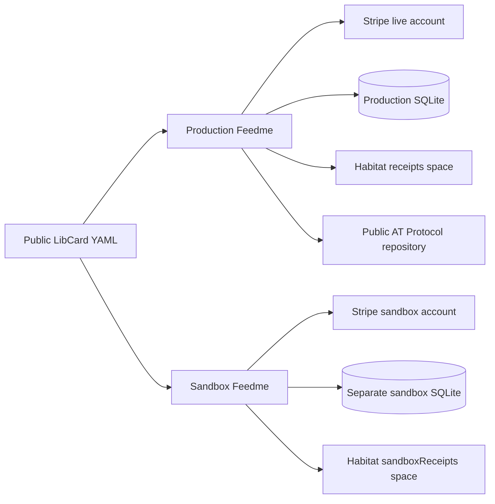

# Test payments in an isolated sandbox

`FEEDME_MODE=sandbox` runs real sign-in, Stripe test Checkout, signed webhooks, billing, and private recovery. No real money moves. The credential-free `demo` mode continues to simulate payments locally.



## Deploy

Create a fresh service, persistent volume, and HTTPS subdomain. Run one replica. Do not fork a production environment with its secrets, copy its database, or reuse its recovery-space URI.

```dotenv
FEEDME_MODE=sandbox
PUBLIC_URL=https://test.your-domain.example
BLUESKY_HANDLE=your.handle
DATA_DIR=/data
HABITAT_URL=https://pear.habitat.network
STRIPE_MODE=own-account
STRIPE_ACCOUNT_ID=acct_YOUR_SANDBOX_ACCOUNT
STRIPE_ENVIRONMENT=test
DIRECTORY_URL=off
```

Generate fresh `DATA_ENCRYPTION_KEY` and `BACKUP_ENCRYPTION_KEY` values. Configure an isolated backup destination. Add the same optional LibCard source and tip presets as your live instance if desired; the importer reads public YAML and does not modify LibCard.

In Stripe, select the dedicated sandbox account and save its restricted `rk_test_…` key as `STRIPE_SECRET_KEY` in your host's secret storage. Use the own-account permissions listed in [Stripe setup](stripe-setup.md). Create a **Your account** event destination at `https://test.your-domain.example/api/stripe/webhook`, with that guide's event list and API version, and save its separate `whsec_…` signing secret as `STRIPE_WEBHOOK_SECRET`.

Sandbox mode rejects live API keys and a live environment setting. Stripe's verified account ID must match `STRIPE_ACCOUNT_ID`. Webhooks must match the pinned test account and pass signature verification.

## Sign in and connect storage

Sign in as the configured creator on the test domain. A production login cookie or stored grant is not copied. Open **Dashboard → Settings → Create private storage**, then **Data & backups** to verify synchronization. Sandbox storage uses the separate `fund.feedme.sandboxReceipts` type; live installations use `fund.feedme.receipts`.

You can use the same Bluesky identity for both sites. The sandbox reads public profiles, but blocks public AT Protocol writes, including posts, follows, unfollows, recommendations, images, profile announcements, and payment acknowledgments. Local project editing and payment views remain usable. Testing public publishing requires a separate test identity and a separately configured installation.

The sandbox displays a persistent banner, returns `mode: "sandbox"` in `/api/health`, sends `X-Robots-Tag: noindex, nofollow`, and returns 404 for the creator-directory declaration. Its public pages are still reachable; noindex is not access control.

## Exercise the real payment flow

Use Stripe's documented [test payment methods](https://docs.stripe.com/testing), never real card details. In test Checkout, `4242 4242 4242 4242` with a future expiry and any three-digit CVC simulates a successful card payment. Check that the page is labeled sandbox/test before submitting.

Verify one-time and recurring support, payment failure, cancellation, refunds, duplicate webhook delivery, and private recovery using the [acceptance checklist](hosting.md#live-acceptance-checklist). A Checkout redirect never proves payment; the signed event must update the ledger. Renewal timing can be exercised using compatible Stripe test clocks or real sandbox invoice cycles.

## Restore and updates

Each SQLite database is pinned to live or sandbox mode, even before its first payment. An older initialized database without this marker is treated as live. Habitat sandbox checkpoints carry the same boundary, and restore rejects crossing it. Keep the sandbox on a current version of Feedme; older versions do not understand these safeguards.

Do not promote a sandbox by replacing its key or toggling its mode. Deploy production against its own database, keys, Stripe account, and private space. Update code independently from stored data, following the normal [release process](releases.md).
