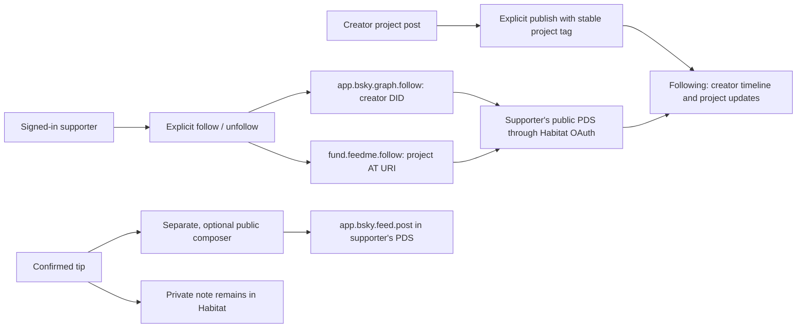

# Following the work 🌱

Feedme uses the supporter's own AT Protocol repository for social actions. Creator and friend follows are normal Bluesky follows. Projects need a small additional record because a native follow targets an account DID, not a project.

## Implementation checklist

- [x] Native creator/friend follows, including existing follows and unfollow.
- [x] Portable project subscriptions and deterministic project tags.
- [x] Following page with creator timeline and project updates.
- [x] Keep-me-updated controls alongside tipping and after payment.
- [x] Explicit public tip posts, with separate text and verified receipt access.
- [x] Actor-scoped writes, idempotent retries, pagination, and privacy tests.
- [x] Accessible HTML forms, demo supporter, desktop/mobile browser verification.

## Protocol contracts

- `app.bsky.graph.follow` lives in the follower's public repo, targets a DID, and uses a TID record key. Existing records from other apps are honored.
- `fund.feedme.follow` lives in the follower's public repo and targets `at://<creator DID>/fund.feedme.project/<project key>`. This lexicon is intentionally small. Legacy `social.feedme.follow` records remain readable during migration. An optional title is a display hint, not an authority or payment destination.
- Creator shares are ordinary `app.bsky.feed.post` records with an external project card. An additional tag, `feedme-` plus the first 32 hexadecimal characters of SHA-256 of the project's AT URI, associates updates with a project across domains. Only posts authored by that project's DID count as its updates. A tip post is not a creator update.
- Posts use TID keys and the Bluesky limits of 300 graphemes and 3,000 UTF-8 bytes. Private notes, amounts, payment IDs, receipt IDs, and billing data are never copied into a post.
- Public tip posts are deliberately separate from public payment acknowledgments. Publishing identifies the author and project even when the receipt was anonymous. The app requires explicit consent and either the original checkout browser or the named tip's authenticated DID.

## Boundaries

The Following page is server-rendered. Creator follows participate in Bluesky's own timeline. Project follows currently surface updates in Feedme, not project-specific Bluesky push notifications. Native creator activity subscriptions and a Bluesky custom feed generator are possible later additions; they are not simulated here.

Social writes restore the acting supporter's OAuth session, never the instance owner's. They complete synchronously with a persisted, stable record key for safe retry; failures remain visible. The owner's background outbox remains separate. Public subscription records can be read by other compatible instances; this first implementation does not crawl arbitrary instances or operate a network-wide indexer.

Live interoperability with the configured Habitat proxy and Bluesky AppView still needs an operator account. Demo mode exercises the same UI without making external social writes.

## Primary references

- [Native follow record](https://github.com/bluesky-social/atproto/blob/main/lexicons/app/bsky/graph/follow.json)
- [Post record, tags, replies, and text limits](https://github.com/bluesky-social/atproto/blob/main/lexicons/app/bsky/feed/post.json)
- [Authenticated timeline](https://github.com/bluesky-social/atproto/blob/main/lexicons/app/bsky/feed/getTimeline.json)
- [Author feed and cursor pagination](https://github.com/bluesky-social/atproto/blob/main/lexicons/app/bsky/feed/getAuthorFeed.json)
- [Official SDK service proxy support](https://github.com/bluesky-social/atproto/blob/main/packages/api/src/agent.ts)
- [Habitat's implemented endpoints](https://github.com/habitat-network/habitat/blob/main/api-docs/docs/space-proxy/endpoints.mdx)
