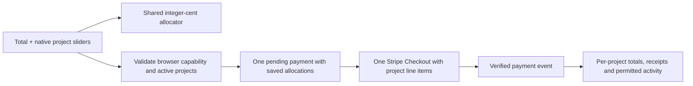

# Split support

A supporter chooses one USD total ($1–$1,000) and relative project weights on the homepage. Every selected project belongs to the same creator and connected Stripe account. The allocations express where the supporter wants that creator to spend their energy; they do not create multiple payouts.

## Allocation rules

- Sliders are integer weights from 0 to 100; the amount is distributed in proportion to their sum.
- Equal nonzero weights receive equal shares, apart from unavoidable rounding cents. A lone nonzero weight receives everything.
- All-zero selections are rejected. A maximum of 100 selected projects matches Stripe’s [Checkout line-item limit](https://docs.stripe.com/api/checkout/sessions/create).
- Calculations use integer cents. Largest fractional remainders receive the leftover cents; ties use the order saved with the form. Shares rounded to zero cents are omitted.
- Archived and completed projects cannot receive new support. The server validates selected projects again when the form is submitted.
- With JavaScript disabled, native range inputs still submit their weights. The exact split appears in hosted Checkout (or on the simulated demo receipt). The page hides stale calculated outputs.

## Payment and privacy

The browser capability binds a short-lived form to its project set. The server freezes the total, allocations, visibility, identity, and private note before contacting Stripe. Repeated identical submissions reuse the same intent and Checkout idempotency key; changed details require a fresh form.

The operational `Support` record stores one overall amount and an optional allocation array. Stripe’s metadata references that parent intent. Checkout has a separate line item for each nonzero allocation, and the webhook validates the overall paid amount, currency, session, and connected account. Redirects never settle payments.

`supportParts` derives stable per-project records for totals, studio reporting, Habitat private receipts, and public projections. Existing single-project records remain unchanged. Each project receives only its allocated amount; the whole payment is not counted repeatedly. The public tip count counts project contributions, so one payment supporting three projects contributes three entries.

The selected privacy policy applies to every allocation. Public tips publish only allowed project-specific fields. Anonymous tips remain absent from public totals; separate permission is required for anonymous timeline entries. Private notes and payment identifiers never enter public records. The receipt breakdown requires the original checkout browser or the matching signed-in supporter account.

Public messages after a split link to the creator’s project list and never copy the private note or allocated amounts. Follow links remain available on the individual project pages.

## Refunds and disputes

Stripe charge-level refunds are cumulative and have no project attribution. Feedme applies the cumulative refunded cents to allocations in their saved order, exhausting each before the next. This deterministic rule keeps every project’s net support nonincreasing as refunds grow and ensures the parts always add up to the parent’s net amount. Older refund deliveries cannot restore amounts.

Disputes affect all allocations together. A full refund or lost dispute removes their visible support through the existing public-projection and outbox paths. Partial refunds update the affected per-project amounts. Refund accounting does not change the original supporter’s chosen split or any past payment instruction.

## Validation

Unit and route tests cover even and weighted splits, single-project selection, cent conservation, invalid and zero weights, project changes, browser binding, repeated submissions, privacy, exact Stripe line items, webhook races, refunds, and disputes. Browser checks exercise the production build with JavaScript enabled and disabled. Live Stripe test-account Checkout and webhook delivery still require operator acceptance.
