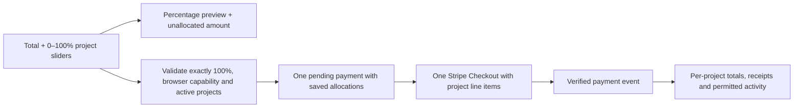

# Split support

A supporter chooses one USD total ($1–$1,000) and explicit project percentages on the homepage. Every selected project belongs to the same creator and connected Stripe account. The allocations express where the supporter wants that creator to spend their energy; they do not create multiple payouts.

## Allocation rules

- Sliders represent whole percentages from 0 to 100 and start at zero. They are not normalized: 30% of a $22 tip previews $6.60, leaving $15.40 unallocated.
- The changed slider is capped at `100 - sum(other percentages)`. Other selections stay fixed, and every track retains a native maximum of 100. Lower another slider to free capacity.
- Checkout requires exactly 100%. Partial and excessive totals are rejected by the server before an intent or Stripe session is created.
- “Split evenly” distributes 100 percentage points in display order, giving leftover points to the earliest projects. Three projects receive 34% / 33% / 33%; two receive 50% / 50%. The action selects up to the applicable project limit.
- One-time support allows up to 100 selected projects; recurring support allows up to 20. These match Stripe’s [Checkout line-item limit](https://docs.stripe.com/api/checkout/sessions/create).
- Calculations use integer cents and divide each amount by the fixed denominator 100. A partial preview rounds its allocated subtotal once; that subtotal plus the unallocated amount always equals the entered total. Largest fractional remainders receive leftover cents; ties use display order. Completed allocations conserve the full total. Shares rounded to zero cents are omitted.
- Archived and completed projects cannot receive new support. The server validates selected projects again when the form is submitted.
- With JavaScript disabled, native range inputs still submit percentages. They must total exactly 100%; the server rejects under- and overallocated submissions. The exact split appears in hosted Checkout (or on the simulated demo receipt). The page hides stale calculated outputs. Keyboard users can use arrow keys for one percentage point and Home/End for the track endpoints.

## Payment and privacy

The browser capability binds a short-lived form to its project set and percentage-allocation mode. Forms opened before the move from relative weights must be reloaded, so old values cannot be silently reinterpreted. The server freezes the total, frequency, allocations, visibility, identity, and private note before contacting Stripe. Repeated identical submissions reuse the same intent and Checkout idempotency key; changed details require a fresh form.

The operational `Support` record stores one overall amount and an optional allocation array. Stripe’s metadata references that parent intent. Checkout has a separate line item for each nonzero allocation, and the webhook validates the overall paid amount, currency, session, and connected account. Redirects never settle payments. For monthly/yearly support, all recurring line items share the chosen interval; each paid invoice gets a separate parent contribution and independent project receipts. See [recurring support](recurring-support.md).

`supportParts` derives stable per-project records for totals, studio reporting, Habitat private receipts, and public projections. Existing single-project records remain unchanged. Each project receives only its allocated amount; the whole payment is not counted repeatedly. The public tip count counts project contributions, so one payment supporting three projects contributes three entries.

The selected privacy policy applies to every allocation. Public tips publish only allowed project-specific fields. Anonymous tips remain absent from public totals; separate permission is required for anonymous timeline entries. Private notes and payment identifiers never enter public records. The receipt breakdown requires the original checkout browser or the matching signed-in supporter account.

Public messages after a split link to the creator’s project list and never copy the private note or allocated amounts. Follow links remain available on the individual project pages.

## Refunds and disputes

Stripe charge-level refunds are cumulative and have no project attribution. Feedme applies the cumulative refunded cents to allocations in their saved order, exhausting each before the next. This deterministic rule keeps every project’s net support nonincreasing as refunds grow and ensures the parts always add up to the parent’s net amount. Older refund deliveries cannot restore amounts.

Disputes affect all allocations together. A full refund or lost dispute removes their visible support through the existing public-projection and outbox paths. Partial refunds update the affected per-project amounts. Refund accounting does not change the original supporter’s chosen split or any past payment instruction.

## Validation

Unit and route tests cover partial previews, linked slider caps, even percentage splits, single-project selection, cent conservation, invalid percentages, incomplete totals, old form rejection, project changes, browser binding, repeated submissions, privacy, exact Stripe line items, webhook races, refunds, and disputes. Browser checks exercise the production build with JavaScript enabled and disabled. Live Stripe test-account Checkout and webhook delivery still require operator acceptance.
