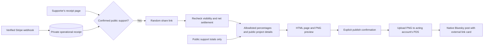

# Public support cards

After a confirmed **public** tip, the receipt page gives the supporter a stable `/share/<random-id>` link, an image download, and a copy-link button. The link opens without signing in. Its Open Graph and Twitter metadata reference a real **1200 × 630 PNG**, so platforms can show the allocation image when someone pastes the URL. The largest six allocations appear in two columns and up to three rows; the page stacks its readable project details on mobile.

The card leaves out the tip amount, private note, supporter DID, and billing identifiers. This does **not** make a public payment amount secret: choosing public support already publishes amounts in acknowledgments and the supporter timeline. Private tips and anonymous tips, including anonymous timeline entries, never get allocation cards. Publishing a Bluesky message still requires a separate explicit confirmation.

## Allocation and aspiration rules

- Allocations use the settled, unrefunded parts of the payment. Percentages round to tenths using a deterministic largest-remainder method. Very small positive shares display as `<0.1%`.
- The top six retain their fraction of the **whole** tip; they are never renormalized. Any remaining allocation appears as an “other projects” percentage. Draft or missing project details are omitted and counted in that remainder.
- Aspiration progress includes only net public support, excluding private and anonymous money, refunds, and disputed payments. Ongoing projects without a target have no goal meter.
- The ordinary bar fills at the aspiration. A rainbow surplus bar starts filling after 100%, fills completely at 200%, and keeps an uncapped surplus label after that. For example, 350% total support reads “250% beyond aspiration.” The same component appears on the homepage, project pages, and public share pages. The compact PNG uses a rainbow overlay for the surplus.
- Goal progress is current when the image is requested, not frozen at checkout. Each recurring payment has its own share link when its receipt is opened.

## Hosting and privacy boundaries

No extra service, image API key, scheduled build, or browser renderer is needed. PNGs render in Node using [resvg-js](https://github.com/thx/resvg-js) and bundled [Lato fonts](https://github.com/google/fonts/tree/main/ofl/lato), licensed under the included `public/fonts/OFL.txt`. Keep `dist/client/fonts` in the deployment; the supplied Docker image already copies it with the rest of the build.

Set the existing `PUBLIC_URL` to the instance's public HTTPS origin. Social crawlers need access to both the share page and its `.png` endpoint; localhost previews cannot be fetched by external platforms. A generated image is attached directly when Feedme publishes the optional Bluesky message through the acting account's `com.atproto.repo.uploadBlob` grant. Demo posts remain local and do not upload to a PDS.

The opaque share ID is separate from the receipt/payment ID. Its local mapping is encrypted with other operational data in live mode. Both public endpoints recheck the stored payment before returning content, including before reading the bounded image cache. Pending, fully refunded, disputed, or nonpublic support returns HTTP 404. Partial refunds update the percentages. The checkout redirect never marks a tip as paid.

The app uses `no-store` responses. External platforms can still keep independent image caches, and an image already attached to a Bluesky post remains in that account's PDS. Refunds cannot retract copied screenshots or previously published posts. Retrying a post retains its original attachment and record key rather than creating another post with newly changed progress.

## Verification

Automated tests cover visibility and settlement gates, opaque-link lookup, private-total exclusion, partial refunds, rounding, top-six remainders, missing/draft projects, multiple goal laps, SVG escaping, PNG dimensions, and actor-scoped image uploads. The demo exercises local checkout and share endpoints. Live Bluesky publication and external crawler previews still require an HTTPS deployment and an authenticated operator acceptance check.
